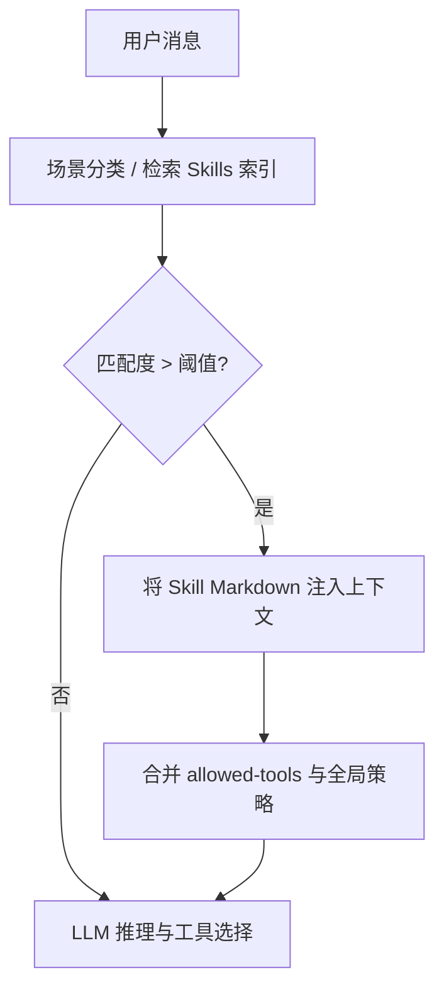
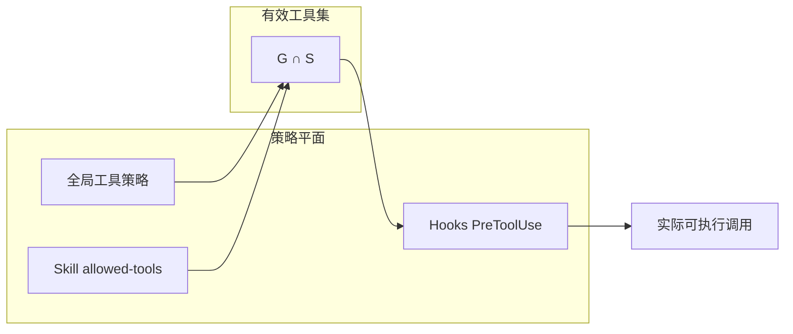

# 第十六部分 · 16.3 Skills — Markdown 封装的轻量工作流

> **导航**：[← 16.2 PreToolUse](./02-pre-tool-use.md) · [16.4 Plugins →](./04-plugins.md)

---

## 学习目标

完成本节学习后，你应该能够：

1. **定义** Skill：以 **Markdown** 为载体、带元数据（YAML frontmatter）的**可发现工作流片段**。
2. **解释** `allowed-tools` 声明的意图：在匹配场景下**约束/强烈提示**模型可调用工具集合，与平台策略**求交**。
3. **描述** 系统如何在「模型匹配到某场景」时**注入** Skill 正文到上下文，并**强制**遵循流程（enforcement 程度因版本而异）。
4. **区分** Skill 与系统提示、项目 `AGENTS.md`、Plugin 命令文档的边界。

---

## 生活类比：后厨标准作业程序（SOP）卡片

把 **Skill** 想象成餐厅墙上塑封的 **SOP 卡片**：

- 每张卡片（一个 `.md` 文件）写明：**何时启用**（frontmatter 里的描述/标签）、**允许用哪些厨具**（`allowed-tools`）、**分步操作**（正文 Markdown）。
- 主厨（**模型**）在接到「海鲜过敏客诉」这类信号时，应**翻牌执行对应 SOP**，而不是即兴发挥。
- SOP 不是把整个厨房搬走（那是 **Plugin**），也不是监控摄像头（那是 **Hook**）。

---

## Skill 文件结构（示意）

```markdown
---
name: database-migration-checklist
description: 在检测到 SQL 迁移相关请求时启用
allowed-tools: FileRead, Grep, Bash
version: 1
---

## 步骤

1. 阅读 `migrations/` 下最新文件。
2. 搜索破坏性变更关键字 `DROP`, `TRUNCATE`。
3. 生成回滚建议段落。
```

---

## frontmatter 字段参考表

| 字段 | 必填 | 说明 |
|------|------|------|
| `name` | 建议 | 稳定标识符 |
| `description` | 建议 | 触发语义，供检索与模型路由 |
| `allowed-tools` | 可选 | 逗号分隔工具列表 |
| `version` | 可选 | 便于迁移与缓存失效 |

---

## Mermaid：Skill 注入时机



---

## Mermaid：allowed-tools 与系统强制



---

## 源码片段：Skill 加载（示意）

```typescript
// skill-types.ts（示意）
export interface SkillFrontmatter {
  name: string;
  description: string;
  allowedTools?: string[];
  version?: string;
}

export interface LoadedSkill {
  id: string;
  frontmatter: SkillFrontmatter;
  bodyMarkdown: string;
}
```

```typescript
// skill-matcher.ts（示意）
export function selectSkills(
  userTurn: string,
  catalog: LoadedSkill[],
  topK: number
): LoadedSkill[] {
  const scored = catalog.map((s) => ({
    skill: s,
    score: semanticScore(userTurn, s.frontmatter.description),
  }));
  return scored
    .filter((x) => x.score > 0.35)
    .sort((a, b) => b.score - a.score)
    .slice(0, topK)
    .map((x) => x.skill);
}
```

```typescript
// tool-gate.ts（示意）
export function effectiveTools(
  globalAllow: Set<string>,
  skill?: LoadedSkill
): Set<string> {
  if (!skill?.frontmatter.allowedTools?.length) return globalAllow;
  const skillSet = new Set(skill.frontmatter.allowedTools);
  return new Set([...globalAllow].filter((t) => skillSet.has(t)));
}
```

---

## 「系统强制模型匹配场景必须调用」的含义

| 层级 | 行为 |
|------|------|
| **软提示** | 仅把 Skill 文本当作建议 |
| **硬门控** | 工具选择器过滤非 `allowed-tools` |
| **审计** | 若模型跳过 Skill，记录 telemetry |

具体产品落在哪一档，应以你所用版本的实现与文档为准；**本指南强调设计空间**。

---

## Skills 与 Hooks 协作

| 场景 | Hook | Skill |
|------|------|-------|
| 拦截非法 `Bash` | PreToolUse | 提供合规替代步骤 |
| 数据外泄 | block | 正文写明脱敏清单 |
| 长流程一致性 | PostToolUse 记录 | 步骤模板 |

---

## 组织治理建议

| 实践 | 说明 |
|------|------|
| **单一职责** | 一 Skill 一主题，避免万行 Markdown |
| **可测试** | 给 `description` 写触发样例句 |
| **版本化** | `version` + changelog |
| **评审** | PR 模板检查 `allowed-tools` 是否过宽 |

---

## 反模式表

| 反模式 | 后果 |
|--------|------|
| `allowed-tools: *` 语义 | 失去约束意义 |
| 复制粘贴旧流程 | 模型上下文膨胀 |
| 无 matcher 关键词 | Skill 永不触发 |

---

## 与 Plugins 的边界（预告）

| 对比 | Skills | Plugins |
|------|--------|---------|
| 交付形态 | 多数 `.md` | 目录包 + manifest |
| 命令扩展 | 少 | 多（斜杠命令） |
| 运行时成本 | 低 | 中高 |

---

## 常见问题 FAQ

| 问题 | 回答方向 |
|------|----------|
| Skill 能访问密钥吗？ | 不应明文；走环境/密钥管理。 |
| 多 Skill 同时命中？ | 需 merge 策略与 token 预算。 |
| 与 Cursor Rules 关系？ | 同属「提示治理」，载体不同。 |

---

## 小结

- **Skills** = **Markdown + frontmatter**，主打**轻量、可检索、可组合**工作流。
- **`allowed-tools`** 是连接「流程描述」与「工具沙箱」的桥梁，常与全局策略取交。
- 与 **PreToolUse** 叠加可形成**软+硬**双层治理。

---

## 课后自测

1. 为一个「安全依赖升级」主题起草 frontmatter（含 `allowed-tools` 列表）。
2. 解释 `effectiveTools = global ∩ skill` 在空 `allowed-tools` 时应如何退化。
3. 列举两个应放在 Hook 而非 Skill 的策略例子。

---

**上一节**：[16.2 PreToolUse](./02-pre-tool-use.md)  
**下一节**：[16.4 Plugins](./04-plugins.md)
