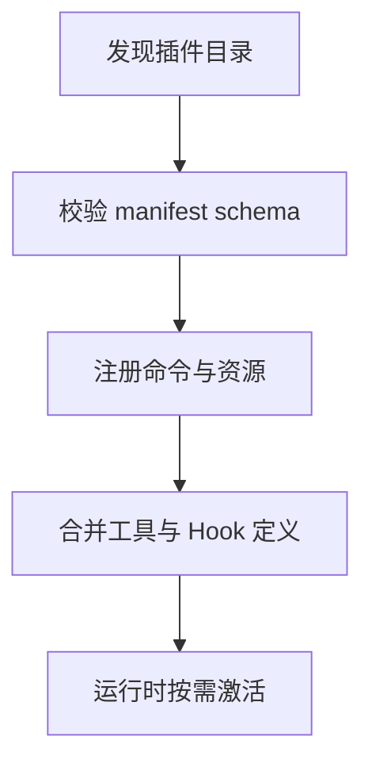
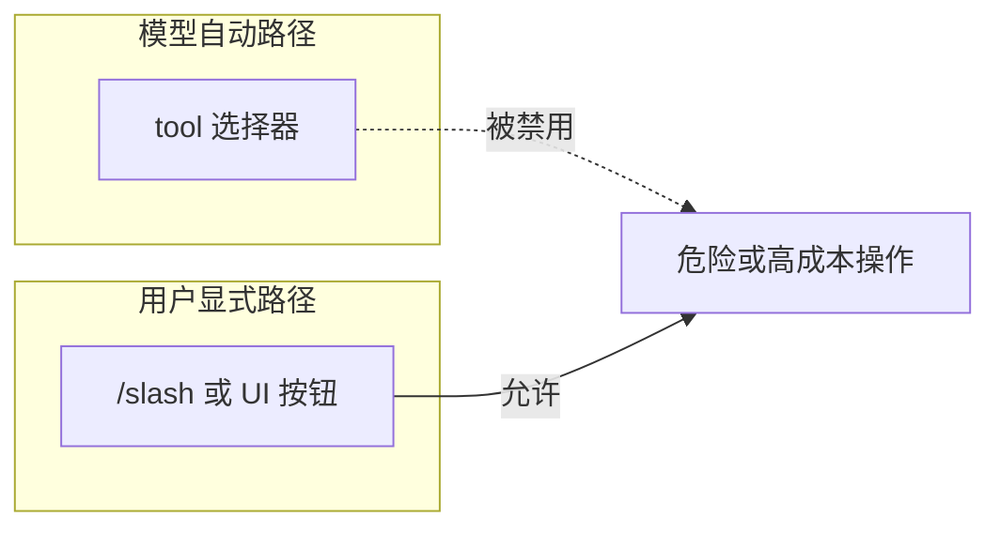

# 第十六部分 · 16.4 Plugins — 重型扩展：命令、目录与硬性标记

> **导航**：[← 16.3 Skills](./03-skills.md) · [16.5 MCP 注入 →](./05-mcp-injection.md)

---

## 学习目标

完成本节学习后，你应该能够：

1. **定义** Plugin：以**独立目录**与 **manifest** 组织的扩展包，可注册**自定义命令**、静态资源与配置片段。
2. **解释** `disable-model-invocation`（或等价标记）的用途：**禁止模型自动调用**某些路径/工具， forcing **显式用户触发**。
3. **对比** Plugin 与 Skill 在**交付物、生命周期、权限面**上的差异。
4. **列举** 插件开发中常见的工程约束：名称空间、版本兼容、与 MCP 工具名碰撞处理。

---

## 生活类比：机场里的「品牌专柜」

- **Skill** 像**机上杂志**里的服务流程页——轻、可复制、贴在座椅后背。
- **Plugin** 像航站楼里占地几十平米的**免税店**：有**独立装修**（目录）、**专属店员培训**（命令实现）、**合同条款**（manifest 里的硬性标记），甚至规定「某些高价值商品只能人工收银」（`disable-model-invocation`）。

---

## Plugin 目录结构（示意）

```text
my-plugin/
  plugin.json          # manifest
  commands/
    deploy.md          # 斜杠命令文档 + 参数 schema
  hooks/               # 可选：随包分发 Hook 片段
  resources/
    templates/...
```

---

## manifest 字段教学表

| 字段 | 说明 |
|------|------|
| `name` | 插件唯一标识 |
| `version` | SemVer |
| `commands` | 命令注册表 |
| `permissions` | 额外声明的网络/文件范围 |
| `disableModelInvocation` | 硬性关闭模型自动调用特定能力 |

> 实际键名以你所用平台的 schema 为准；本节用 camelCase 示意。

---

## Mermaid：Plugin 生命周期



---

## Mermaid：disable-model-invocation 语义



---

## 源码片段：manifest 类型（示意）

```typescript
// plugin-manifest.ts（示意）
export interface PluginCommand {
  id: string;
  title: string;
  description: string;
  entry: string; // markdown 或 handler 路径
}

export interface PluginManifest {
  name: string;
  version: string;
  commands: PluginCommand[];
  disableModelInvocationFor?: string[]; // tool/command ids
}
```

```typescript
// plugin-loader.ts（示意）
export function loadPlugin(root: string): LoadedPlugin {
  const manifest = readJson<PluginManifest>(path.join(root, 'plugin.json'));
  validateManifestOrThrow(manifest);
  const commands = manifest.commands.map((c) =>
    loadCommandDoc(path.join(root, c.entry))
  );
  return { manifest, commands, root };
}
```

```typescript
// tool-gate-integration.ts（示意）
export function isModelInvocationAllowed(
  toolName: string,
  plugin: LoadedPlugin
): boolean {
  const blocked = plugin.manifest.disableModelInvocationFor ?? [];
  return !blocked.includes(toolName);
}
```

---

## 自定义命令与 Slash（衔接 16.6）

| 维度 | 说明 |
|------|------|
| 注册 | manifest `commands[]` |
| 解析 | 用户输入 `/deploy staging` |
| 文档 | `commands/deploy.md` 内嵌参数说明 |

详见 [16.6](./06-custom-commands.md)。

---

## 与 Hooks / Skills 的组合矩阵

| 组合 | 用途 |
|------|------|
| Plugin + PreToolUse | 随包分发安全策略 |
| Plugin + Skill | 插件内置 SOP 模板 |
| Plugin + MCP | 插件启动时注册 MCP 子进程 |

---

## 名称空间与冲突

| 冲突类型 | 缓解 |
|----------|------|
| 工具名与 MCP | 前缀 `plugin__myplugin__tool` |
| 命令与内置斜杠 | manifest 校验拒绝保留字 |
| 环境变量 | 使用 `PLUGIN_MYPLUGIN_*` |

---

## 测试与发布

| 阶段 | 建议 |
|------|------|
| 本地 | `plugin.json` schema 测试 |
| CI | 打包体积与许可证扫描 |
| 发布 | SemVer + changelog |

---

## 安全表

| 风险 | 缓解 |
|------|------|
| 恶意 Hook | 仅安装可信来源；PreToolUse 审计 |
| 过度权限 manifest | 代码评审 + 最小权限 |
| 供应链 | 锁定版本与哈希 |

---

## 常见问题 FAQ

| 问题 | 回答方向 |
|------|----------|
| Plugin 能改核心二进制吗？ | 通常不能；扩展在沙箱 API 内。 |
| 禁用模型调用后 UX？ | 应用斜杠/按钮引导。 |
| 与 monorepo 兼容？ | 本地路径安装 + workspace 相对引用。 |

---

## 小结

- **Plugins** 提供 **manifest + 目录 + 命令** 的**重型**扩展面。
- **`disable-model-invocation`** 把高危能力从「模型随手可调」降级为「**用户显式**」。
- 与 **Skills**、**Hooks**、**MCP** 可叠加，需注意**名称空间**与**策略合并顺序**。

---

## 课后自测

1. 设计一个插件命令：仅允许人工触发生产数据库只读查询，并标注 manifest 字段。
2. 解释为何「禁用模型调用」不等于「禁用工具存在」。
3. 列出插件加载失败时应有的三级降级策略。

---

**上一节**：[16.3 Skills](./03-skills.md)  
**下一节**：[16.5 MCP 动态指令注入](./05-mcp-injection.md)
