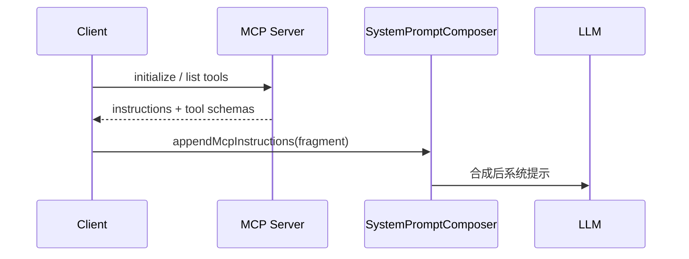
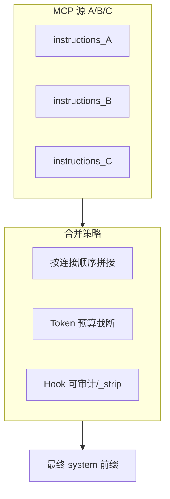

# 第十六部分 · 16.5 MCP 动态指令注入 — instructions 与系统提示词拼接

> **导航**：[← 16.4 Plugins](./04-plugins.md) · [16.6 自定义命令 →](./06-custom-commands.md)

---

## 学习目标

完成本节学习后，你应该能够：

1. **解释** MCP（Model Context Protocol）设备连接后，其 **`instructions`** 如何作为**动态文本**进入**系统提示词**合成管线。
2. **区分** 静态系统提示、项目级 `AGENTS.md`、Skill 注入与 **MCP instructions** 的**时序与优先级**（概念级）。
3. **识别** 动态注入带来的风险：**提示注入**、**工具描述膨胀**、**多 MCP 源冲突**。
4. **列举** 缓解策略：摘要、分层、Hook 审计、defer 加载（见 16.7）。

---

## 生活类比：外聘专家的「当天简报」

把 **MCP 服务器**想象成按项目聘请的**外部专家**：

- 专家进会议室（**连接成功**）时，会递上一份**当天简报**（`instructions`）：「我今天带的仪器能测什么、不能测什么、报告格式要求」。
- 会议主席（**系统提示合成器**）把简报**夹进总议程**（系统提示词），让所有人（**模型**）知道边界。
- 若三位专家同时发言且彼此矛盾，主席需要**合并规则**或**标注优先级**——这就是**多 MCP 注入**的工程难题。

---

## 数据流要素表

| 要素 | 来源 | 去向 |
|------|------|------|
| MCP 元数据 | 握手/清单 | 运行时注册表 |
| `instructions` | 服务器声明 | 系统提示片段 |
| 工具 schema | `tools/list` | 工具选择器 + 描述块 |
| 资源模板 | 可选 | 上下文引用 |

---

## Mermaid：连接与注入时序



---

## Mermaid：多 MCP 片段合并



---

## 源码片段：合成器（示意）

```typescript
// system-prompt-composer.ts（示意）
export function composeSystemPrompt(ctx: {
  base: string;
  projectRules: string;
  skills: string[];
  mcp: { serverId: string; instructions: string }[];
}): string {
  const mcpBlock = ctx.mcp
    .map(
      (m) =>
        `## MCP Server: ${m.serverId}\n${trimInstructions(m.instructions)}`
    )
    .join('\n\n');
  return [ctx.base, ctx.projectRules, ...ctx.skills, mcpBlock]
    .filter(Boolean)
    .join('\n\n---\n\n');
}
```

```typescript
// mcp-session.ts（示意）
export class McpSession {
  constructor(
    public readonly serverId: string,
    private readonly conn: McpConnection
  ) {}

  async hydrateIntoContext(composer: SystemPromptComposer) {
    const meta = await this.conn.getServerMeta();
    composer.appendMcpInstructions({
      serverId: this.serverId,
      instructions: meta.instructions ?? '',
    });
    await this.registerTools(meta.tools);
  }
}
```

```typescript
// token-budget.ts（示意）
export function trimInstructions(text: string, maxChars: number): string {
  if (text.length <= maxChars) return text;
  return text.slice(0, maxChars) + '\n…[truncated]';
}
```

---

## 与 PreToolUse 的协同

| 场景 | 说明 |
|------|------|
| instructions 诱导调用恶意工具 | PreToolUse 以策略覆盖 |
| 工具名 `mcp__*` 批量审计 | matcher 前缀 |
| 敏感数据经 MCP 返回 | PostToolUse 脱敏 |

---

## 提示注入风险表

| 攻击面 | 示例 | 缓解 |
|--------|------|------|
| instructions 内含「忽略上文」 | 经典注入 | 分隔符 + 模型安全训练 |
| 工具 description 过长 | 挤压用户消息 | 摘要与 defer |
| 多源互相覆盖 | A 说可删库 B 说不行 | 显式优先级段落 |

---

## Token 经济学

| 组件 | 影响 |
|------|------|
| 每 MCP instructions | +N tokens / 请求 |
| 工具 schema | 更大头；可延迟加载 |
| Skills | 与 MCP 共享预算 |

---

## 可观测性

| 指标 | 用途 |
|------|------|
| `mcp_instruction_chars` | 预算调优 |
| `mcp_connect_failures` | 可靠性 |
| `tool_register_latency_ms` | 启动性能 |

---

## 版本与缓存

| 实践 | 说明 |
|------|------|
| 服务器版本变更 | 失效合成缓存 |
| 工具列表 etag | 减少重复拉取 |

---

## 常见问题 FAQ

| 问题 | 回答方向 |
|------|----------|
| instructions 可热更新吗？ | 视客户端是否支持重连/刷新。 |
| 无 instructions 的 MCP？ | 仅用工具 schema 片段。 |
| 与企业代理冲突？ | TLS 与 allowlist 需预配。 |

---

## 小结

- **MCP 动态指令注入** = 连接后将 **`instructions`** 拼进**系统提示词**。
- **多 MCP** 需要**合并策略 + Token 预算 + 安全审计**。
- 与 **Hooks**、**defer_loading** 形成「**能连、能控、能省**」三角。

---

## 课后自测

1. 手写一个三段式 system 模板：`BASE`、`PROJECT`、`MCP[{id}]`。
2. 解释为何工具 schema 往往比 instructions 更耗 Token。
3. 设计一个 PostToolUse 事件：检测响应里是否包含疑似注入短语。

---

## 术语表（中英）

| 中文 | 英文 | 备注 |
|------|------|------|
| 系统提示词 | system prompt | 与 user/assistant 消息并列 |
| 清单 | manifest / capability list | MCP 握手返回 |
| 截断 | truncation | 需配合「已截断」提示防模型误判 |
| 合成器 | composer | 负责拼接各片段的纯函数或服务 |

---

## 与 defer_loading 的衔接说明

当 `instructions` 较短而 **tool schema** 极大时，常见架构是：

1. **首包**仅把 `instructions` 与工具**名称列表**送入 system；
2. 具体 **JSON Schema** 在 `ensureHydrated(toolName)` 时加载（见 [16.7](./07-defer-loading.md)）；
3. **PostToolUse** 仍可对「已加载工具集」做审计，无需等待全量 schema。

该拆分能显著降低「连接 10 个 MCP」时的冷启动 Token。

---

**上一节**：[16.4 Plugins](./04-plugins.md)  
**下一节**：[16.6 自定义斜杠命令](./06-custom-commands.md)
