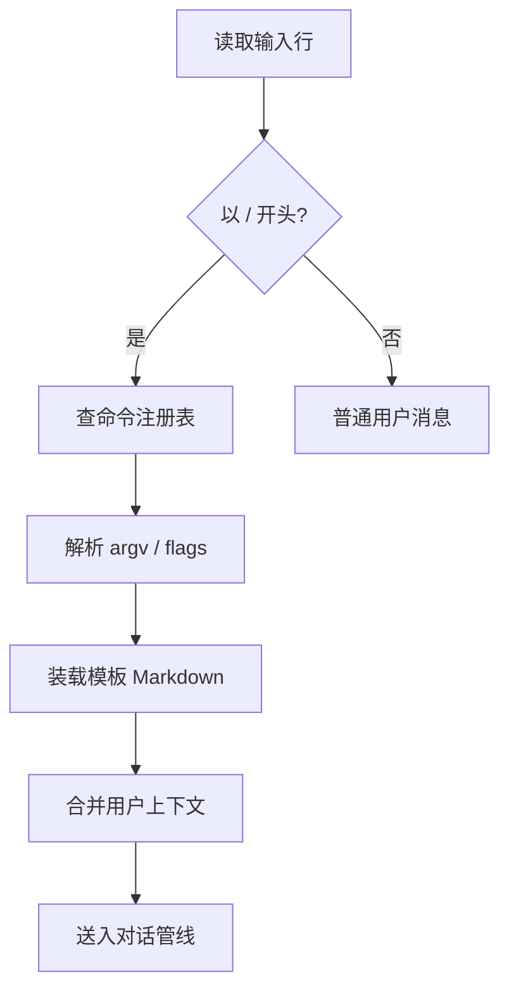
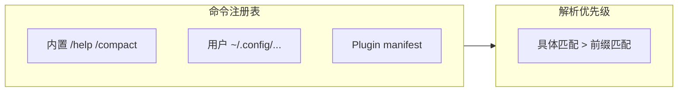

# 第十六部分 · 16.6 自定义命令 — Slash 命令开发

> **导航**：[← 16.5 MCP 注入](./05-mcp-injection.md) · [16.7 defer_loading →](./07-defer-loading.md)

---

## 学习目标

完成本节学习后，你应该能够：

1. **定义** 斜杠（Slash）命令：以 **`/`** 前缀触发的用户意图快捷方式，映射到**固定提示模板**、**脚本**或 **Plugin 处理器**。
2. **描述** 自定义命令从**注册**（manifest / 配置）到**解析**（参数分词）再到**执行**（注入对话上下文）的链路。
3. **列举** 良好命令设计的要素：帮助文本、参数 schema、示例、权限声明。
4. **关联** [16.4 Plugins](./04-plugins.md) 中的 `commands/` 目录约定。

---

## 生活类比：快餐编号点餐

把 Slash 命令想象成快餐店的**编号餐**：

- 顾客不说长句，只喊 **`/12 套餐`**——收银机（解析器）知道对应**固定配方**（模板）与**可加选项**（参数）。
- **自定义命令**就是门店总部允许加盟店在收银机里**新增编号**，但必须附带**价目表说明**（help）与**过敏原提示**（权限/风险）。

---

## 命令形态示例

| 输入 | 语义 |
|------|------|
| `/review` | 无参，触发代码审查 SOP |
| `/deploy staging` | 位置参数 |
| `/sql --dry-run` | 标志位 |

---

## Mermaid：Slash 解析管线



---

## Mermaid：Plugin 命令与内置命令共存



---

## 源码片段：命令定义（示意）

```typescript
// slash-command.ts（示意）
export interface SlashCommand {
  name: string; // 不含前导 /
  description: string;
  usage: string;
  handler:
    | { type: 'template'; path: string }
    | { type: 'script'; bin: string }
    | { type: 'delegate'; plugin: string };
}
```

```typescript
// parser.ts（示意）
export function parseSlashInput(line: string): ParsedSlash | null {
  if (!line.startsWith('/')) return null;
  const tokens = line.slice(1).trim().split(/\s+/);
  const name = tokens.shift() ?? '';
  return { name, args: tokens };
}
```

```markdown
<!-- commands/review.md（示意） -->
---
command: review
description: 对当前 git diff 做结构化审查
---

请按以下结构输出：

1. 变更摘要
2. 风险等级（低/中/高）
3. 测试建议
4. 可改进命名

参数：{{args}}
```

---

## manifest 注册（衔接 Plugin）

```json
{
  "commands": [
    {
      "id": "review",
      "title": "Code Review",
      "description": "结构化 diff 审查",
      "entry": "commands/review.md"
    }
  ]
}
```

---

## 参数 schema 建议

| 字段 | 类型 | 说明 |
|------|------|------|
| `positional` | string[] | 按顺序 |
| `flags` | record | `--key value` |
| `env` | string[] | 需要的环境变量 |

可用 JSON Schema 生成 IDE 补全（视平台支持）。

---

## 与 `disable-model-invocation` 联动

| 场景 | 做法 |
|------|------|
| 高危 `/deploy prod` | 仅允许 slash，不允许模型自拟工具链 |
| 只读 `/audit` | 模型可调用只读工具 |

---

## UX 清单

| 项 | 说明 |
|----|------|
| `/help` 列出命令 | 可发现性 |
| 错误信息 | 未知命令给建议 |
| 别名 | `r` → `review` |

---

## 测试表

| 用例 | 输入 | 期望 |
|------|------|------|
| T1 | `/review` | 装载 review 模板 |
| T2 | `/unknown` | 友好错误 |
| T3 | `/sql ; rm` | 被安全层拒绝或转义 |

---

## 国际化

| 话题 | 建议 |
|------|------|
| 命令名 | 保持 ASCII 稳定 |
| 帮助文本 | 可本地化文件 |

---

## 常见问题 FAQ

| 问题 | 回答方向 |
|------|----------|
| Slash 与 @ 文件引用优先级？ | 平台相关；通常先解析 slash。 |
| 命令能嵌套吗？ | 一般不建议；用子命令 ` /git commit`。 |
| 与 MCP 工具重名？ | 命名空间隔离；文档说明。 |

---

## 小结

- **自定义 Slash 命令**把重复工作流压缩为**可注册、可文档化**的入口。
- **Plugin** 通过 **manifest + markdown 模板**扩展命令表。
- 与 **权限、PreToolUse、disable-model-invocation** 组合可构造**安全的人工闸**。

---

## 课后自测

1. 为 `/migrate-db` 起草 `usage` 字符串与两个示例调用。
2. 写伪代码：在 `parseSlashInput` 后把结果转为「合成用户消息」。
3. 解释为何命令帮助应独立于模型自由文本。

---

## 合成用户消息（示意伪代码）

下列片段展示如何把 Slash 解析结果映射为**结构化用户消息**，便于在 transcript 中区分「显式命令」与自由输入：

```typescript
function slashToSyntheticUserMessage(parsed: ParsedSlash, template: string) {
  const filled = template.replace('{{args}}', parsed.args.join(' '));
  return {
    role: 'user' as const,
    content: filled,
    metadata: { kind: 'slash', name: parsed.name },
  };
}
```

---

## 保留字与命名空间（建议表）

| 类别 | 示例 | 策略 |
|------|------|------|
| 内置 | `/help`, `/clear` | 插件不可覆盖 |
| 组织 | `/corp-*` | 内部插件统一前缀 |
| 实验 | `/x-*` | 随时可删，不入正式文档 |

---

**上一节**：[16.5 MCP 注入](./05-mcp-injection.md)  
**下一节**：[16.7 defer_loading](./07-defer-loading.md)
