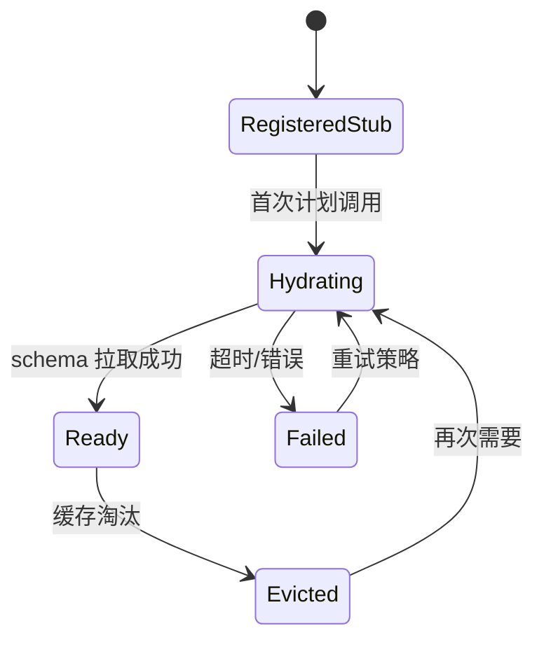
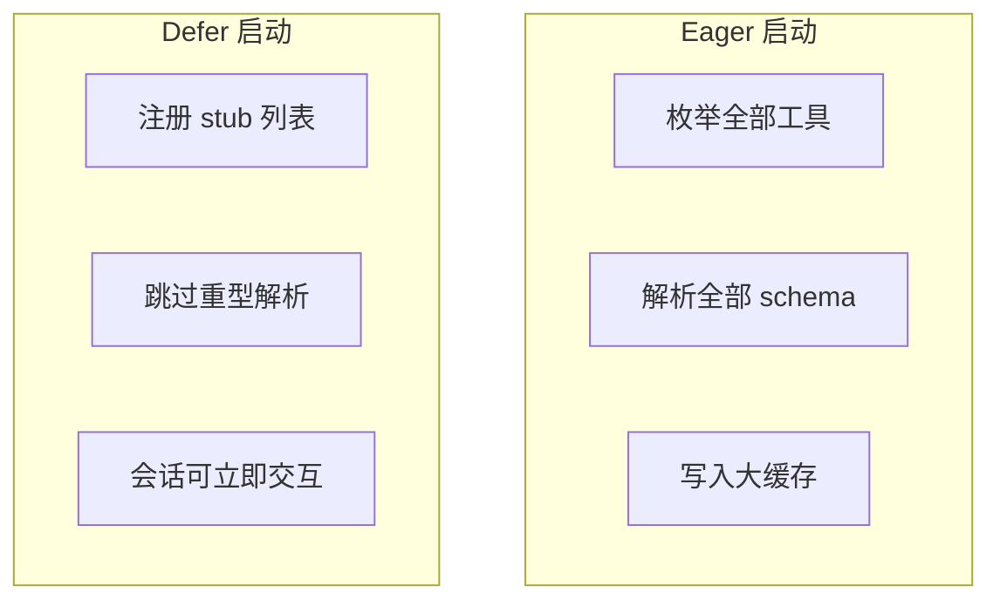

# 第十六部分 · 16.7 defer_loading — 工具延迟加载与缓存保护

> **导航**：[← 16.6 自定义命令](./06-custom-commands.md) · [16.8 综合演练 →](./08-practice.md)

---

## 学习目标

完成本节学习后，你应该能够：

1. **解释** `defer_loading`（或等价机制）在工具注册中的目标：**推迟**重型工具定义的物化，直到**首次需要**或**显式预热**。
2. **描述** 延迟加载如何**保护缓存**：避免每次会话启动**全量失效**与**重复解析**大 schema（尤其 MCP）。
3. **对比** eager load 与 deferred load 在**首响延迟**、**内存占用**、**调试复杂度**上的权衡。
4. **关联** [16.5 MCP 注入](./05-mcp-injection.md) 中的 schema 体积问题。

---

## 生活类比：图书馆闭架借书

- **Eager loading**像开业时把**所有书**都摊在大厅——找得快一眼看完，但**搬书累死**（启动慢）、**灰尘多**（缓存抖动）。
- **Defer loading**像**闭架书库**：目录卡片在前台（轻量索引），真有人借某类书时，管理员才去库房取（**按需加载**），并且同一本书当天只取一次（**缓存命中**）。

---

## 核心概念表

| 概念 | 说明 |
|------|------|
| **工具 stub** | 仅含名称与轻描述，占位 |
| **hydrate** | 首次调用前拉全 schema |
| **cache key** | 通常含插件版本、MCP 会话 id、工具列表哈希 |
| **invalidate** | 连接变更、manifest 更新 |

---

## Mermaid：延迟加载状态机



---

## Mermaid：启动路径对比



---

## 源码片段：注册与惰性解析（示意）

```typescript
// tool-registry.ts（示意）
export interface ToolRegistration {
  name: string;
  kind: 'builtin' | 'mcp';
  loader?: () => Promise<ToolSchema>;
  schema?: ToolSchema; // hydrated
}

export class ToolRegistry {
  private tools = new Map<string, ToolRegistration>();

  registerDeferred(t: ToolRegistration) {
    this.tools.set(t.name, { ...t, schema: undefined });
  }

  async ensureHydrated(name: string): Promise<ToolSchema> {
    const reg = this.tools.get(name);
    if (!reg) throw new Error('unknown tool');
    if (reg.schema) return reg.schema;
    if (!reg.loader) throw new Error('no loader');
    reg.schema = await reg.loader();
    return reg.schema;
  }
}
```

```typescript
// cache-layer.ts（示意）
export function makeCacheKey(parts: {
  mcpServerId: string;
  toolListHash: string;
}): string {
  return `mcp:${parts.mcpServerId}:tools:${parts.toolListHash}`;
}

export async function getOrLoad<T>(
  key: string,
  loader: () => Promise<T>,
  ttlMs: number
): Promise<T> {
  const hit = lruGet<T>(key);
  if (hit && !isStale(hit, ttlMs)) return hit.value;
  const value = await loader();
  lruSet(key, { value, fetchedAt: Date.now() });
  return value;
}
```

```typescript
// planner-integration.ts（示意）
export async function planToolCall(
  registry: ToolRegistry,
  call: { name: string; args: unknown }
) {
  const schema = await registry.ensureHydrated(call.name);
  validateArgs(schema, call.args);
  return execute(call);
}
```

---

## 缓存保护含义

| 威胁 | defer 的缓解 |
|------|----------------|
| 每次全量 schema 下载 | 仅 hydrate 用到的子集 |
| 大对象 JSON parse | 分摊到多次 idle |
| 冷启动阻塞 UI | 先渲染会话，再后台预热 |

---

## 预热策略

| 策略 | 描述 |
|------|------|
| 用户显式 | `/tools warmup` |
| 启发式 | 根据最近历史预测下一工具 |
| 空闲时 | requestIdleCallback 批量 hydrate |

---

## 与 Hooks 的交互

| 事件 | 说明 |
|------|------|
| `SessionStart` | 可触发 selective preload |
| `PreToolUse` | hydrate 若失败 → block 并提示 |

---

## 调试清单

| 步骤 | 动作 |
|------|------|
| 1 | 日志记录 `hydrate_ms` |
| 2 | 对比 eager vs defer 的 P95 启动 |
| 3 | 压测 20+ MCP 同时连接 |

---

## 反模式

| 反模式 | 后果 |
|--------|------|
| 每次调用都重新拉 schema | 延迟爆炸 |
| cache key 过粗 | 陈旧 schema |
| cache key 过细 | 命中率趋近 0 |

---

## 常见问题 FAQ

| 问题 | 回答方向 |
|------|----------|
| defer 影响确定性吗？ | 不应；仅影响**何时**加载。 |
| 与流式首 token 关系？ | 先返回对话，再后台 hydrate。 |
| 离线模式？ | stub 需含降级错误文案。 |

---

## 小结

- **defer_loading** 通过 **stub + 按需 hydrate** 降低冷启动成本。
- **缓存 key** 设计决定**新鲜度 vs 命中**平衡。
- 与 **MCP 大 schema**、**多插件**场景强相关。

---

## 课后自测

1. 为 `ensureHydrated` 添加并发合并（coalescing）伪代码：同一工具并发请求只触发一次 loader。
2. 计算：100 个工具每个 schema 8KB，全量 eager 与仅 5 个 defer hydrate 的内存差（量级）。
3. 设计缓存失效：MCP `tools/list` 变更时的监听点。

---

## 并发合并（coalescing）示意

```typescript
const inflight = new Map<string, Promise<ToolSchema>>();

async function ensureHydratedCoalesced(
  name: string,
  loader: () => Promise<ToolSchema>
): Promise<ToolSchema> {
  const existing = inflight.get(name);
  if (existing) return existing;
  const p = loader().finally(() => inflight.delete(name));
  inflight.set(name, p);
  return p;
}
```

同一工具在极短时间窗口内的重复请求将共享 **单次** `loader()`，避免惊群与重复网络 I/O。

---

## 监控面板建议字段

| 字段 | 类型 | 说明 |
|------|------|------|
| `defer_hydrate_ms` | histogram | hydrate 耗时分布 |
| `defer_cache_hit_ratio` | gauge | 命中比例 |
| `defer_inflight` | gauge | 当前并发 hydrate 数 |

---

**上一节**：[16.6 自定义命令](./06-custom-commands.md)  
**下一节**：[16.8 综合演练](./08-practice.md)
