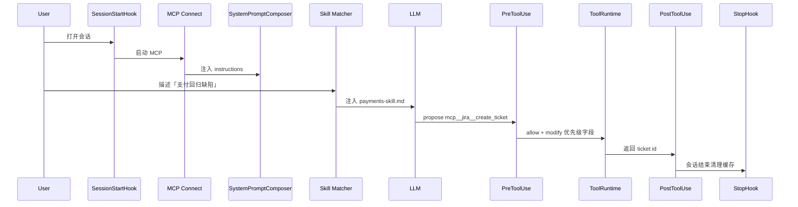
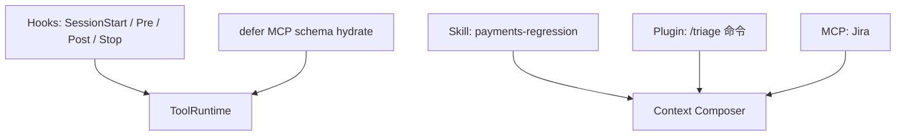

# 第十六部分 · 16.8 综合演练 — 从 Hooks 到 defer 的端到端蓝图

> **导航**：[← 16.7 defer_loading](./07-defer-loading.md) · [返回 16.1](./index.md)

---

## 学习目标

完成本节学习后，你应该能够：

1. **整合** 本部分知识点：在**同一虚构项目**中同时配置 **PreToolUse**、**Skill**、**Plugin 斜杠命令**、**MCP instructions** 与 **defer 工具加载**。
2. **演练** 一次完整会话：**SessionStart → 用户提交 → MCP 连接 → Skill 命中 → 模型发起 MCP 工具 → PreToolUse 审计 → PostToolUse 记录 → Stop 清理**。
3. **输出** 可交付团队的**检查清单**与**回滚策略**。
4. **复盘** Token、延迟、安全三者的权衡决策。

---

## 生活类比：开一家「受控自动化」咖啡店

你要开一家店：

- **MCP** 是**外部原料供应商**，每天送货时附**当天品控说明**（instructions 注入）。
- **Skill** 是**员工手册**里的「客诉处理 SOP」。
- **Plugin `/refund`** 是收银机上的**退款专用键**（自定义命令），规定**只能店长按**（`disable-model-invocation`）。
- **PreToolUse** 是**店长在出杯前最后一眼**：发现异常配方立刻 **block**。
- **defer_loading** 是**库房按需取豆**：早上不把 30 种豆子全倒上台面。

---

## 演练场景设定

| 要素 | 取值 |
|------|------|
| 仓库 | `payments-service` monorepo |
| MCP | `mcp__jira__create_ticket` |
| 风险 | 禁止模型自动建高优先级工单 |
| 合规 | 所有 MCP 调用写审计日志 |

---

## Mermaid：端到端序列（综合）



---

## Mermaid：组件依赖图



---

## 配置蓝图（示意 YAML）

```yaml
hooks:
  - event: SessionStart
    callback: { kind: shell, command: ./scripts/bootstrap-audit.sh }
  - event: PreToolUse
    matcher: { type: prefix, value: 'mcp__jira__' }
    callback: { kind: shell, command: ./scripts/jira-guard.sh }
  - event: PostToolUse
    matcher: { type: prefix, value: 'mcp__' }
    callback: { kind: http, url: https://audit.internal/mcp }
  - event: Stop
    callback: { kind: shell, command: ./scripts/teardown-cache.sh }

skills:
  searchPaths: ['.claude/skills']

plugins:
  - path: ./plugins/payments-plugin

mcp:
  servers:
    - id: jira
      command: npx
      args: ['-y', '@example/mcp-jira']

tools:
  deferLoading: true
```

---

## Skill 摘要（示意）

```markdown
---
name: payments-regression
description: 当讨论支付回归、对账、退款链路时启用
allowed-tools: FileRead, Grep, mcp__jira__create_ticket
---
## 流程
1. 定位相关模块 `payments/`.
2. 列出潜在边界条件。
3. 如需工单，仅使用 Jira MCP，并设置优先级为 Low，除非用户显式授权。
```

---

## Plugin 命令片段（示意）

```markdown
---
command: triage
description: 人工触发高优先级工单流程（需审批）
disableModelInvocationFor:
  - mcp__jira__create_ticket
---
用户已显式运行 /triage。允许以下例外：……
```

---

## PreToolUse 决策表（演练）

| 调用 | 决策 | 理由 |
|------|------|------|
| `mcp__jira__create_ticket` priority=High | block | 无 `/triage` |
| 同上 priority=Low | allow | 符合 Skill |
| `Bash` `curl` 外网 | block | 数据外泄 |

---

## defer_loading 演练步骤

| 步骤 | 操作 | 观察 |
|------|------|------|
| 1 | 冷启动会话 | 首屏时间 |
| 2 | 首次触发 Jira 工具 | `hydrate_ms` 峰值 |
| 3 | 第二次调用 | 命中缓存 |

---

## 回滚策略

| 层级 | 动作 |
|------|------|
| L1 | 关闭单个 Hook |
| L2 | 禁用插件 manifest |
| L3 | `defer_loading: false` 临时恢复 eager |
| L4 | 断开 MCP |

---

## Token 复盘表

| 片段 | 粗估影响 |
|------|----------|
| MCP instructions | +0.5–2k tokens |
| Skill 正文 | +0.2–1k |
| 工具 schema（defer 后） | 首调前较小 |

---

## 团队分工 RACI

| 工作 | R | A | C | I |
|------|---|---|---|---|
| Hook 策略 | 安全 | 平台负责人 | SRE | 研发 |
| Skill 内容 | 业务架构 | 工程经理 | QA | 全员 |
| Plugin 发布 | 工具链 | 发布经理 | 安全 | 用户 |

---

## 常见问题 FAQ

| 问题 | 回答方向 |
|------|----------|
| 演练环境？ | 独立 staging + 假 Jira |
| 失败重试？ | PostToolUse 应幂等 |
| 成本谁买单？ | MCP + LLM 双计费 |

---

## 交付物清单

| 交付物 | 格式 |
|--------|------|
| Hook 脚本 | `scripts/*.sh` + 单元测试 |
| Skill 库 | `.claude/skills/*.md` |
| Plugin | `plugins/.../plugin.json` |
| 运行手册 | 本节 + 内部 wiki |

---

## 小结

- 本演练把 **Hooks / Skills / Plugins / MCP / defer** 穿成一条**可审计**链路。
- **PreToolUse** 是安全闸，**Skill** 是流程，**Slash** 是人工钥匙，**defer** 是性能垫。
- **回滚分层**与 **RACI** 让实验可进可退。

---

## 课后自测（大作业）

1. 将示意 YAML 转为你团队真实路径，并列出三条验证命令。
2. 写一次「事故复盘」模板：当 PreToolUse 误 block 时如何快速旁路。
3. 估算全链路 P99：从用户发送到 MCP 首次返回。

---

## 本部分回顾（16.1–16.8）

| 节 | 关键词 |
|----|--------|
| 16.1 | 六事件、总览、三件套 |
| 16.2 | PreToolUse、MCP 匹配 |
| 16.3 | Skills、allowed-tools |
| 16.4 | Plugins、disable-model-invocation |
| 16.5 | MCP instructions 注入 |
| 16.6 | Slash 命令 |
| 16.7 | defer_loading、缓存 |
| 16.8 | 综合演练 |

---

**上一节**：[16.7 defer_loading](./07-defer-loading.md)  
**返回**：[16.1 总览](./index.md)
