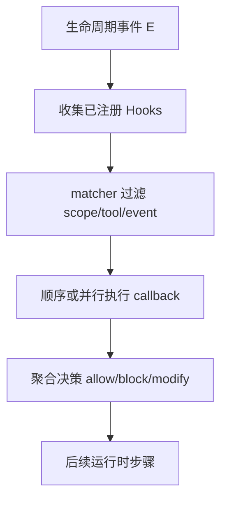
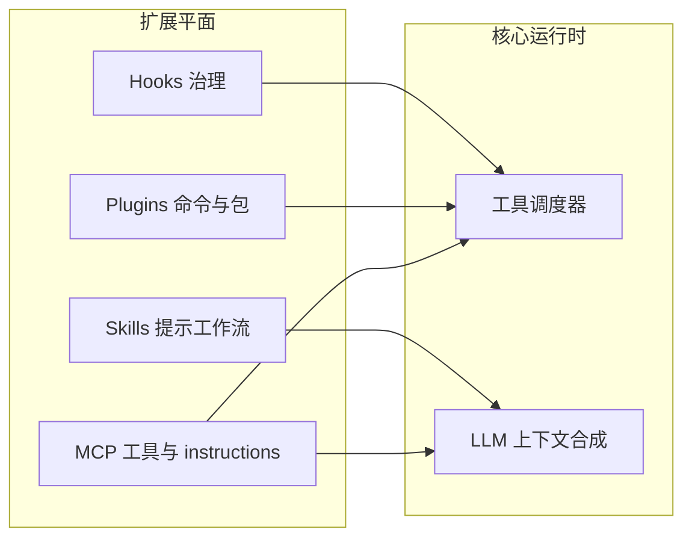

# 第十六部分 · Hooks / Skills / Plugins 生态（16.1）— 扩展点总览

> **导航**：本部分共 8 节。本节建立**钩子（Hooks）**、**技能（Skills）**、**插件（Plugins）**三者的边界与协作模型；后续各节深入 `PreToolUse`、Skills、Plugins、MCP 注入、斜杠命令、延迟加载与综合演练。

---

## 学习目标

完成本节学习后，你应该能够：

1. **定义** **Hooks**：用户声明的 **Shell / HTTP / LLM** 回调，在运行时**特定生命周期点**被调度执行。
2. **枚举** **六个 Hook 事件**：`SessionStart`、`UserPromptSubmit`、`PreToolUse`、`PermissionRequest`、`PostToolUse`、`Stop`。
3. **对比** **Skills**（基于 Markdown 的轻量工作流，可声明 `allowed-tools`）与 **Plugins**（更重：自定义命令、独立目录配置、`disable-model-invocation` 等硬性标记）。
4. **叙述** 端到端管线：**事件触发 → 收集注册 Hooks → matcher 过滤 → callback 执行 → 聚合决策**（`allow` / `block` / `modify`）。
5. **预告** **MCP 动态指令注入**、**斜杠自定义命令**、**defer_loading** 与本部分的衔接章节。

---

## 生活类比：机场联检流水线

把一次完整的 Claude Code 会话想象成**国际航班抵达通道**：

- **SessionStart**：航班靠桥，边检系统**开机自检**（环境变量、工作区、MCP 连接）。
- **UserPromptSubmit**：旅客递交入境卡——Hook 可**预审**表单（过滤敏感词、附加审计 ID）。
- **PreToolUse**：行李过 **X 光机**：可 **放行 / 扣留 / 改贴标签**（改写工具名与参数）。
- **PermissionRequest**：海关抽查需**人工柜台**——Hook 可自动批准或升级审批。
- **PostToolUse**：行李离开传送带后**二次拍照存档**（写日志、同步外部工单）。
- **Stop**：旅客离开隔离区——做**清场与埋点**。

**Skills**像「**海关张贴的多语言告示**」：轻量、可复制、告诉模型**遇到某类场景必须按某流程走**。**Plugins**像「**航站楼里的特许经营店**」：自带装修（目录结构）、员工手册（命令）、甚至「禁止总部代下单」（`disable-model-invocation`）。

---

## 三件套对比总表

| 维度 | Hooks | Skills | Plugins |
|------|-------|--------|---------|
| **载体** | 配置 + 脚本/HTTP/LLM | Markdown + 元数据 | 包/目录 + manifest |
| **主要用途** | 治理、审计、拦截 | 工作流模板、工具白名单提示 | 命令、深度集成、强约束 |
| **执行时机** | 生命周期事件 | 模型匹配场景时注入 | 安装期 + 运行期 |
| **能否阻止工具** | 是（尤其 PreToolUse） | 间接（提示 + allowed-tools） | 依实现；常配合 Hooks |
| **典型用户** | 平台/安全团队 | 团队模板作者 | 扩展开发者 |

---

## 六个 Hook 事件速查

| 事件 | 触发时机（概念） | 典型用途 |
|------|------------------|----------|
| `SessionStart` | 会话建立后尽早 | 环境探测、注入审计上下文 |
| `UserPromptSubmit` | 用户消息进入管线前 | 过滤、改写、附加标签 |
| `PreToolUse` | 工具调用执行前 | **拦截/改写/允许** |
| `PermissionRequest` | 需要显式授权时 | 自动策略、工单联动 |
| `PostToolUse` | 工具返回后 | 日志、同步外部 CMDB |
| `Stop` | 会话或任务终止 | 清理、指标上报 |

---

## Mermaid：Hook 管线总览



---

## Mermaid：Skills / Plugins / MCP 共生



---

## 源码片段：Hook 注册表（示意）

```typescript
// hooks-registry.ts（示意）
export type HookEvent =
  | 'SessionStart'
  | 'UserPromptSubmit'
  | 'PreToolUse'
  | 'PermissionRequest'
  | 'PostToolUse'
  | 'Stop';

export type HookCallback =
  | { kind: 'shell'; command: string }
  | { kind: 'http'; url: string; method: 'POST' | 'GET' }
  | { kind: 'llm'; model: string; promptTemplate: string };

export interface RegisteredHook {
  id: string;
  event: HookEvent;
  matcher?: ToolMatcher;
  callback: HookCallback;
  priority: number;
}
```

```typescript
// hook-runner.ts（示意）
export async function dispatchHooks(
  event: HookEvent,
  payload: HookPayload,
  hooks: RegisteredHook[]
): Promise<HookDecision> {
  const candidates = hooks
    .filter((h) => h.event === event)
    .filter((h) => !h.matcher || matchTool(h.matcher, payload.tool))
    .sort((a, b) => a.priority - b.priority);

  let decision: HookDecision = { type: 'allow' };
  for (const h of candidates) {
    const partial = await runCallback(h.callback, payload);
    decision = mergeDecisions(decision, partial);
    if (decision.type === 'block') break;
  }
  return decision;
}
```

---

## `PreToolUse` 为何被单独成章？

| 原因 | 说明 |
|------|------|
| **权力最大** | 可直接改变工具调用图 |
| **安全关键** | 数据外泄、破坏性命令多在此拦截 |
| **复杂匹配** | 支持 MCP 工具名如 `mcp__server__tool` |
| **决策三态** | `allow` / `block` / `modify` |

详见 [16.2 PreToolUse](./02-pre-tool-use.md)。

---

## Skills 核心句柄：`allowed-tools`

Skills Markdown  frontmatter 中常见：

```yaml
---
name: sql-migration-review
allowed-tools: Bash, Grep, FileRead
---
```

运行时可将此清单与**系统策略**合并，迫使模型在匹配场景下**优先**调用声明工具（具体 enforcement 以版本为准）。

---

## Plugins 的「重型」特征（节选）

| 特征 | 含义 |
|------|------|
| 自定义命令 | 新增斜杠或 CLI 子命令 |
| 独立目录 | 资源隔离、版本升级 |
| `disable-model-invocation` | 硬性禁止模型自动调用某些路径 |

详见 [16.4 Plugins](./04-plugins.md)。

---

## MCP 与系统提示词

MCP 设备连接成功后，其 **`instructions` 字段**常被**动态拼接**进系统提示词，使模型「知道」此外设的约束与能力。见 [16.5](./05-mcp-injection.md)。

---

## defer_loading（预告）

工具注册表可使用 **延迟加载**避免冷启动时一次性解析全部工具定义，保护本地缓存与首屏时延。见 [16.7](./07-defer-loading.md)。

---

## 与本指南其他部分的衔接

| 概念 | 参考 |
|------|------|
| 工具系统 | 第六部分 |
| 权限模型 | 第七部分 |
| Feature Flags | 第十五部分 |

---

## 常见问题 FAQ

| 问题 | 回答方向 |
|------|----------|
| Hooks 会显著拖慢吗？ | Shell/HTTP 可能；需超时与并发控制。 |
| Skills 能替代单元测试？ | 不能；它是流程与提示治理。 |
| Plugins 与 MCP 冲突吗？ | 正交；注意工具名空间去重。 |

---

## 小结

- **Hooks** = 生命周期回调 + 决策聚合；**PreToolUse** 是皇冠上的明珠。
- **Skills** = Markdown 轻量封装 + 工具白名单语义。
- **Plugins** = 重型扩展面；**MCP** 动态注入 instructions；**defer_loading** 优化工具加载。

---

## 课后自测

1. 将六个事件按时间顺序手写排列，并各举一例非安全类用途。
2. 画一张 Venn 图文字描述：Skills 与 Plugins 的重叠与差异。
3. 解释「matcher 过滤」在 O(n) Hook 列表下的性能注意点。

---

**下一节**：[16.2 PreToolUse — 拦截、放行与改写](./02-pre-tool-use.md)
