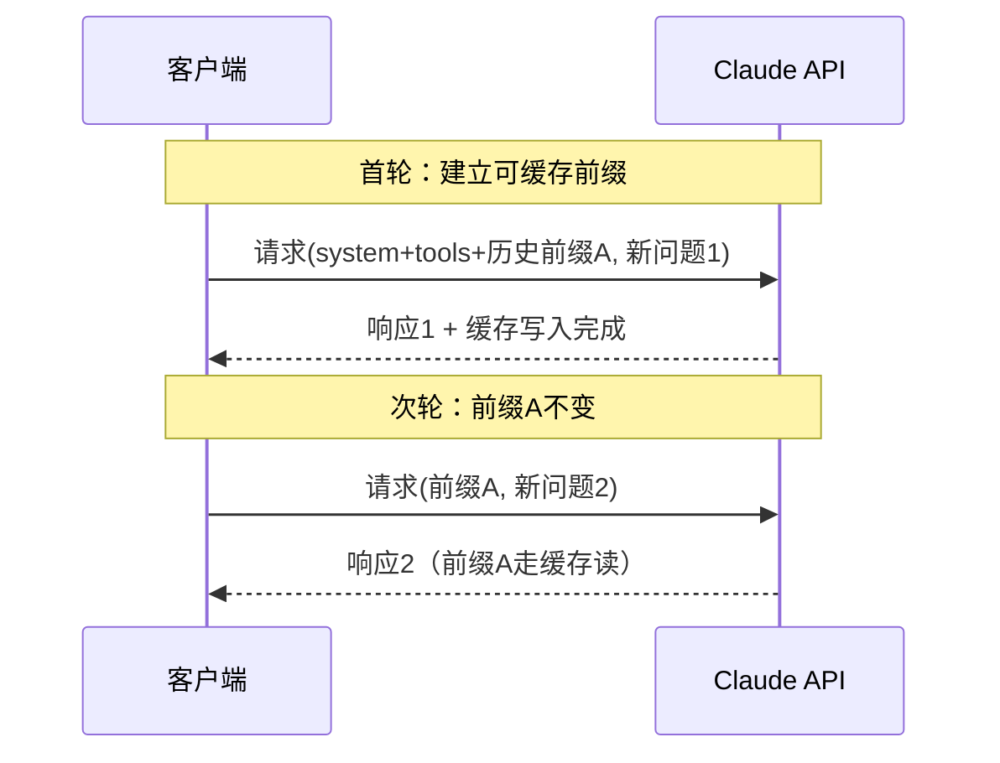
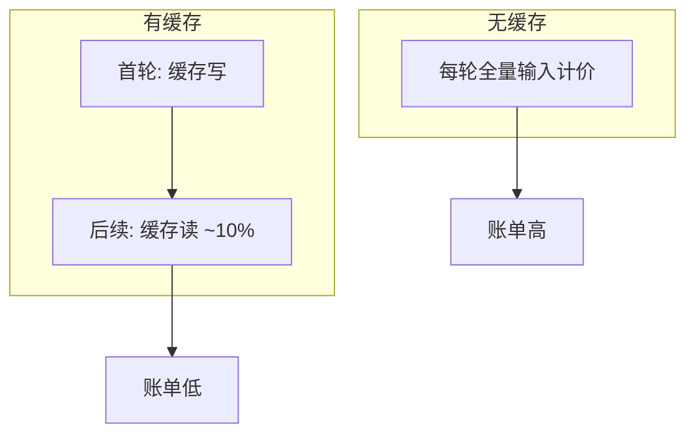

# 17.2 Prompt 缓存：从「每轮全价」到「前缀命中」

> **本节焦点**：Prompt Caching 如何把重复出现的**长前缀**从「全价输入」变成「低价缓存读」，从而在长会话中实现数量级节省。

---

## 学习目标

1. **说明** Prompt 缓存的「前缀一致」原理与**字节级**匹配直觉。
2. **量化** 无缓存与有缓存场景下，100 轮 Opus 会话的成本区间（教学用：**$50–100** vs **$10–19**，约 **80%** 节省）。
3. **解释** 缓存读取成本约为正常输入 **10%**（Sonnet：**$0.375 vs $3 / 百万**）意味着什么。
4. **列举** 提高命中率的工程手段：稳定 system、工具顺序固定、避免无意义抖动。
5. **规避** 反模式：在每轮前缀末尾追加时间戳、随机 UUID 等「破坏前缀」的做法。

---

## 生活类比：图书馆编目与「快速取书」

想象你在写博士论文，每天都要引用同一套**基础参考书目 + 实验室安全守则**（几十页）。  

- **无缓存**：每天去图书馆，馆员把**整套守则重新复印一遍**再给你 —— 贵、慢。  
- **有缓存**：第一天「登记入库」（**缓存写**，一次性较贵），之后只给你**索书号条**（**缓存读**，极便宜）。

模型侧的「前缀」就是那套**永远不变的章节目录**；你每轮新问的问题只是**目录后面的新页**。

---

## 核心数据（教学用）

| 场景 | 粗算账单（示意） | 相对 |
|------|------------------|------|
| 100 轮会话，**无缓存**，Opus 档 | **约 $50–100** | 基准 100% |
| 同会话，**有缓存**、高中命中率 | **约 $10–19** | **约节省 80%** |
| Sonnet 缓存**读** vs 正常**输入** | $0.375 / M vs $3 / M | 读 ≈ **10%** 输入价 |

> 注：真实数字取决于每轮输入输出 Token、前缀长度、是否跨模型失效等。此处强调**数量级**。



---

## 源码片段（概念）：标记可缓存块

Anthropic 系 API 常见模式是在消息结构中标注 `cache_control`。下面为**教学伪代码**：

```typescript
// 教学伪代码：展示「前缀可缓存」思想
const stablePrefix = [
  {
    type: "text",
    text: SYSTEM_PROMPT + TOOL_SCHEMAS_FROZEN_ORDER,
    cache_control: { type: "ephemeral" }, // 示意：可缓存段
  },
];

const userTurn = {
  type: "text",
  text: userMessage, // 通常不放 cache_control，避免污染前缀键
};

async function sendTurn(history: Message[]) {
  return await anthropic.messages.create({
    model: "claude-3-5-sonnet-latest",
    system: stablePrefix,
    messages: history,
    tools: toolsPossiblyCached,
  });
}
```

**要点**：

- **可缓存段**应尽可能**长且稳定**。
- **易变字段**（时间、随机 id）应放在**前缀之后**，否则整段前缀失效。

---

## 命中率工程检查表

| 检查项 | 建议 | 反例 |
|--------|------|------|
| system 文本 | 版本化、可复用 | 每轮插入 `Date.now()` |
| 工具列表顺序 | 固定排序 | 按对象哈希无序遍历 |
| 依赖文件摘要 | 摘要 hash 变才更新 | 全量文件每轮重传 |
| 模型与 endpoint | 切换可能使缓存失效 | 频繁 A/B 切模型 |

---

## 成本对比表：同一 100 轮会话

假设（简化）：每轮除前缀外新增 2k 输入、1k 输出；前缀合计 80k Token；Opus 输入 $15/M、输出 $75/M。

| 模式 | 前缀每轮计费方式 | 100 轮前缀累计（示意） |
|------|------------------|------------------------|
| 无缓存 | 80k × 100 × 全价输入 | 极高 |
| 有缓存 | 首轮写 + 99 轮读（~10% 价） | 显著下降 |



---

## 与 Sonnet 定价的联动

当团队默认 **Sonnet** 时：

- **正常输入 $3/M** 是「未命中」锚点。
- **缓存读 $0.375/M** 让你愿意把「稳定知识」往前放。
- **缓存写 $3.75/M** 提醒：**不要为极小前缀启用缓存** —— 可能得不偿失。

| Token 类型 | Sonnet 示意单价 | 策略含义 |
|------------|-----------------|----------|
| 输入（全价） | $3/M | 压缩可变部分 |
| 缓存读 | $0.375/M | 扩大稳定前缀 |
| 缓存写 | $3.75/M | 控制「重写」频率 |

---

## 调试：如何知道「命中了没有」

真实集成应读取：

- API 响应中的 **usage** 字段（`cache_creation_input_tokens`、`cache_read_input_tokens` 等，以官方字段名为准）。
- 内部仪表盘：命中率、每轮前缀长度分布。

**教学用日志片段（伪）：**

```json
{
  "usage": {
    "input_tokens": 1200,
    "cache_creation_input_tokens": 0,
    "cache_read_input_tokens": 80000,
    "output_tokens": 900
  }
}
```

当 `cache_read_input_tokens` 与「稳定前缀长度」接近时，说明工程目标达成。

---

## 与子 Agent 缓存的衔接（预告 17.5）

多 Agent 若统一以同一字符串开头，例如：

`Fork started — processing in background`

则不同进程的请求在**字节级前缀**上对齐，利于共享同一缓存键空间（具体以平台实现为准）。详见 `05-sub-agent-cache.md`。

---

## 常见面试式问答

**Q：缓存会降低模型「聪明度」吗？**  
A：缓存是**传输与计费**优化，不改变模型权重；但若错误地把动态状态放进「假稳定」前缀，会造成**陈旧上下文**问题，那是工程失误而非缓存本身。

**Q：小团队要不要上缓存？**  
A：只要存在**长 system + 多工具 + 长会话**，通常**值得**；短问答收益有限。

---

## 自测

1. 用 Sonnet 价：80 万 Token 前缀若全走缓存读，输入侧费用约多少美元？
2. 举三种「破坏前缀」的代码写法。
3. 解释「缓存写」为何可能比「普通输入」更贵或同量级（查表对比 $3.75 vs $3）。

---

## 小结

- **无缓存**长会话可在 Opus 档达到 **$50–100（百轮示意）**；**有缓存**可压到 **$10–19**，**约 80%** 节省是合理宣传口径（视场景浮动）。
- **缓存读 ≈ 正常输入 10%**（Sonnet：**$0.375 / $3**）是记忆锚点。
- 工程核心是：**长且稳的前缀 + 有序工具 + 无随机污染**。

---

*上一节：[index.md](./index.md) · 下一节：[03-parallel-prefetch.md](./03-parallel-prefetch.md)*
