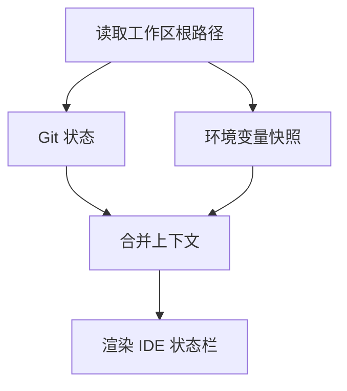

# 17.3 并行预取：启动路径上的「不等公交」

> **本节焦点**：在 Agent / IDE 启动阶段，**并行**拉取系统信息、Git 状态、环境检测，避免串行等待造成的秒级甚至十秒级卡顿。

---

## 学习目标

1. **对比** 串行 `await A; await B; await C` 与 `Promise.all` 的总耗时模型。
2. **设计** 启动阶段任务DAG：哪些可并行、哪些必须顺序（例如依赖 `$PATH` 的检测）。
3. **解释** 并行预取与 **Token 账单** 的关系：主要改善 **延迟与体验**，间接减少人类因等待而重试。
4. **识别** 资源争用风险：磁盘 IO、Git 锁、CPU 密集检测的背压策略。
5. **落地** 可观测性：为每个预取任务打点耗时（衔接第 18 篇）。

---

## 生活类比：出差前的「并行收拾行李」

串行像：**先找袜子 → 再找充电器 → 再订车**，每一步干等。  
并行像：**袜子、充电器、订车同时进行**，最后在一个「汇合点」检查是否齐全。  
前提是：**订车不依赖袜子是否穿好** —— 依赖关系要画清。

---

## 串行 vs 并行：时间线直觉

```mermaid
gantt
  title 启动预取（示意）
  dateFormat X
  axisFormat %Ls
  section 串行
  系统信息 :a1, 0, 200
  Git状态  :a2, after a1, 300
  环境检测 :a3, after a2, 150
  section 并行
  系统信息 :b1, 0, 200
  Git状态  :b2, 0, 300
  环境检测 :b3, 0, 150
```



并行墙钟时间 ≈ **max(200,300,150)=300ms**；串行 ≈ **650ms**。

---

## 源码片段：并行预取骨架

```typescript
// 教学示例：启动时并行预取
type PrefetchResult = {
  sys: SystemInfo;
  git: GitStatus;
  env: EnvironmentProbe;
};

async function prefetchAll(signal: AbortSignal): Promise<PrefetchResult> {
  const sysP = getSystemInfo({ signal });
  const gitP = getGitStatus({ signal });
  const envP = probeEnvironment({ signal });

  const [sys, git, env] = await Promise.all([sysP, gitP, envP]);
  return { sys, git, env };
}

// 在应用入口
async function bootstrap() {
  const ac = new AbortController();
  const prefetch = prefetchAll(ac.signal);
  renderSplash(); // 不阻塞在空白屏
  const ctx = await prefetch;
  mountAgentUI(ctx);
}
```

**要点**：

- 统一 **`AbortSignal`**：用户取消启动或超时合并时一并取消子任务。
- **先渲染壳子**再等待数据，改善感知性能。

---

## 任务分类表

| 任务 | 典型耗时来源 | 并行安全？ | 备注 |
|------|----------------|-----------|------|
| `uname` / OS 版本 | 进程 spawn | 是 | 注意沙箱权限 |
| `git status` | 仓库大小 | 通常 | 大仓库可加超时 |
| Node/Bun 版本 | `process.version` | 是 | 极快 |
| MCP 服务发现 | 网络 | 视情况 | 建议独立超时 |
| 读取超大 `.env` | 磁盘 | 是 | 应限制读取大小 |

---

## 依赖 DAG（何时不能并行）



若 **B 必须知道根路径**，则 **A 先于 B**；**C 与 B** 在 A 之后可并行。

---

## 进阶：限制并发与优先级

并行不是「无限线程」：

```typescript
async function prefetchWithPool<T>(
  tasks: Array<() => Promise<T>>,
  limit: number
): Promise<T[]> {
  const results: T[] = [];
  let i = 0;
  async function worker() {
    while (i < tasks.length) {
      const idx = i++;
      results[idx] = await tasks[idx]();
    }
  }
  await Promise.all(Array.from({ length: limit }, worker));
  return results;
}
```

适用于：**数十个** MCP 探测或子目录扫描，避免把机器打满。

---

## 与 Token 经济学的关系

| 维度 | 说明 |
|------|------|
| 直接计费 | 预取本地信息通常**不走模型**，不耗 Token |
| 间接计费 | 卡顿 → 用户取消 → 重试 → **重复发送上下文** |
| 团队体验 | 快启动 → 更少「抱怨式」加长 system 来解释环境 |

---

## 错误处理：一个失败要不要全失败？

| 策略 | 适用 |
|------|------|
| `Promise.all` 全失败 | 强一致：缺 Git 就不能工作 |
| `Promise.allSettled` 部分成功 | IDE 可降级：无 Git 仍可用 |
| 超时兜底 | 网络类预取必备 |

```typescript
async function withTimeout<T>(p: Promise<T>, ms: number, label: string): Promise<T> {
  let to: ReturnType<typeof setTimeout>;
  const timeout = new Promise<never>((_, rej) => {
    to = setTimeout(() => rej(new Error(`${label} timeout`)), ms);
  });
  try {
    return await Promise.race([p, timeout]);
  } finally {
    clearTimeout(to);
  }
}
```

---

## 与懒加载的边界（预告 17.4）

**预取**解决「启动时要已知的全局状态」；**懒加载**解决「工具/schema 不必一次性进上下文」。二者互补：

- 预取：**墙钟时间**优化。
- 懒加载：**上下文体积**优化。

---

## 检查清单

- [ ] 所有预取任务是否支持 **abort**？
- [ ] 是否为 **git / 网络** 设了 **超时**？
- [ ] 是否在 UI 上暴露 **「仍在加载」** 而非白屏？
- [ ] 日志是否带 **任务名 + 耗时**？

---

## 自测

1. 画出一个你熟悉项目的启动 DAG。
2. 解释为何 `Promise.all` 中任一 reject 会导致整体 reject，以及如何用 `allSettled` 改进。
3. 并行预取如何**间接**降低 Token 成本？

---

## 小结

- **并行预取**把系统信息、Git、环境检测从「串行加法」变成「并行取 max」，是启动性能的基本盘。
- 配好 **AbortSignal、超时、部分成功** 才能在真实仓库与弱网下站稳。
- 与 **缓存、懒加载** 组合，形成「快 + 省」的双轮驱动。

---

*上一节：[02-prompt-caching.md](./02-prompt-caching.md) · 下一节：[04-lazy-loading.md](./04-lazy-loading.md)*
