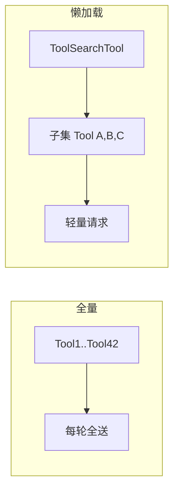
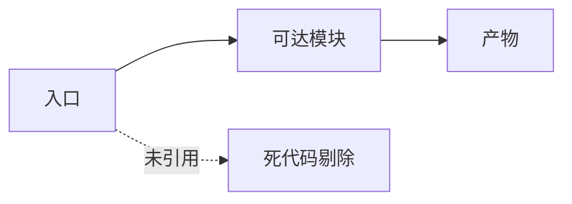
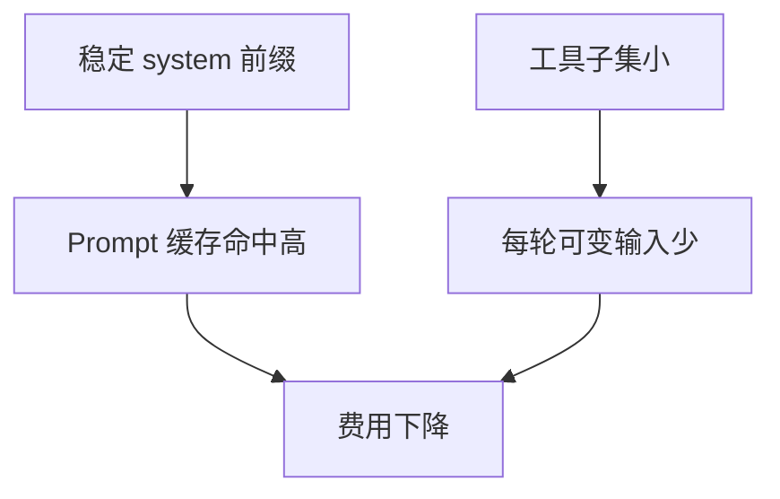

# 17.4 懒加载：四十二般兵器不必一次背上身

> **本节焦点**：将 **42 个工具**（教学口径）从「启动全量加载」改为**按需加载**：通过 **ToolSearchTool 注入**、**条件 `require`** 等机制，削减每轮请求中的 schema 体积。

---

## 学习目标

1. **解释** 全量工具加载如何线性放大 **输入 Token**（工具 JSON Schema 之和）。
2. **描述** `ToolSearchTool` 式「元工具」如何把「工具目录」与「当前可用工具子集」分离。
3. **实现** 条件 `require` / 动态 `import()` 的边界：Node/Bun 下的冷启动与循环依赖注意点。
4. **对比** 懒加载与 **Prompt 缓存**：前者减「每轮子集」，后者减「重复前缀」。
5. **制定** 工具分层策略：核心工具常驻、领域工具按项目类型启停。

---

## 生活类比：瑞士军刀 vs 工具箱在车库里

若你每次出门都把**整个车库**背在背上（全量工具），走路都费劲。  
懒加载是：**口袋里只留一把常用小刀**（核心工具），需要电钻时**回家取**（动态加载）或通过**目录卡片**（ToolSearch）让店员递给你。

---

## 问题陈述：Schema 体积爆炸

假设每个工具定义平均 **1.5k Token**（示意）：

| 策略 | 每轮附带 schema 量 | 42 工具示意 |
|------|-------------------|-------------|
| 全量加载 | 全部 | ~63k Token 仅工具 |
| 懒加载 + 子集 | 5–8 个常用 | ~9–12k Token |



---

## 源码片段：ToolSearchTool 注入模式（概念）

```typescript
// 概念：元工具返回「可加载工具名列表」或「内联说明」
const toolSearchTool = {
  name: "tool_search",
  description: "根据用户意图检索可调用工具的名称与摘要。",
  input_schema: {
    type: "object",
    properties: {
      query: { type: "string" },
    },
    required: ["query"],
  },
  async run({ query }: { query: string }) {
    const hits = searchToolCatalog(allToolMetadata, query); // 仅元数据，非全 schema
    return { tools: hits.map((h) => h.name) };
  },
};

// 会话状态：当前已「挂载」的工具
let mountedTools = new Set<string>(["read_file", "grep", "tool_search"]);

function buildAnthropicTools() {
  return [...mountedTools].map((name) => loadToolSchema(name));
}
```

**流程**：

1. 首轮只挂载 **核心 + tool_search**。
2. 模型调用 `tool_search` → 返回 `["docker_exec", "k8s_apply"]`。
3. 运行时 `mountedTools.add(...)` 并 **动态拉取** 对应 schema。

---

## 条件 require 与动态 import

### CommonJS 风格（示意）

```javascript
function loadExecutor(name) {
  if (name === "git") return require("./executors/git");
  if (name === "npm") return require("./executors/npm");
  throw new Error(`unknown ${name}`);
}
```

### ESM 动态 import（推荐）

```typescript
async function loadToolModule(name: string) {
  switch (name) {
    case "git":
      return import("./tools/git.js");
    case "container":
      return import("./tools/container.js");
    default:
      throw new Error(`unknown tool ${name}`);
  }
}
```

| 方式 | 优点 | 注意 |
|------|------|------|
| `require` 条件分支 | 简单 | 打包器需识别以拆分 chunk |
| `import()` | 标准 ESM | 需 `await`，错误处理异步化 |

---

## 死代码消除：Bun 打包与 tree shaking

**Tree shaking** 指 bundler 基于静态分析**删除从未被引用的导出**，减小产物体积与解析成本。Bun 在 `bun build` 时会做死代码消除；与懒加载结合时，注意 **import 路径可静态解析**。

| 实践 | 作用 |
|------|------|
| `sideEffects: false` | 告诉打包器哪些包可安全摇树 |
| 避免 `export *` 滥用 | 减少「误保留」导出 |
| 动态 `import("./x")` + `--splitting` | 罕见工具进独立 chunk，主包更瘦 |



**教学命令（示意）：**

```bash
bun build ./src/main.tsx --outdir=dist --minify --splitting
```

懒加载若在源码层写成**静态字符串路径**，`bun build --splitting` 更易生成独立 chunk；若路径完全动态（如 `import(\`./tools/${name}\`)`），需配置或白名单，否则可能**无法分块**或**整包打入**。

---

## 工具分层表（建议模板）

| 层级 | 示例工具 | 加载策略 |
|------|----------|----------|
| L0 核心 | read, write, grep, glob | 会话开始即挂载 |
| L1 通用 | run_terminal_cmd, mcp_list | 第二批或首次使用时 |
| L2 领域 | k8s, terraform, ios | 项目探测后注入 |
| L3 罕见 | 许可证生成器 | 仅 tool_search 命中 |

---

## 与 Prompt 缓存的联合效果



- **缓存**优化「重复的大前缀」。
- **懒加载**优化「每轮都在变的工具块」若也能稳定成「当前挂载集合」则更可预测。

---

## 反模式

| 反模式 | 后果 |
|--------|------|
| 每次挂载按随机顺序序列化工具 | 缓存键抖动 |
| tool_search 返回整份 schema | 元工具失去意义 |
| 懒加载不做并发锁 | 两次并行加载同一工具重复 IO |

**简单互斥锁示意：**

```typescript
const inflight = new Map<string, Promise<ToolDef>>();

async function getTool(name: string): Promise<ToolDef> {
  if (inflight.has(name)) return inflight.get(name)!;
  const p = loadToolSchema(name);
  inflight.set(name, p);
  try {
    return await p;
  } finally {
    inflight.delete(name);
  }
}
```

---

## 安全与权限

懒加载不是「隐藏能力」：

- ACL 仍应在 **执行层** 校验（谁允许 `docker`）。
- `tool_search` 应对 **敏感工具** 打标签，默认不向某些工作区暴露。

---

## 观测指标

| 指标 | 含义 |
|------|------|
| 平均每轮挂载工具数 | 懒加载是否过「碎」 |
| tool_search 调用率 | 模型是否常找不到工具 |
| 动态 import 失败次数 | 打包路径/权限问题 |

---

## 自测

1. 用假设计算：42×1.5k vs 8×1.5k Token 的输入侧费用差（Sonnet $3/M）。
2. 说明 ToolSearchTool 与「把 42 个 schema 全写进 system」的本质差异。
3. 为何工具顺序稳定对缓存友好？

---

## 课堂扩展：伪代码 —— 会话状态机

```typescript
type SessionState = {
  mounted: Set<string>;
  projectFlavor: "node" | "go" | "unknown";
};

function onProjectDetected(s: SessionState, flavor: SessionState["projectFlavor"]) {
  s.projectFlavor = flavor;
  if (flavor === "node") {
    ["npm_tool", "eslint_tool"].forEach((t) => s.mounted.add(t));
  }
}
```

---

## 小结

- **42 工具全量**加载是 **Token 与解析** 的双重税；**按需加载**是规模化必选项。
- **ToolSearchTool 注入**把「发现」与「装载」拆开，是常见架构模式。
- **条件 require / 动态 import** 应配合 **打包拆分** 与 **稳定顺序** 才能与缓存策略共振。

---

*上一节：[03-parallel-prefetch.md](./03-parallel-prefetch.md) · 下一节：[05-sub-agent-cache.md](./05-sub-agent-cache.md)*
