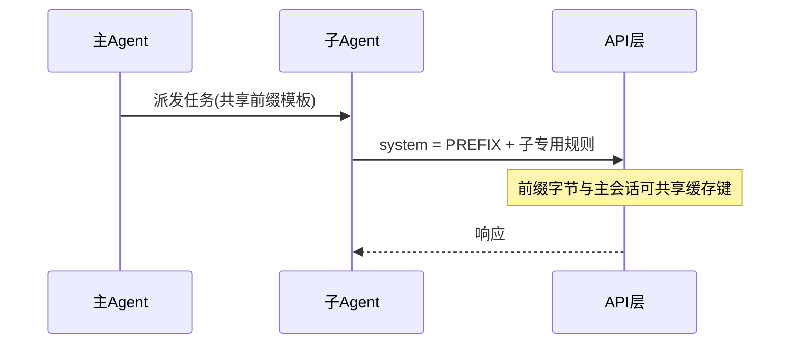
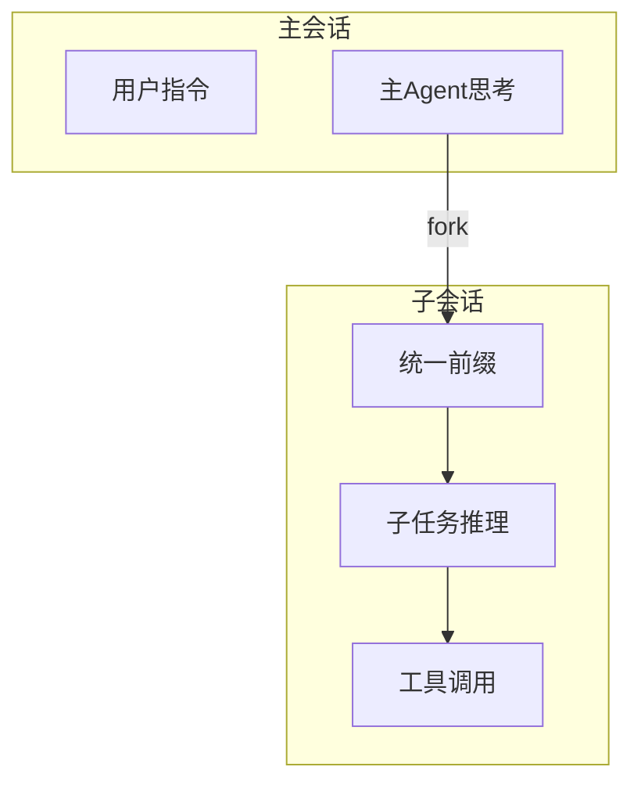

# 17.5 子 Agent 缓存：统一前缀与字节级命中

> **本节焦点**：多 Agent / 子进程协作时，通过**统一前缀**（教学示例：`Fork started — processing in background`）对齐请求开头，利用**字节级前缀匹配**提高 **Prompt 缓存**命中率。

---

## 学习目标

1. **解释** 为何「子 Agent 的首条可见文本」应**高度一致、可预测**。
2. **描述** 字节级前缀匹配与「字符串相等」的差异直觉（BOM、换行符、空格）。
3. **设计** 主 Agent 与子 Agent 的 **system 拼接规范**，避免一字之差导致整段失效。
4. **评估** 统一前缀对**可观测性**的好处：日志 grep、指标归类。
5. **规避** 在多语言环境下因翻译或本地化破坏前缀的问题。

---

## 生活类比：合唱团的「起调音」

主唱与子歌手若**同一音高起调**，指挥一挥手大家就对齐。  
若每个子歌手用**不同方言喊「开始」**，听众以为换了首歌 —— 缓存键「对不上」。

---

## 统一前缀模式

**教学用常量（勿在业务中硬编码魔法字符串而不文档化）：**

```typescript
export const SUB_AGENT_PUBLIC_PREFIX =
  "Fork started — processing in background\n";

export function wrapSubAgentSystem(base: string): string {
  return SUB_AGENT_PUBLIC_PREFIX + base;
}
```

| 要求 | 说明 |
|------|------|
| 固定 UTF-8 编码 | 避免平台默认编码差异 |
| 结尾换行一致 | `\n` vs `\r\n` 会导致前缀不同 |
| 不插入动态时间 | 时间戳应放在前缀之后 |



---

## 源码片段：主 / 子 共用缓存块

```typescript
// 共享：可缓存的稳定块（示意）
const SHARED_STABLE = {
  type: "text",
  text: CORPORATE_POLICY + TOOL_CATALOG_MINIMAL,
  cache_control: { type: "ephemeral" },
};

function buildMainSystem(extra: string) {
  return [SHARED_STABLE, { type: "text", text: extra }];
}

function buildSubSystem(role: string) {
  const header = SUB_AGENT_PUBLIC_PREFIX + `Role:${role}\n`;
  return [SHARED_STABLE, { type: "text", text: header }];
}
```

**关键**：`SHARED_STABLE` 在主、子请求中**逐字节相同**，最易命中。

---

## 字节级前缀匹配：工程师自查表

| 项目 | 检查 |
|------|------|
| BOM | 确保文件保存为 **无 UTF-8 BOM** 或全项目一致 |
| 空格 | 全角空格 `　` 与半角 ` ` 不同 |
| Unicode 规范化 | NFC vs NFD 可能不同（如 ä 组合字符） |
| 尾部空格 | 看似相同，实际多一个空格即失效 |

**Node 侧规范化（教学）：**

```typescript
import { normalize } from "node:path"; // 路径用
// 文本建议：统一 NFC
function toNfc(s: string) {
  return s.normalize("NFC");
}
```

---

## 与「Fork」语义的结合

统一前缀不仅是缓存，也是 **UX**：

- 用户在 Transcript 里搜索 `Fork started` 即可过滤子 Agent 输出。
- 告警规则可对包含此前缀的 span 单独采样。



---

## 失败案例库（教学）

| 现象 | 可能原因 |
|------|----------|
| 子 Agent 从未命中缓存 | 前缀中插入了 `pid` |
| 偶发命中 | 某些机器 `\r\n`、某些 `\n` |
| 升级后命中骤降 | 常量字符串「文案润色」改了两个字 |

---

## 与并行预取、懒加载的关系

| 机制 | 子 Agent 场景 |
|------|----------------|
| 并行预取 | 子 Agent 启动时并行拉取其工作副本状态 |
| 懒加载 | 子 Agent 仅挂载与其子任务相关的工具 |
| 统一前缀 | 与主会话共享 **大块稳定前缀** |

三者叠加：又快又省。

---

## 监控 SQL / 伪查询（示意）

```sql
-- 示意：按前缀聚合缓存读 Token
SELECT
  CASE WHEN prompt LIKE 'Fork started — processing%' THEN 'sub' ELSE 'main' END AS lane,
  SUM(cache_read_tokens) AS crt
FROM turns
GROUP BY 1;
```

---

## 安全注意

统一前缀**不是认证**：

- 仍应对子 Agent 的 **凭证** 做隔离（最小权限）。
- 前缀可公开，不要在其中放 **密钥**。

---

## 自测

1. 写出两种「肉眼相同但字节不同」的前缀变体。
2. 解释为何要把动态内容放在前缀之后。
3. 主、子共享 `SHARED_STABLE` 时，懒加载工具应如何影响共享块？

---

## 扩展阅读（概念）

- Unicode Normalization Forms（Unicode 标准）
- Anthropic Prompt Caching 文档中的「可缓存块」限制与失效条件

---

## 术语对照

| 英文 | 中文 |
|------|------|
| Prefix match | 前缀匹配 |
| Ephemeral cache | 短期/会话级缓存（依厂商定义） |
| Fork | 分支/子任务（进程或逻辑） |

---

## 小结

- **统一前缀** `Fork started — processing in background` 是教学示例，核心是 **跨 Agent 字节级一致**。
- **字节级细节**（换行、规范化、BOM）决定「真命中」还是「假一致」。
- 与 **共享可缓存块** 组合，是 multi-agent 降费的关键拼图。

---

*上一节：[04-lazy-loading.md](./04-lazy-loading.md) · 下一节：[06-render-performance.md](./06-render-performance.md)*
