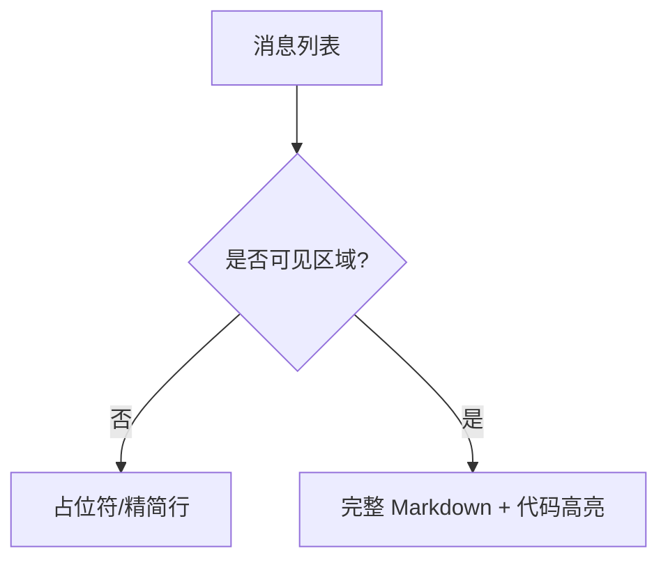
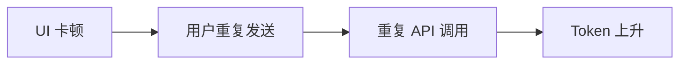

# 17.6 React 渲染性能：流畅 UI 如何「省下重试」

> **本节焦点**：在 Claude Code 类 IDE 界面中，通过 **虚拟滚动**、**条件渲染**、`React.memo` 等手段降低主线程压力，改善长会话体验，**间接**减少因卡顿导致的重复请求与 Token 浪费。

---

## 学习目标

1. **解释** 长 Transcript（数千消息）下 DOM 节点膨胀的问题。
2. **实现** 虚拟列表（windowing）的直觉模型与关键 props（item 高度估计、overscan）。
3. **使用** `memo` / `useMemo` / `useCallback` 的边界：何时有效、何时无效。
4. **设计** 条件渲染：折叠工具详情、懒渲染 Markdown 预览。
5. **连接** 性能与成本：流畅 UI → 更少误操作重试。

---

## 生活类比：超市价签

若超市把**一万件商品**的价签**同时贴在天花板上**（全量渲染），你抬头就累。  
虚拟滚动是：**只贴你眼前货架那一截**，你走它再换 —— **看得见的才存在**。

---

## 三大手段速览

| 手段 | 解决什么 | 典型 API |
|------|----------|----------|
| 虚拟滚动 | 长列表 DOM 过多 | `react-window`、`react-virtuoso` |
| 条件渲染 | 不可见模块仍 diff | `&&`、早期 return |
| memo | 子树 props 不变仍重渲染 | `memo`, `useMemo` |


---

## 源码片段：虚拟列表骨架

```tsx
import { FixedSizeList as List } from "react-window";

type Row = { id: string; role: "user" | "assistant"; text: string };

function TranscriptPane({ rows }: { rows: Row[] }) {
  const Row = ({ index, style }: { index: number; style: React.CSSProperties }) => (
    <div style={style}>
      <MessageBubble row={rows[index]} />
    </div>
  );

  return (
    <List
      height={600}
      itemCount={rows.length}
      itemSize={72}
      width="100%"
      overscanCount={8}
    >
      {Row}
    </List>
  );
}
```

**注意**：

- `itemSize` 若可变，需 **可变高度列表** 或 **测量缓存**。
- `MessageBubble` 内部仍应用 **memo** 避免行内重绘。

---

## memo 与稳定 props

```tsx
import { memo } from "react";

const MessageBubble = memo(function MessageBubble({ row }: { row: Row }) {
  return (
    <article>
      <header>{row.role}</header>
      <p>{row.text}</p>
    </article>
  );
});
```

**失效场景**：

| 情况 | 结果 |
|------|------|
| 父组件每次 `inline` 新对象 `{row}` | memo 无效 |
| `new Date()` 作 prop | 每帧变 |
| 子组件消费 Context 频繁变 | memo 挡不住 |

**对策**：`useCallback` / 拆分 Context / selector 库（如 zustand、`use-context-selector`）。

---

## 条件渲染：工具调用折叠

```tsx
function ToolCallCard({ call }: { call: ToolCall }) {
  const [open, setOpen] = useState(false);
  if (!open) {
    return (
      <button type="button" onClick={() => setOpen(true)}>
        {call.name}（点击展开参数）
      </button>
    );
  }
  return <HeavyJsonViewer value={call.args} />;
}
```

- **HeavyJsonViewer** 仅在展开时挂载，避免千次工具调用的 JSON 高亮拖垮页面。



---

## useMemo 用于昂贵派生

```tsx
function Stats({ rows }: { rows: Row[] }) {
  const tokenishEstimate = useMemo(() => {
    return rows.reduce((s, r) => s + r.text.length / 4, 0); // 粗估非精确
  }, [rows]);
  return <footer>≈ {tokenishEstimate.toFixed(0)} tokens</footer>;
}
```

避免每次父级无关 state 变化都 **O(n)** 扫描。

---

## 与流式输出的协同（衔接 17.7）

流式追加文本时：

- **虚拟列表**应 `scrollToItem` 或 sticky 到底部。
- **防抖**更新：每 16ms 合并多次 chunk，减少 React commit 次数。

```typescript
import { useEffect, useRef } from "react";

function useRafThrottle<T>(value: T, cb: (v: T) => void) {
  const raf = useRef<number | null>(null);
  useEffect(() => {
    if (raf.current != null) cancelAnimationFrame(raf.current);
    raf.current = requestAnimationFrame(() => cb(value));
    return () => {
      if (raf.current != null) cancelAnimationFrame(raf.current);
    };
  }, [value, cb]);
}
```

---

## 性能检查清单

- [ ] React DevTools Profiler：哪颗子树最红？
- [ ] 长会话采样：滚动 FPS 是否掉下 50？
- [ ] 内存： detached DOM 是否泄漏？

---

## 与 Token 成本的因果链



优化 UI 是 **成本治理** 的隐藏杠杆。

---

## 自测

1. 说明 `memo` 与 `useMemo` 分别缓存什么。
2. 虚拟列表 `overscanCount` 增大有何利弊？
3. 为何流式输出时要节流 React state 更新？

---

## 常见坑

| 坑 | 修复 |
|----|------|
| 列表 key 用 index | 重排时状态错乱，用稳定 id |
| 全局 dark mode Context | 拆分子树或 memo + 拆分 Provider |
| Markdown 全量 highlight | 延迟到可见或 Web Worker |

---

## 小结

- **虚拟滚动**治理长 Transcript；**条件渲染**推迟昂贵子树；**memo 家族**削减无效 diff。
- 与 **流式节流** 搭配，可把「跟手」做到极致。
- 流畅 UI 通过减少 **误操作重试** 间接保护 Token 预算。

---

*上一节：[05-sub-agent-cache.md](./05-sub-agent-cache.md) · 下一节：[07-streaming-pipeline.md](./07-streaming-pipeline.md)*
