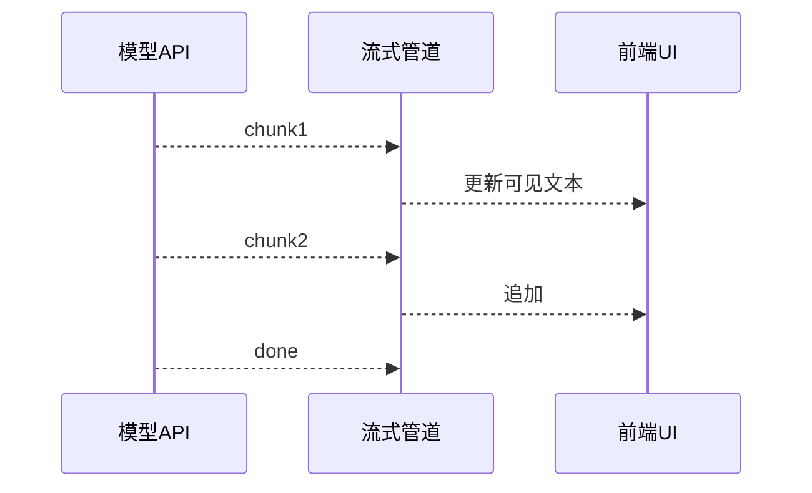
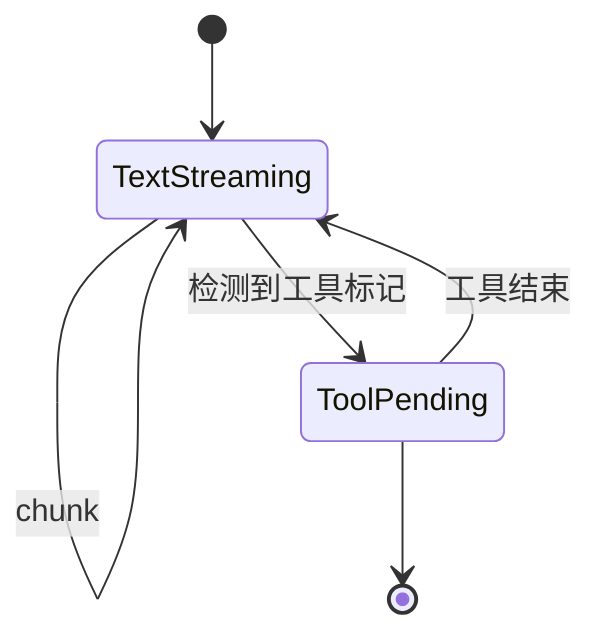

# 17.7 流式管道：async generator 与逐词到达

> **本节焦点**：用 **async generator**、`yield` 分片推送模型输出，构建**不等完整响应**的 UX 与背压可控的管道，降低**首字延迟（TTFB 体感）**并改善取消语义。

---

## 学习目标

1. **实现** 基于 `async function*` 的流式读取循环，配合 `for await` 消费。
2. **对比** 「攒齐全文再渲染」与「边到边渲染」在**感知性能**与**可中断性**上的差异。
3. **解释** 流式与 **React 状态更新** 的节流策略（衔接 17.6）。
4. **描述** 背压：下游慢时如何暂停上游 `pull`（示意）。
5. **识别** 工具调用与流式混排时的解析边界（JSON 片段、SSE 事件）。

---

## 生活类比：听播客 vs 等整季下载完

- **非流式**：整季下载完才能听第一秒。
- **流式**：边下边播；不想听了就**停**（abort），已缓冲的还能保留。

---

## 核心思想：不等完整响应



用户**更早**开始阅读 → **更少焦虑性重复提问** → 间接省 Token。

---

## 源码片段：async generator 包装 SSE

```typescript
async function* streamClaudeText(
  body: ReadableStream<Uint8Array>,
  signal: AbortSignal
): AsyncGenerator<string> {
  const reader = body.getReader();
  const decoder = new TextDecoder();
  try {
    while (true) {
      if (signal.aborted) throw new DOMException("aborted", "AbortError");
      const { value, done } = await reader.read();
      if (done) break;
      const text = decoder.decode(value, { stream: true });
      // 真实场景需按 SSE 事件切分，这里教学简化为按块 yield
      if (text) yield text;
    }
  } finally {
    reader.releaseLock();
  }
}

// 消费端
async function renderLoop(gen: AsyncGenerator<string>, onDelta: (s: string) => void) {
  for await (const delta of gen) {
    onDelta(delta);
  }
}
```

---

## 与 fetch 结合（概念）

```typescript
async function startTurn(prompt: string, signal: AbortSignal) {
  const res = await fetch("/api/claude/stream", {
    method: "POST",
    body: JSON.stringify({ prompt }),
    signal,
    headers: { "content-type": "application/json" },
  });
  if (!res.body) throw new Error("no body");
  for await (const chunk of streamClaudeText(res.body, signal)) {
    appendToTranscript(chunk);
  }
}
```

---

## 解析复杂度：工具调用穿插

| 模式 | 说明 |
|------|------|
| 纯文本 SSE | `yield` 字符串即可 |
| JSON tool_calls 流 | 需增量解析或等结构化块 |
| 混排 | 常见做法是**服务端**先流式文本，**工具**走独立 channel |



---

## 背压示意（教学）

若 UI 渲染极慢，可**暂停读取**：

```typescript
async function* throttled<T>(source: AsyncIterable<T>, ms: number) {
  for await (const item of source) {
    yield item;
    await new Promise((r) => setTimeout(r, ms));
  }
}
```

生产环境更常用 **`requestAnimationFrame`** 或 **队列 + max pending**。

---

## Abort：用户按「停止」时

```typescript
const ac = new AbortController();
startTurn("...", ac.signal).catch((e) => {
  if (e.name === "AbortError") return; // 用户取消
  showError(e);
});

// 用户点击停止
function onStop() {
  ac.abort();
}
```

流式让 **abort** 更有意义：不必等整包返回。

---

## 与虚拟滚动联动

长回答边生成边增长度：

- 列表应 **auto-scroll** 到底部，但避免与用户手动上翻冲突（「粘底」标志位）。
- 大块 Markdown 应 **分阶段** highlight，避免每字符全量 re-parse。

---

## 错误恢复（预告第 18 篇）

| 事件 | 流式策略 |
|------|----------|
| 网络闪断 | 断点续传需服务端 `last-event-id` |
| 5xx | 自动重试应**丢弃**不完整的工具 JSON |
| 429 | 退避 + 用户可见倒计时 |

---

## 性能指标

| 指标 | 目标直觉 |
|------|----------|
| TTFB | 首 chunk 到达时间 |
| chunk 间隔 | 过长 → 「卡住」感 |
| 取消耗时 | abort 后多久停止计费（依平台） |

---

## Node/Bun 侧等价

在服务端转发模型流时：

```typescript
import { Readable } from "node:stream";

function generatorToReadable(gen: AsyncGenerator<Uint8Array>) {
  return Readable.from(
    (async function* () {
      for await (const u8 of gen) {
        yield u8;
      }
    })()
  );
}
```

便于接入 **Express / Hono** 的 `response` 流。

---

## 自测

1. `for await` 与 `while + next()` 消费 async generator 有何区别？
2. 为何工具调用 JSON 不适合逐字符展示给用户？
3. abort 后客户端还应做哪些 **UI 状态** 清理？

---

## 与成本的关系（重申）

| 链路 | 效果 |
|------|------|
| 更快可见输出 | 用户更少打断 / 重发 |
| 可中断 | 少付「不需要的尾部输出」（视 API 计费粒度） |
| 更细粒度观测 | 可对慢 chunk 打点优化 prompt |

---

## 小结

- **async generator + yield** 是表达「异步拉取 + 分段产出」的自然模型。
- **流式**优化**体感首延迟**与**取消**，与 **React 节流、虚拟列表** 组合完整。
- 工具调用与 JSON **需单独设计**，避免半拉子结构污染 UX。

---

*上一节：[06-render-performance.md](./06-render-performance.md) · 下一节：[08-cost-cheatsheet.md](./08-cost-cheatsheet.md)*
