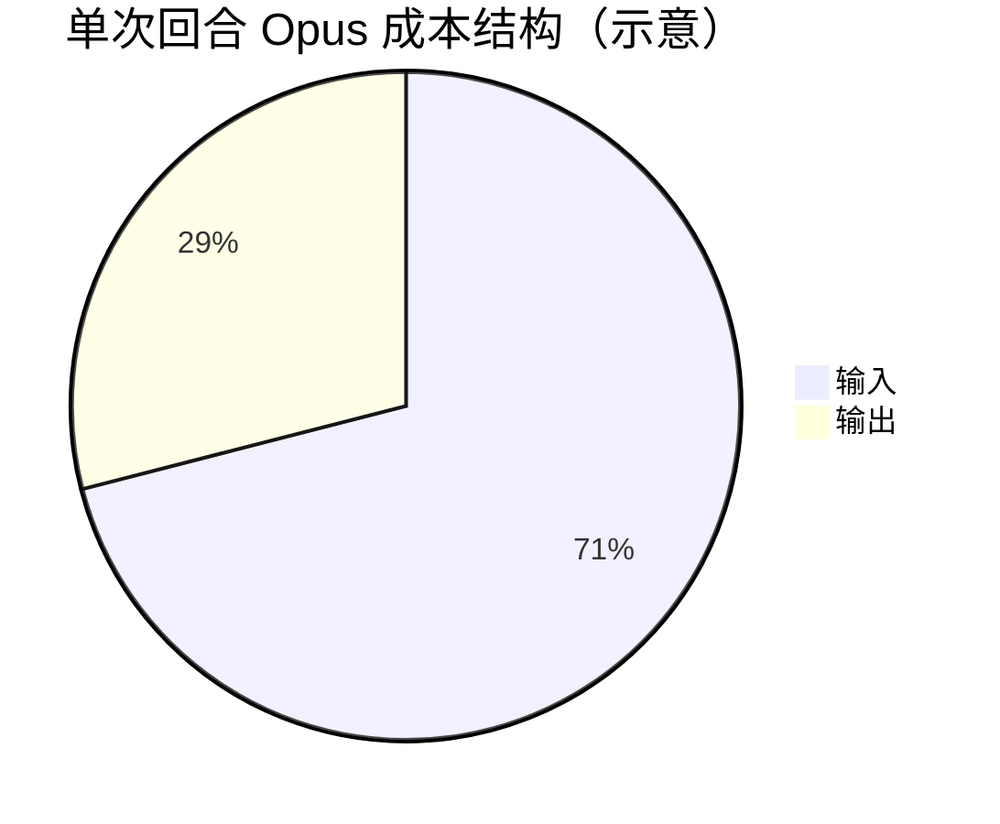
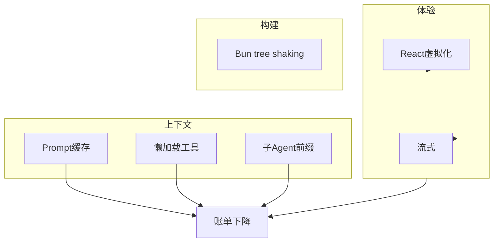

# 17.8 省钱速查表：场景 × 模型 × 动作

> **本节汇总** 第 17 篇定价锚点与优化手段，用**可操作的表格**做场景化估算与决策。

---

## 学习目标

1. **快速查阅** Opus / Sonnet 输入输出与缓存读写单价。
2. **估算** 典型开发日、长会话、子 Agent 派发的费用区间（数量级）。
3. **对照** 每项优化手段的预期收益与实施成本。
4. **制定** 团队「默认策略」：何时 Sonnet、何时 Opus、何时开缓存。
5. **复盘** 如何用遥测验证估算（衔接第 18 篇）。

---

## 定价锚点表（教学）

| 项目 | Opus（示意） | Sonnet（示意） |
|------|-------------|----------------|
| 输入 | $15 / 1M | $3 / 1M |
| 输出 | $75 / 1M | $15 / 1M |
| 缓存写 | （以官方为准） | $3.75 / 1M |
| 缓存读 | （以官方为准） | $0.375 / 1M |

**缓存读 / 正常输入（Sonnet）**：$0.375 ÷ $3 = **12.5%**（教学中常记 **约 10%**）。

---

## 场景估算表 A：单次大回合

假设：**150k 输入**（含工具与历史）+ **12k 输出**。

| 模型 | 输入费用 | 输出费用 | 合计（约） |
|------|----------|----------|------------|
| Opus | 150×15/1000=$2.25 | 12×75/1000=$0.90 | **$3.15** |
| Sonnet | 150×3/1000=$0.45 | 12×15/1000=$0.18 | **$0.63** |



---

## 场景估算表 B：百轮会话（与缓存）

| 策略 | Opus 区间（教学） | 说明 |
|------|-------------------|------|
| 无缓存 | **$50–100** | 大前缀每轮全价 |
| 有缓存 | **$10–19** | **约省 80%** |

> 实际随每轮 Token、命中率波动；用于**立项沟通**足够。

---

## 场景估算表 C：工具策略

| 策略 | 相对输入 Token | 适用 |
|------|-----------------|------|
| 42 工具全量 | 高 | 不推荐长会话 |
| 懒加载 8 工具 | 低 | 默认推荐 |
| tool_search 元工具 | 中 | 大目录必备 |

---

## 场景估算表 D：前端与流式

| 动作 | 直接省 Token？ | 间接收益 |
|------|----------------|----------|
| 虚拟滚动 | 否 | 减少重试 |
| 流式输出 | 依平台 | 减少焦虑性重复提问 |
| 并行预取 | 否 | 快启动 → 少放弃 |

---

## 死代码消除：Bun 打包与 tree shaking（速查）

| 命令/配置（示意） | 作用 |
|-------------------|------|
| `bun build --minify` | 体积↓ |
| `bun build --splitting` | 动态 import 拆 chunk |
| `"sideEffects": false` in package.json | 助 tree shake |


**教学片段**：

```typescript
// 若从未引用 heavy，可被摇掉
export const light = () => 1;
export const heavy = () => import("./heavy"); // 动态则进分包
```

---

## 决策速查：今天该用哪档模型？

| 信号 | 建议 |
|------|------|
| 大规模重构 / 安全审计 | Opus 或 Opus 抽检 |
| CRUD、格式化、单测补齐 | Sonnet |
| 上下文已 >200k | Sonnet + 缓存 + 分片 |
| 预算告警触发 | 全员 Sonnet + 强制缓存审查 |

---

## 优化手段 × 收益 × 成本

| 手段 | 预期收益 | 实施成本 | 见节 |
|------|----------|----------|------|
| Prompt 缓存 | 高（长会话） | 中（前缀工程） | 17.2 |
| 并行预取 | 中（体验） | 低 | 17.3 |
| 懒加载工具 | 高（输入） | 中 | 17.4 |
| 子 Agent 统一前缀 | 中（缓存命中） | 低 | 17.5 |
| React 虚拟滚动 | 中（间接） | 中 | 17.6 |
| 流式管道 | 中（体验/中断） | 中 | 17.7 |
| Bun tree shaking | 低（前端体积） | 低 | 本节 |

---

## 一日账单「咖啡换算」（纯属直觉）

假设 **Sonnet**，**2M 输入 + 200k 输出** / 天：

- 输入：2 × $3 = **$6**
- 输出：0.2 × $15 = **$3**
- **合计 ~$9/天** → 约两杯精品咖啡（城市差异大，仅作记忆锚）

---

## 团队政策模板（可复制）

```markdown
1. 默认模型：Sonnet
2. system 与工具顺序：锁定版本号，禁止随机字段
3. 子 Agent 前缀：使用统一常量 SUB_AGENT_PREFIX
4. 代码审查：新增工具必须声明层级（L0-L3）
5. 每周复盘：cache_read / input 比值
```

---

## 与第 18 篇的接口

| 你要证明优化有效 | 需要遥测 |
|------------------|----------|
| 缓存命中上升 | `cache_read_input_tokens` 系列 |
| 懒加载生效 | 每轮 `tools` schema token 估计 |
| 流式体验 | 首 chunk 延迟 P95 |

---

## 常见数字陷阱

| 陷阱 | 说明 |
|------|------|
| 把「字符数」当 Token | 中英文压缩比不同 |
| 忽略输出 | 长解释同样贵 |
| 只看模型价 | 工具/MCP 侧也会引入间接成本（人力、机器） |

---

## 自测答案指引（不写死数字）

1. 用 **17.8** 表 A 公式重算若输入变为 300k 的费用。
2. 说明 **80%** 节省依赖哪些前提（长前缀重复、命中率高）。
3. 列举三项 **不花钱** 但 **降 retry** 的优化。

---

## Mermaid：优化组合路线图



---

## 小结

- **速查表**把抽象 $/M 落到 **单次 / 百轮 / 团队政策**。
- **Sonnet 缓存读 ≈ 输入一折** 是最应刻进肌肉记忆的比率之一。
- **优化组合拳**：缓存 + 懒加载 + 前缀 + UI + 流式；**Bun tree shaking** 守护分发体积。

---

*第 17 篇完。继续：[第 18 篇 · 遥测与生命周期](../part18-telemetry-lifecycle/index.md)*
