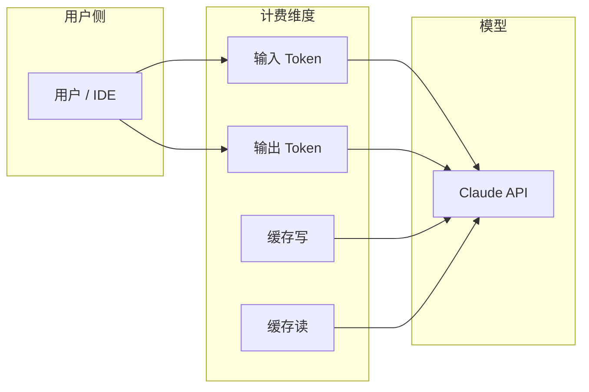
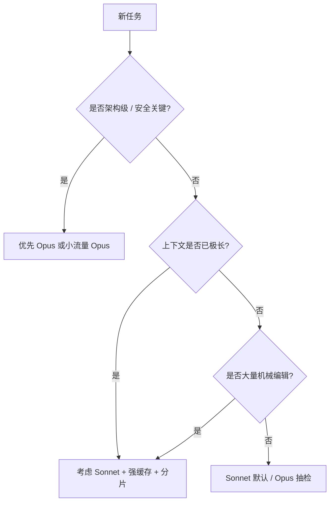
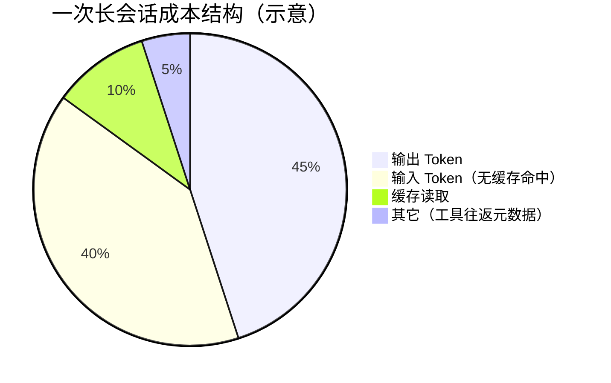

# 第17篇 · 17.1 Token 经济学与定价心智模型

> **本篇导读**：理解 Claude Code 背后的「按 Token 计费」逻辑，是把「用得爽」和「花得值」统一起来的第一步。本节建立定价表、成本直觉与决策框架。

---

## 学习目标

完成本节后，你应能够：

1. **复述** Anthropic API 在 Opus / Sonnet 档位下的输入、输出与缓存读写单价（美元 / 百万 Token）。
2. **解释** 为何「输出 Token」通常比「输入 Token」贵，以及这对长对话、长 diff 的影响。
3. **对比** 纯对话场景与「工具 + 上下文膨胀」场景下的成本结构差异。
4. **建立** 个人或团队的「Token 预算」心智：何时升级模型、何时缩短 system 提示。
5. **将** 定价数字与后续各节（缓存、懒加载、流式）形成连贯的优化叙事。

---

## 核心定价速览（教学用基准）

下列数字为**教学场景下常用的公开档位示意**（实际以 [Anthropic 官方定价页](https://www.anthropic.com/pricing) 为准，会随产品与区域调整）。

| 项目 | Opus（示意） | Sonnet（示意） |
|------|-------------|----------------|
| 输入（Input） | **$15 / 百万 Token** | **$3 / 百万 Token** |
| 输出（Output） | **$75 / 百万 Token** | **$15 / 百万 Token** |
| 缓存写入（Cache write） | 依产品档 | **$3.75 / 百万 Token**（Sonnet 档示意） |
| 缓存读取（Cache read） | 依产品档 | **$0.375 / 百万 Token**（Sonnet 档示意） |

### 生活类比：餐厅「座位费」与「点菜价」

- **输入 Token** 像**你已坐在店里占用的座位时间**：菜单、环境说明、你带进去的故事，都算「进场成本」。
- **输出 Token** 像**厨师现做的一道道热菜**：工序多、不可预测长度，所以**单价更高**。
- **缓存** 像**提前炖好的一锅高汤**：第一次写入贵一点，后面「舀一勺」便宜一个数量级。



---

## 成本直觉：一次「典型请求」如何拆解

假设某次 Agent 回合向 API 发送：

- 系统提示 + 工具定义 + 历史 + 当前文件摘要：**200k 输入 Token**（含可缓存前缀）
- 模型返回：**8k 输出 Token**

### Opus 档粗算（无缓存、全按输入计价）

| 科目 | 计算 | 小计（美元） |
|------|------|-------------|
| 输入 | 200 × ($15 / 1M) | $3.00 |
| 输出 | 8 × ($75 / 1M) | $0.60 |
| **合计** | | **≈ $3.60** |

同一请求若换 **Sonnet**（仍无缓存）：

| 科目 | 计算 | 小计（美元） |
|------|------|-------------|
| 输入 | 200 × ($3 / 1M) | $0.60 |
| 输出 | 8 × ($15 / 1M) | $0.12 |
| **合计** | | **≈ $0.72** |

可见：**模型档位切换**对账单的影响往往是**数倍级**，而非百分之几。

---

## 源码片段（概念层）：客户端如何组装「可计费」载荷

真实 Claude Code 代码库会封装 HTTP 客户端与消息格式。下面用**伪代码**说明「哪些东西会吃掉输入 Token」：

```typescript
// 概念示意：非生产代码
type TurnPayload = {
  system: string;           // 系统提示 → 输入 Token
  tools: ToolDefinition[];  // 每个工具 schema → 输入 Token
  messages: Message[];      // 多轮历史 → 输入 Token
  metadata: {
    model: "opus" | "sonnet";
    enablePromptCache: boolean;
  };
};

function estimateBillableInput(p: TurnPayload): number {
  const systemTokens = countTokens(p.system);
  const toolTokens = p.tools.reduce((s, t) => s + countTokens(JSON.stringify(t)), 0);
  const historyTokens = p.messages.reduce((s, m) => s + countTokens(m.content), 0);
  return systemTokens + toolTokens + historyTokens;
}
```

要点：

- **工具定义越长、工具越多**，每轮「固定输入」越重。
- **把大段文档无差别塞进 system**，是常见的「贵但未必更聪明」的做法。

---

## 决策树：何时值得用 Opus？



---

## Token「膨胀」的五大来源

| 来源 | 说明 | 降费思路（预告） |
|------|------|------------------|
| 系统提示与规则 | 每次回合重复发送 | 稳定前缀 + Prompt 缓存（见 17.2） |
| 工具 Schema | JSON 模式长 | 懒加载工具（见 17.4） |
| Git / 目录树 | 状态快照大 | 并行预取 + 裁剪展示（见 17.3） |
| 模型输出 | diff / 解释冗长 | 流式体验 + 提示约束（见 17.7） |
| UI 调试残留 | 日志灌进上下文 | 生产配置隔离（见第 18 篇） |

---

## 与后续小节的映射

| 小节文件 | 主题 | 与 Token 经济学的关系 |
|----------|------|------------------------|
| `02-prompt-caching.md` | 提示缓存 | 直接降低重复输入与缓存读单价 |
| `03-parallel-prefetch.md` | 并行预取 | 减少「等待时间」≠ 直接减 Token，但改善 SLA |
| `04-lazy-loading.md` | 懒加载 | 削减每轮工具 schema 体积 |
| `05-sub-agent-cache.md` | 子 Agent 缓存 | 多进程共享前缀，提高缓存命中率 |
| `06-render-performance.md` | React 性能 | 前端流畅，间接减少「人类重试」 |
| `07-streaming-pipeline.md` | 流式管道 | 感知延迟下降，优化交互轮次 |
| `08-cost-cheatsheet.md` | 省钱速查 | 把本节数字落到场景表 |

---

## 自测清单

1. 同样 100k 输入 + 20k 输出，Opus 与 Sonnet 的费用比大约是多少倍？（用本节表估算）
2. 为什么说「输出 Token」对「长解释 + 大 patch」更敏感？
3. 缓存读取单价约为 Sonnet 正常输入的百分之几？（用表：$0.375 vs $3）

---

## 延伸阅读建议

- 官方定价与「prompt caching」说明（以最新文档为准）。
- 本篇 `08-cost-cheatsheet.md`：把抽象美元换算成「每天一杯咖啡」式直觉。
- 第 18 篇：遥测与生命周期——用数据验证你的降费策略是否生效。

---

## 术语表

| 术语 | 含义 |
|------|------|
| Token | 模型处理文本的最小计费单位，不等价于「字符」或「单词」 |
| 输入 / 输出 | 分别对应请求体中的提示与模型生成内容 |
| 前缀匹配 | 缓存键通常按**字节级前缀**匹配，稳定前缀越长、命中越高 |

---

## 小结

- **Opus** 输入 **$15/M**、输出 **$75/M**；**Sonnet** 输入 **$3/M**、输出 **$15/M** 是理解账单的数量级锚点。
- **缓存写 / 读**（Sonnet 示意 **$3.75 / $0.375**）使「重复上下文」从成本中心变成优化杠杆。
- 降费不是单一技巧，而是 **模型选择 × 上下文工程 × 缓存 × 工具加载** 的乘积；后续小节将逐项拆开。

---

## 进阶：把「百万 Token」换算成日常单位

下列换算**仅帮助建立直觉**，真实消耗以仪表盘为准。

| 若你的项目… | 可近似理解为… |
|-------------|----------------|
| 每天 50 次 Sonnet 调用，平均每次 20k 输入 + 2k 输出 | 输入约 $3/M×1M=$3/天量级（示意） |
| 周报需要对比「切 Opus 的一周」 | 用本节表 × 你的 Token 日志 |



---

## 常见误区

| 误区 | 实际情况 |
|------|----------|
| 「模型越贵越省时间」 | 若任务简单，贵模型会付出更高输出溢价 |
| 「缓存免费」 | 缓存**写入**仍计费；命中读才显著便宜 |
| 「缩短用户消息就够了」 | 系统提示与工具定义往往才是大头 |

---

## 团队协作：Token 预算表（模板）

| 角色 | 默认模型 | 日 Token 上限（示例） | 例外审批 |
|------|----------|---------------------|----------|
| 一线开发 | Sonnet | 5M 输入（示例） | 架构评审用 Opus |
| SRE | Sonnet | 按值班周调整 | 事故复盘可加 Opus |
| 文档 | Sonnet | 低输出配额 | 长文生成走批处理 |

---

## 与 API 错误率的经济学

高延迟或失败导致的**人类重试**，在账单上表现为：

- 重复的**输入前缀**（若未命中缓存 → 全价输入）
- 重复的**输出**（若客户端丢弃半成品 → 输出浪费）

因此「稳定性」与「成本」同构；第 18 篇将从生命周期与遥测角度收紧这一环。

---

## 参考公式（背公式不如背数量级）

设输入单价 $P_i$（$/M）、输出 $P_o$（$/M），本轮输入 Token 为 $T_i$、输出 $T_k$（千 Token 换算为 M 时需除以 1000）：

$$
\text{Cost} \approx \frac{T_i}{10^6} P_i + \frac{T_o}{10^6} P_o
$$

有缓存时，将 $T_i$ 拆成「未命中部分」与「缓存读部分」，分别乘以对应单价即可（详见 17.2）。

---

## 课堂练习（书面）

1. **题 A**：输入 120k、输出 15k，分别用 Opus 与 Sonnet 估算费用。
2. **题 B**：说明为何「把 README 全文粘进 system」可能比「放进 RAG 片段」更贵。
3. **题 C**：画一张草图（可用纸笔）描述你当前项目的「Token 从哪进、从哪出」。

---

## 附录：与 Claude Code 产品形态的对应（概念）

| 产品概念 | 经济学含义 |
|----------|------------|
| Agent 多轮工具循环 | 每轮可能重复发送大段 system/tools |
| 子 Agent | 若前缀一致，有利于缓存前缀匹配（见 17.5） |
| IDE 插件 | 前端性能影响「体感」与重试率（见 17.6） |

---

*下一节：[`02-prompt-caching.md`](./02-prompt-caching.md) — Prompt 缓存与命中率工程。*
