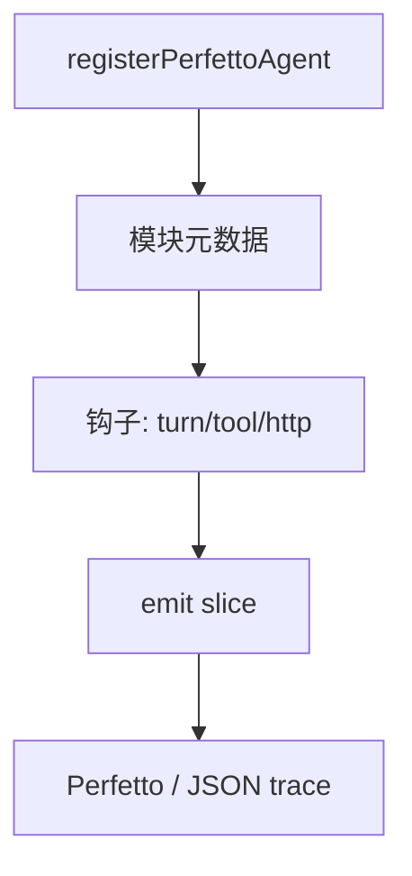
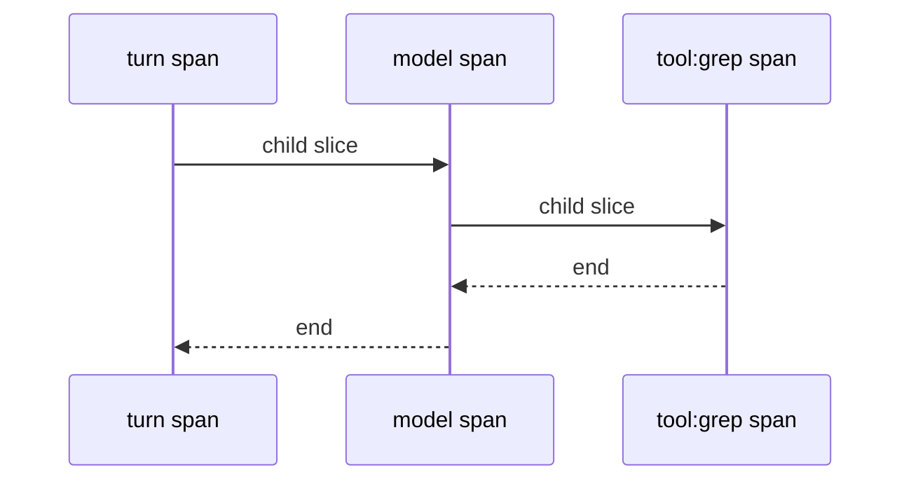

# 18.2 Perfetto 性能追踪：`registerPerfettoAgent()`

> **本节焦点**：通过 **`registerPerfettoAgent()`**（教学命名）将追踪模块注册进系统，把**每一次 Agent 运行**建模为一次**微服务调用**：有入口 span、子 span（工具、模型、渲染），可在 Perfetto UI 中切片分析。

---

## 学习目标

1. **解释** Perfetto / Chrome Tracing 模型：`track`、`slice`、`flow` 的基本语义。
2. **设计** `registerPerfettoAgent` 的 API：注册 name、版本、采样开关。
3. **映射** Agent 回合 → `turn` slice，工具调用 → child slice，HTTP → nested slice。
4. **评估** 开销：生产环境采样率、异步 buffer。
5. **关联** 全链路遥测（18.3）：同一 `traceId` 贯通日志与追踪。

---

## 生活类比：机场航班雷达

每次 Agent 运行像**一架航班**：起飞（turn 开始）、巡航（模型思考）、经停（工具）、降落（输出完成）。  
Perfetto 是**雷达屏幕**：你看到的是**时间轴上的航迹**，而不是黑盒。

---

## 核心注册流程（概念 API）

```typescript
// 教学用 API 名
type PerfettoAgentModule = {
  name: string;
  version: string;
  onTrace: (emit: PerfettoEmitter) => void;
};

declare function registerPerfettoAgent(mod: PerfettoAgentModule): Disposable;

type PerfettoEmitter = {
  beginSlice(cat: string, title: string, args?: Record<string, unknown>): void;
  endSlice(): void;
  instant(name: string, args?: Record<string, unknown>): void;
};
```



---

## 源码片段：在 Agent 回合包一层

```typescript
const perfetto = registerPerfettoAgent({
  name: "claude-code-agent",
  version: "2.0.0",
  onTrace(emit) {
    bus.on("turn:start", ({ id }) => {
      emit.beginSlice("agent", `turn:${id}`, { id });
    });
    bus.on("turn:end", () => emit.endSlice());

    bus.on("tool:start", ({ name }) => {
      emit.beginSlice("tool", name);
    });
    bus.on("tool:end", () => emit.endSlice());

    bus.on("http:start", ({ route }) => {
      emit.beginSlice("http", route);
    });
    bus.on("http:end", ({ status }) => {
      emit.instant("http:status", { status });
      emit.endSlice();
    });
  },
});

// 应用退出
process.on("exit", () => perfetto.dispose());
```

---

## 微服务心智：每次运行 = 一次调用链

| Span | 类比微服务 |
|------|------------|
| `turn` | API Gateway 入站请求 |
| `model.stream` | 下游 LLM 服务 |
| `tool.grep` | 内部工具微服务 |
| `mcp.fetch` | 外部 MCP 提供方 |



---

## 与 `traceId` / `spanId` 对齐（示意）

```typescript
import { randomUUID } from "node:crypto";

function startTurnTrace() {
  const traceId = randomUUID();
  const baggage = { traceId };
  return baggage;
}
```

日志行应带 **`traceId`**，便于从 Perfetto slice 跳转到 **结构化日志**。

---

## 生产开关

| 环境 | 建议 |
|------|------|
| 开发 | 100% 追踪或 Chrome `trace_event` |
| 预发 | 50% 采样 |
| 生产 | 1–5% 采样 + 慢请求全量 |

```typescript
const SAMPLE_RATE = Number(process.env.PERFETTO_SAMPLE ?? "0.01");

function maybe<T>(fn: () => T): T | undefined {
  if (Math.random() < SAMPLE_RATE) return fn();
  return undefined;
}
```

---

## 输出格式注意

- **Perfetto JSON**、**Chrome Trace Event**、**OpenTelemetry** 可互转；选型依现有栈。
- **时钟域**：前端 `performance.now()` 与后端 `hrtime` 需**对齐策略**（服务器权威 vs 客户端展示）。

---

## 常见坑

| 坑 | 后果 |
|----|------|
| `begin` 无配对 `end` | trace 文件损坏 / UI 错乱 |
| slice 过密（每 token） | 体积爆炸 |
| PII 打进 args | 合规风险 |

**脱敏示例**：

```typescript
function redact(s: string) {
  return s.length > 200 ? s.slice(0, 200) + "…" : s;
}
```

---

## 与第 17 篇性能优化的闭环

| 优化 | 在 Perfetto 中验证 |
|------|-------------------|
| 并行预取 | 启动阶段 slice 墙钟变短 |
| 懒加载 | `tool.register` slice 后移 |
| 流式 | `model.firstChunk` instant 提前 |

---

## 自测

1. 为何要把 **tool** 与 **model** 分成不同 **category**？
2. 采样率与 **问题可复现性** 如何权衡？
3. `instant` 事件与 `slice` 的区别？

---

## 表：推荐 category 命名

| category | 用途 |
|----------|------|
| `agent` | 回合级 |
| `model` | API 调用 |
| `tool` | 本地工具 |
| `mcp` | 远程 MCP |
| `ui` | React commit / 渲染 |

---

## 小结

- **`registerPerfettoAgent()`** 是把追踪**插件化**的枢纽；每次 Agent 运行视为**微服务调用链**最利于对齐团队语言。
- **配对 slice**、**控制粒度**、**脱敏** 是上线三板斧。
- 与 **traceId** 日志贯通后，才能从「感觉慢」走到「哪一段慢」。

---

*上一节：[index.md](./index.md) · 下一节：[03-telemetry.md](./03-telemetry.md)*
