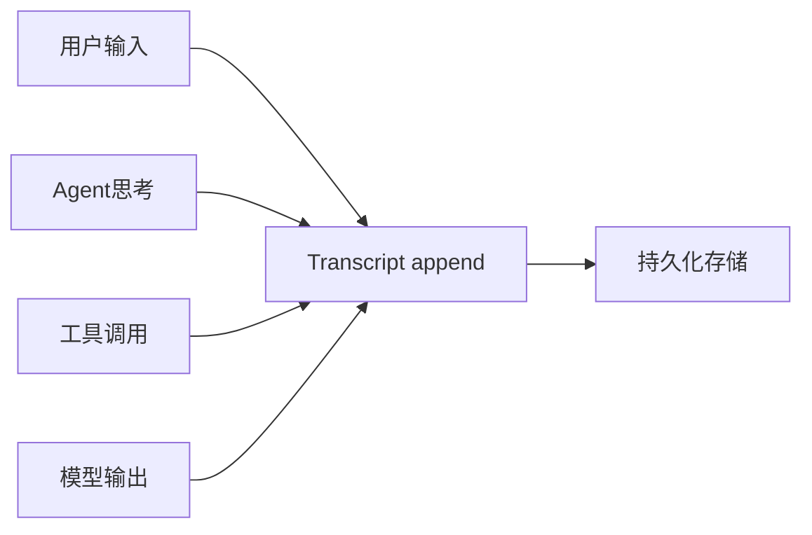
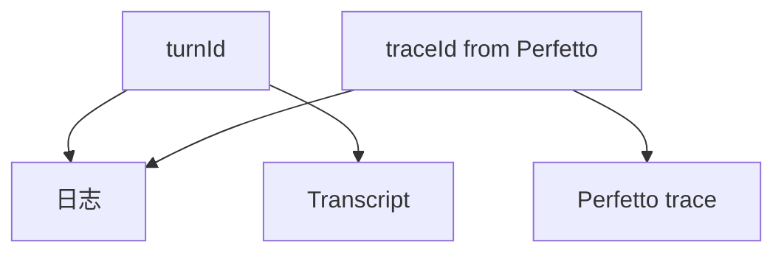

# 18.3 全链路遥测：Transcript、工具计时与 API 延迟

> **本节焦点**：**执行副本（Transcript）强制记录**、**工具调用计时**、**API 延迟监控** 三位一体，构成可审计、可优化、可告警的数据平面。

---

## 学习目标

1. **定义** Transcript 的最小不可变字段集（谁、何时、输入摘要、输出摘要、工具轨迹）。
2. **实现** 工具包装的 **before/after** 计时与错误捕获。
3. **设计** API 延迟直方图：P50/P95/P99 与模型维度切片。
4. **解释** 为何 Transcript 应 **append-only**（合规与复盘）。
5. **对接** Perfetto（18.2）与资源清理（18.4）：同一 `turnId`。

---

## 生活类比：飞机黑匣子

- **Transcript** 是黑匣子：**发生了什么**按时间顺序**不可抵赖**地记下。
- **工具计时** 是每个仪表的**读数间隔**：哪块表异常一目了然。
- **API 延迟** 是**塔台响应时间**：管制慢，整条航线堵。

---

## Transcript 记录模式

| 字段 | 说明 |
|------|------|
| `turnId` | UUID |
| `ts` | ISO 时间 |
| `actor` | user / agent / sub-agent id |
| `model` | opus / sonnet |
| `inputDigest` | hash 或截断摘要 |
| `outputDigest` | 同上 |
| `toolSpans` | 有序数组 |
| `status` | ok / error / aborted |



---

## 源码片段：强制 append Transcript

```typescript
type TranscriptEvent =
  | { type: "user"; text: string; turnId: string; ts: string }
  | { type: "assistant"; text: string; turnId: string; ts: string }
  | { type: "tool"; name: string; ms: number; ok: boolean; turnId: string; ts: string };

const sink: TranscriptEvent[] = []; // 教学：内存；生产：WAL / S3 / DB

export function appendTranscript(e: TranscriptEvent) {
  Object.freeze(e);
  sink.push(e);
  // 生产：同步 fsync 或消息队列
}

export function assertTranscriptEnabled() {
  if (process.env.TRANSCRIPT_OFF === "1") {
    throw new Error("Transcript recording cannot be disabled in this environment");
  }
}
```

**「强制记录」** = 关键环境变量禁止关闭 + 启动自检。

---

## 工具调用计时包装器

```typescript
type ToolFn<TArgs, TRes> = (args: TArgs) => Promise<TRes>;

function instrumentTool<TArgs, TRes>(
  name: string,
  fn: ToolFn<TArgs, TRes>,
  turnId: string
): ToolFn<TArgs, TRes> {
  return async (args) => {
    const t0 = performance.now();
    try {
      const res = await fn(args);
      appendTranscript({
        type: "tool",
        name,
        ms: performance.now() - t0,
        ok: true,
        turnId,
        ts: new Date().toISOString(),
      });
      return res;
    } catch (e) {
      appendTranscript({
        type: "tool",
        name,
        ms: performance.now() - t0,
        ok: false,
        turnId,
        ts: new Date().toISOString(),
      });
      throw e;
    }
  };
}
```

---

## API 延迟监控

```typescript
type LatencySample = { route: string; ms: number; model?: string; ts: number };

const samples: LatencySample[] = [];

export function recordApiLatency(s: LatencySample) {
  samples.push(s);
  // 生产：推送到 Prometheus histogram 或 OTel
}

export function p95(values: number[]) {
  if (!values.length) return 0;
  const a = [...values].sort((x, y) => x - y);
  return a[Math.floor(0.95 * (a.length - 1))];
}
```

| 指标名（示意） | 类型 | 标签 |
|----------------|------|------|
| `claude_api_latency_ms` | histogram | `model`, `region` |
| `tool_duration_ms` | histogram | `tool` |
| `turn_total_ms` | summary | `agent_mode` |

---

## 全链路 ID 贯通



---

## 存储与保留策略

| 层级 | 保留 | 备注 |
|------|------|------|
| 热存储 | 7 天 | 快速查询 |
| 温存储 | 90 天 | 成本折中 |
| 冷归档 | 1 年+ | 合规 |

---

## 隐私与脱敏

| 数据 | 策略 |
|------|------|
| 源码片段 | 仅 hash + 行号 |
| env 秘密 | 永不写入 Transcript |
| 用户消息 | 按策略掩码邮箱/电话 |

---

## 与成本分析（第 17 篇）

| Transcript 字段 | 用于 |
|-------------------|------|
| `model` | 分模型账单核对 |
| `toolSpans` | 识别异常频繁工具调用 |
| `tokens`（若记录） | 与实际 API usage 对账 |

---

## 自测

1. 为何 `Object.freeze` 事件对象（教学）有助于审计心智？
2. `instrumentTool` 中若 `fn` 内部再次调用未包装工具，会出现什么观测盲区？
3. P95 与 P99 分别适合哪种告警？

---

## Dashboard 草图（文字）

- **Panel A**：每分钟 turn 数
- **Panel B**：API P95 按模型
- **Panel C**：工具失败率 TopN
- **Panel D**：aborted 占比

---

## 小结

- **Transcript append-only** 是可信叙事的基础；**工具计时**定位局部慢；**API 延迟**定位网络/服务端慢。
- **turnId + traceId** 把日志、追踪、黑匣子缝成一条线。
- 与 **Perfetto、资源清理、错误恢复** 共用同一套事件总线最省事。

---

*上一节：[02-perfetto.md](./02-perfetto.md) · 下一节：[04-resource-cleanup.md](./04-resource-cleanup.md)*
