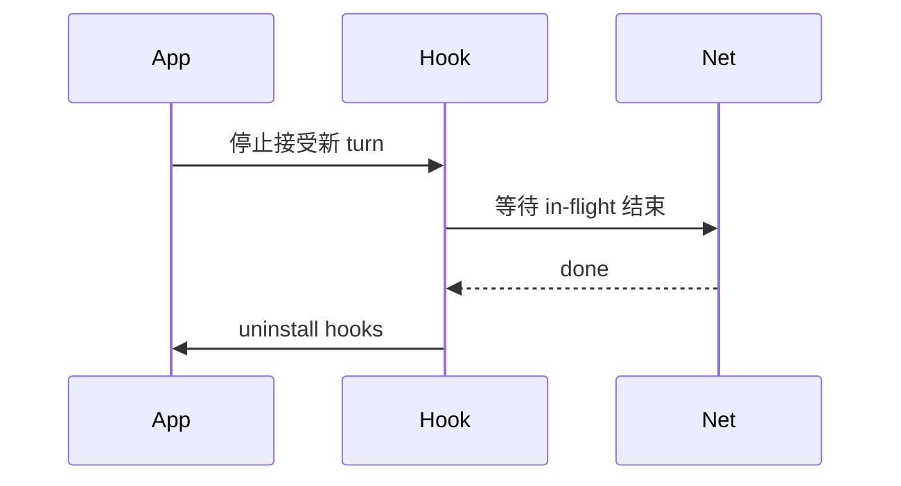

# 18.4 资源清理：`killShellTasksForAgent()` 与连接卸载

> **本节焦点**：Agent 结束或取消时，系统性回收 **Shell 子进程**、**闲置 MCP 连接**、**运行时 Hook** 与**状态缓存**，避免僵尸进程与内存泄漏拖垮长会话桌面端。

---

## 学习目标

1. **实现** `killShellTasksForAgent(agentId)` 的语义：按 Agent 维度猎杀 shell 任务树。
2. **描述** MCP 客户端**空闲断开**策略：超时、引用计数、优雅 shutdown。
3. **列举** 常见运行时 Hook（`fetch` patch、`console` wrap）的**卸载**顺序。
4. **清空** 状态缓存：LRU、会话级 Map、弱引用何时失效。
5. **把** 清理挂到 **abort**、**进程退出**、**窗口关闭** 三钩子。

---

## 生活类比：剧组收工

拍完一场戏要：**关灯**（断 MCP）、**遣散群演**（杀 shell）、**拆轨道**（卸 Hook）、**清空化妆台**（状态缓存）。  
若只喊「散会」不做收工清单，第二天片场全是**遗留道具**和**占着场地的车**。

---

## Shell 僵尸：问题陈述

| 现象 | 根因 |
|------|------|
| 端口仍占用 | 子进程未 SIGTERM |
| CPU 风扇狂转 | 死循环脚本 |
| 文件锁 | `git` / 编译进程未退出 |

```mermaid
flowchart TB
  A[Agent A] --> S1[shell bash]
  A2[Agent B] --> S2[shell zsh]
  R[killShellTasksForAgent(A)] --> K1[杀 S1 树]
  R -.->|不影响| S2
```

---

## 源码片段：按 Agent 追踪 Shell

```typescript
type ShellTask = {
  pid: number;
  agentId: string;
  child: ReturnType<typeof spawn>;
};

const shells = new Set<ShellTask>();

export function registerShellTask(agentId: string, child: ReturnType<typeof spawn>) {
  const pid = child.pid!;
  shells.add({ pid, agentId, child });
  child.on("exit", () => {
    for (const s of shells) {
      if (s.pid === pid) shells.delete(s);
    }
  });
}

export function killShellTasksForAgent(agentId: string) {
  for (const s of [...shells]) {
    if (s.agentId !== agentId) continue;
    try {
      process.kill(-s.pid, "SIGTERM"); // 进程组（若可用）
    } catch {
      s.child.kill("SIGTERM");
    }
    shells.delete(s);
  }
}
```

> Windows / 无进程组环境需换策略；此处 Unix 教学为主。

---

## MCP 连接：强制断开闲置

```typescript
type MCPConn = { id: string; lastUsed: number; close: () => Promise<void> };
const mcps = new Map<string, MCPConn>();

const IDLE_MS = 60_000;
setInterval(async () => {
  const now = Date.now();
  for (const [id, c] of mcps) {
    if (now - c.lastUsed > IDLE_MS) {
      await c.close().catch(() => {});
      mcps.delete(id);
    }
  }
}, 10_000).unref();

export function touchMcp(id: string) {
  mcps.get(id)!.lastUsed = Date.now();
}
```

| 策略 | 适用 |
|------|------|
| 固定 idle 超时 | 大多数 |
| 引用计数 | 多消费者共享连接 |
| 立即关 | 单次脚本 |

---

## 卸载运行时 Hook

```typescript
type HookRestore = () => void;
const restores: HookRestore[] = [];

export function installFetchHook() {
  const orig = globalThis.fetch;
  globalThis.fetch = async (...args) => {
    // 遥测、注入 header...
    return orig(...args);
  };
  restores.push(() => {
    globalThis.fetch = orig;
  });
}

export function uninstallAllHooks() {
  while (restores.length) {
    restores.pop()!();
  }
}
```

**顺序**：先停新请求 → 等飞行中完成 → 再 `uninstall`。



---

## 清空状态缓存

| 缓存类型 | 清理触发 |
|----------|----------|
| 会话 Map | `session:end` |
| 全局 LRU | `memory pressure` 事件 |
| 编译缓存（若内嵌） | `workspace:close` |

```typescript
const sessionCache = new Map<string, unknown>();

export function clearStateForSession(sessionId: string) {
  for (const key of [...sessionCache.keys()]) {
    if (key.startsWith(sessionId + ":")) sessionCache.delete(key);
  }
}
```

---

## 与 AbortController 集成（18.1）

```typescript
function wireCleanup(agentId: string, signal: AbortSignal) {
  const onAbort = () => {
    killShellTasksForAgent(agentId);
    clearStateForSession(agentId);
  };
  signal.addEventListener("abort", onAbort, { once: true });
}
```

---

## 检查清单

- [ ] 子进程是否注册到 **全局表**？
- [ ] MCP `close` 是否 **await**？
- [ ] Hook 是否可 **幂等** 卸载？
- [ ] 是否在 `before-quit`（Electron）重复调用？

---

## 常见坑

| 坑 | 修复 |
|----|------|
| SIGKILL 过早 | 先 SIGTERM，grace period 后 KILL |
| 进程组 ID 为 1 | 检测并降级为单 PID |
| MCP 半开 TCP | 设 keepalive / socket timeout |

---

## 自测

1. 为何按 **agentId** 杀 shell 而不是全局 `pkill`？
2. Hook 卸载为何要等 **in-flight**？
3. idle MCP 断开如何与 **工具调用中** 竞态？

---

## 表：清理动作与触发源

| 动作 | turn abort | session end | app quit |
|------|------------|-------------|----------|
| killShellTasksForAgent | ✓ | ✓ | ✓ |
| MCP close | 可选 | ✓ | ✓ |
| uninstall hooks | | | ✓ |
| clear session cache | ✓ | ✓ | ✓ |

---

## 小结

- **`killShellTasksForAgent()`** 是防止 **shell 僵尸** 的第一道闸。
- **MCP 闲置断开** 保护句柄与远程配额。
- **Hook 卸载 + 缓存清空** 让长时间运行的 IDE **可预测地回到基线**。

---

*上一节：[03-telemetry.md](./03-telemetry.md) · 下一节：[05-error-recovery.md](./05-error-recovery.md)*
