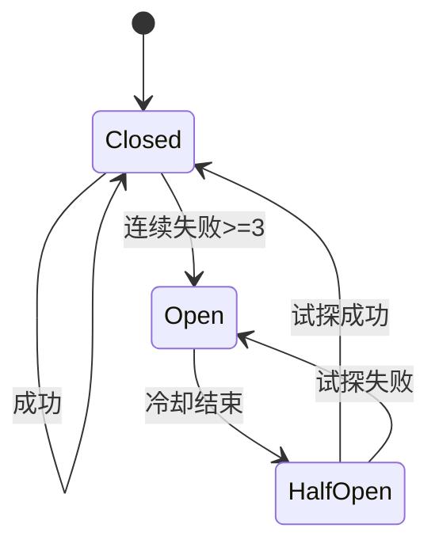
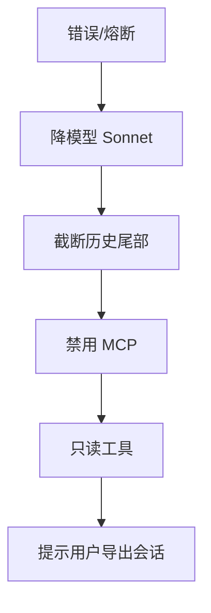

# 18.5 错误恢复：熔断、重试、退避与优雅降级

> **本节焦点**：**连续 3 次压缩失败熔断**、**API 错误自动重试 + 指数退避**、**优雅降级**（换模型、缩上下文、关工具），让系统在故障下仍可「带病运行」。

---

## 学习目标

1. **实现** 压缩失败计数器与**熔断**状态机（开路 / 半开 / 闭合）。
2. **设计** API 重试：可重试状态码（429、5xx、网络）vs 不可重试（400、401）。
3. **应用** 指数退避 + **抖动**避免惊群。
4. **定义** 降级阶梯：降模型 → 截断历史 → 禁用 MCP → 只读模式。
5. **记录** 每次故障到 Transcript（18.3）供事后复盘。

---

## 生活类比：电梯检修

- **重试**：按一次没反应，**稍等再按**，而不是狂按一百次。
- **熔断**：连续三次故障，电梯**停运检修**（开路），避免把人困在半空反复撞击。
- **降级**：货梯坏了，**走楼梯**（功能降级但仍可达）。

---

## 压缩失败熔断（教学口径：连续 3 次）

```typescript
type CompressState = { failures: number; openUntil: number };

const COMPRESS_THRESHOLD = 3;
const COOLDOWN_MS = 60_000;

export class ContextCompressor {
  private state: CompressState = { failures: 0, openUntil: 0 };

  async compress(ctx: string): Promise<string> {
    if (Date.now() < this.state.openUntil) {
      throw new Error("compressor circuit open — skip compress");
    }
    try {
      const out = await this.doCompress(ctx);
      this.state = { failures: 0, openUntil: 0 };
      return out;
    } catch (e) {
      this.state.failures += 1;
      if (this.state.failures >= COMPRESS_THRESHOLD) {
        this.state.openUntil = Date.now() + COOLDOWN_MS;
      }
      throw e;
    }
  }

  private async doCompress(ctx: string): Promise<string> {
    // 调用摘要模型或本地算法
    return ctx.slice(0, Math.min(ctx.length, 8000));
  }
}
```



---

## API 重试与退避

```typescript
async function sleep(ms: number) {
  await new Promise((r) => setTimeout(r, ms));
}

function jitter(ms: number) {
  return Math.floor(ms * (0.5 + Math.random()));
}

export async function withRetry<T>(fn: () => Promise<T>, opts?: { max?: number }) {
  const max = opts?.max ?? 4;
  let attempt = 0;
  let delay = 500;
  for (;;) {
    try {
      return await fn();
    } catch (e: any) {
      attempt += 1;
      if (attempt >= max) throw e;
      if (!isRetriable(e)) throw e;
      await sleep(jitter(delay));
      delay = Math.min(delay * 2, 30_000);
    }
  }
}

function isRetriable(e: any) {
  const code = e?.status ?? e?.code;
  if (code === 429) return true;
  if (typeof code === "number" && code >= 500) return true;
  if (e?.name === "TypeError") return true; // 网络 flake
  return false;
}
```

| 错误类型 | 重试？ |
|----------|--------|
| 429 | ✓（配合 Retry-After） |
| 502/503/504 | ✓ |
| 401 | ✗（刷新凭证） |
| 400 | ✗（修正请求） |

---

## 优雅降级阶梯



| 级别 | 用户可见文案（示例） |
|------|----------------------|
| L1 | 「已切换至经济模式模型」 |
| L2 | 「历史较早部分已折叠，可手动展开」 |
| L3 | 「外部工具暂不可用」 |
| L4 | 「当前为只读协助模式」 |

---

## 与流式结合（第 17 篇）

若流式中途失败：

1. **不要**把半拉子 tool JSON 提交给执行器。
2. **标记** turn `status=error`，允许用户「重试最后一步」。

```typescript
appendTranscript({
  type: "tool",
  name: "stream",
  ms: 0,
  ok: false,
  turnId,
  ts: new Date().toISOString(),
});
```

---

## 半开试探（可选）

```typescript
async function halfOpenTry(compressor: ContextCompressor) {
  // 冷却结束后允许一次真实压缩；失败立即再开路
}
```

---

## 告警阈值建议

| 指标 | 阈值（示例） |
|------|----------------|
| 压缩熔断次数 / h | > 5 |
| API 429 比例 | > 10% |
| 重试后仍失败 | 页面级 banner |

---

## 自测

1. 为何需要 **抖动**？
2. 连续压缩失败可能暗示哪些**根因**（模型、网络、上下文过大）？
3. 降级到「只读」时如何防止**误导用户**以为仍能写文件？

---

## 表：重试头处理

| 响应头 | 行为 |
|--------|------|
| `Retry-After` | 优先使用 |
| 无 | 指数退避 |
| `x-ratelimit-reset` | 可选对齐 |

---

## 小结

- **三次压缩失败熔断**避免在坏路径上浪费 Token 与 CPU。
- **可重试错误 + 退避 + 抖动** 是 API 集成的底线配置。
- **降级阶梯**把「全挂」变成「能用但不完美」，并应用文案管理预期。

---

*上一节：[04-resource-cleanup.md](./04-resource-cleanup.md) · 下一节：[06-best-practices.md](./06-best-practices.md)*
