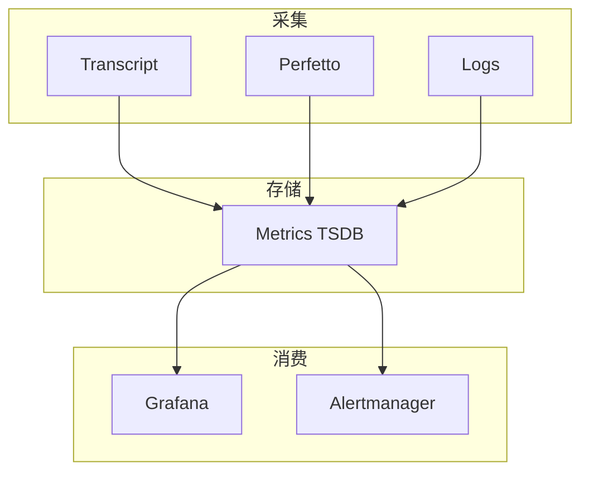
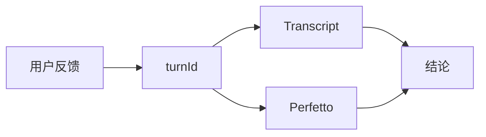
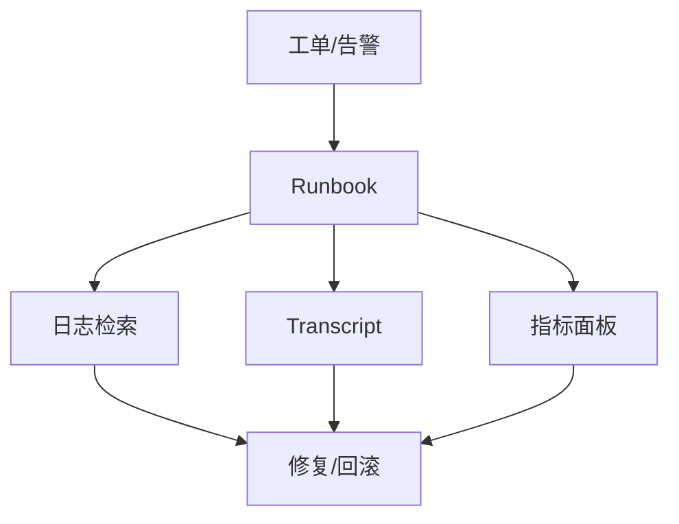

# 18.6 生产最佳实践：监控、告警、日志与调试

> **本节焦点**：把 18.1–18.5 的能力**产品化**：**监控**看板、**告警**路由、**结构化日志**与**一线调试技巧**，形成可复制的运维手册。

---

## 学习目标

1. **列出** Agent 系统的 **SLO** 建议：可用性、P95 延迟、错误预算。
2. **设计** 告警分级：P1 全站不可用 vs P3 体验退化。
3. **规范** 日志字段：`level`、`traceId`、`turnId`、`agentId`、**无密钥**。
4. **掌握** 调试路径：从用户截图 → traceId → Transcript → Perfetto。
5. **制定** 发布 checklist：特性开关、回滚、灰度。

---

## 生活类比：医院急诊分诊

- **监控**是分诊台体温血压：**常态数据**。
- **告警**是红灯：**哪位医生去**取决于级别。
- **日志**是病历：**后续会诊**都靠它。
- **调试**是影像科：**定位病灶**，不是猜。

---

## 监控四维矩阵

| 维度 | 示例指标 | 数据源 |
|------|----------|--------|
| 可用性 | turn 成功率 | Transcript |
| 延迟 | API P95、首 token | telemetry |
| 成本 | tokens / user / day | billing API |
| 资源 | shell 数、MCP 连接数 | 进程表 |



---

## 告警分级表

| 级别 | 条件（示例） | 响应 |
|------|----------------|------|
| P1 | 成功率 < 90% 持续 10m | 电话 |
| P2 | P95 > 30s 持续 20m | IM |
| P3 | 单工具失败率突增 | 工单 |

---

## 结构化日志片段

```typescript
import pino from "pino";

const log = pino({ level: process.env.LOG_LEVEL ?? "info" });

export function logTurn(opts: {
  traceId: string;
  turnId: string;
  msg: string;
  model: string;
}) {
  log.info(
    {
      traceId: opts.traceId,
      turnId: opts.turnId,
      model: opts.model,
    },
    opts.msg
  );
}
```

| 字段 | 必须？ |
|------|--------|
| `traceId` | 强烈推荐 |
| `userId` | 视合规 |
| `prompt` 全文 | 通常禁止 |

---

## 调试剧本（复制即用）

1. **拿到** `turnId`（UI 复制或日志）。
2. **拉取** Transcript 片段：用户输入 → 工具链 → 错误栈。
3. **打开** 同时间段 Perfetto trace：看 **model** slice 是否异常长。
4. **检查** 资源：该 `agentId` 是否残留 shell（18.4）。
5. **验证** 是否为 **429**：若是，审查重试与配额（18.5）。



---

## 特性开关与灰度

| 实践 | 说明 |
|------|------|
| `FEATURE_SUBAGENT` | 可按 workspace 百分比开放 |
| kill switch | API 异常时一键关 MCP |
| 配置远端下发 | 避免发版才关功能 |

---

## 日志查询示例（伪 PromQL / Loki）

```logql
{app="claude-code"} |= "turnId=abc123"
```

```promql
histogram_quantile(0.95, sum(rate(claude_api_latency_ms_bucket[5m])) by (le))
```

---

## 值班手册模板

```markdown
## 429 风暴
1. 确认是否全局
2. 检查最近是否上线更高模型默认档
3. 临时：降采样 + 强制 Sonnet

## 内存上涨
1. heap snapshot
2. 检查 sessionCache 与 transcript buffer
3. killShellTasksForAgent 全量（维护窗）
```

---

## 与合规

| 要求 | 做法 |
|------|------|
| GDPR | 可删除 Transcript 行 |
| SOC2 | 访问审计与加密静态存储 |
| 企业 SSO | 日志脱敏用户标识 |

---

## 自测

1. 为何 **P95** 比 **平均值** 更适合 Agent 延迟 SLO？
2. 日志里放 **API key** 的替代方案是什么？
3. 灰度发布时**最先**观察哪三个指标？

---

## 发布 Checklist

- [ ] 特性开关默认值
- [ ] 回滚脚本 / 镜像 tag
- [ ] 仪表盘已加新 slice category
- [ ] on-call 文档更新

---

## 小结

- **监控 + 告警 + 结构化日志** 是生产三件套；**traceId** 是串联线索。
- **调试剧本**把「玄学」变「工序」。
- **灰度与 kill switch** 让 Agent 这种高耦合系统**可治理**。

---

## On-call 与 Runbook 联动

将 **18.3 Transcript** 与 **18.2 Perfetto** 的查询链接写进 Runbook，可缩短 MTTR：

| 步骤 | 工具 | 产出 |
|------|------|------|
| 1 | 日志 `traceId` | 时间窗口 |
| 2 | Transcript `turnId` | 决策链还原 |
| 3 | Perfetto slice | 慢在模型还是工具 |
| 4 | 指标 | 是否系统性故障 |



---

## 与文化：「可观测性优先」PR 模板

```markdown
## 可观测性
- [ ] 新增代码路径是否打点 / 日志？
- [ ] 是否增加 PII？
- [ ] 是否需要更新 Grafana 面板？
```

---

## 小结（全篇收束）

第 18 篇从 **进程调度** 到 **Perfetto**、**遥测**、**清理**、**容错**、**生产实践**，形成闭环：**看得见、停得掉、救得起、查得到**。

---

*第 18 篇完。回顾性能与成本：[第 17 篇](../part17-performance-cost/index.md)*
