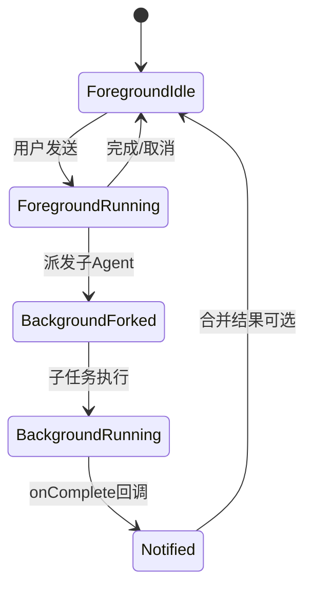
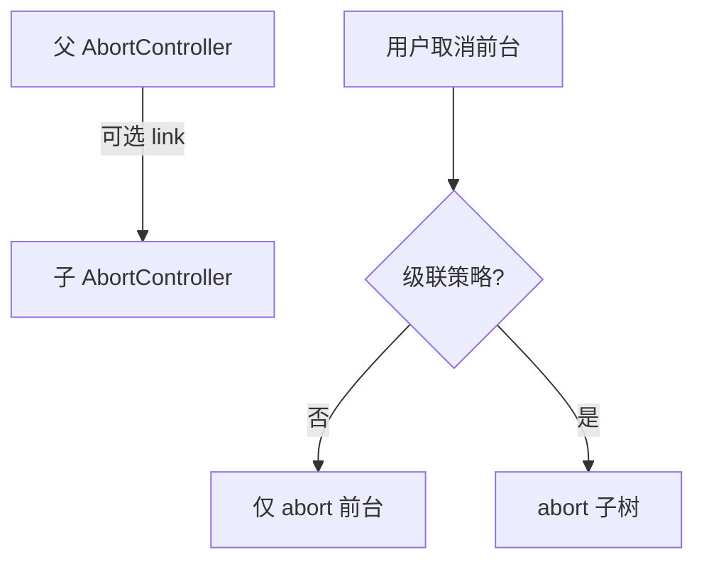
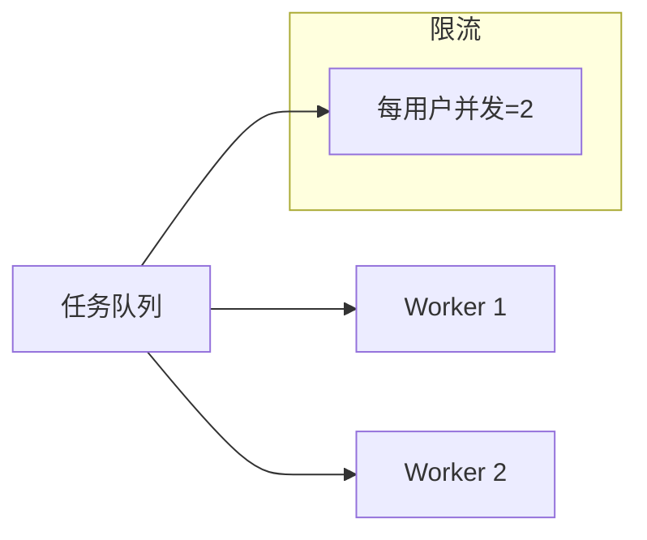

# 第18篇 · 18.1 进程状态调度：前后台 Agent 与生命周期

> **本篇导读**：Claude Code 类系统在长时间运行中会同时存在**前台交互**与**后台子任务**。本节拆解 **Agent 前后台无缝切换**、**独立 AbortController**、**完成通知回调**与**进度追踪**的工程设计。

---

## 学习目标

1. **描述** 前台 Agent 与后台 Agent 在 **UI 状态机**中的切换条件（用户聚焦、任务排队、子 Agent fork）。
2. **解释** 为何后台 Agent 必须持有**独立** `AbortController`，与主会话解耦取消语义。
3. **实现** 完成后的 **回调 / 事件总线** 模式，避免轮询浪费。
4. **设计** 进度追踪：`phase`、`percent`（若可估）、`heartbeat` 时间戳。
5. **关联** 第 17 篇：后台任务失败不应拖垮前台 **Token 预算**（隔离上下文）。

---

## 生活类比：餐厅前台与后厨

- **前台**接待新客、点菜、结账 —— **低延迟响应**。
- **后厨**炖汤、慢烤 —— **可后台进行**，好了**按铃**（回调），不应让前台站着干等。
- 若客人离席（**abort**），前台取消**未上的菜**，但不应误删**别桌**正在炖的汤 —— **每桌独立 AbortController**。

---

## 核心概念表

| 概念 | 含义 |
|------|------|
| 前台 Agent | 与用户当前输入绑定的执行上下文 |
| 后台 Agent | fork / 队列中的子任务，可并行 |
| AbortController | 取消 fetch、子进程、生成器的统一柄 |
| 回调 / Promise | 任务完成向上层通知 |
| 进度 | 可观测、可展示、可告警的中间状态 |



---

## 源码片段：独立 AbortController

```typescript
type AgentHandle = {
  id: string;
  abort: AbortController;
  onComplete: (result: Result) => void;
  onProgress?: (p: Progress) => void;
};

const agents = new Map<string, AgentHandle>();

export function forkBackgroundAgent(job: JobSpec, parentId: string): string {
  const id = crypto.randomUUID();
  const abort = new AbortController();

  const handle: AgentHandle = {
    id,
    abort,
    onComplete: (result) => {
      emit("agent:complete", { id, parentId, result });
      agents.delete(id);
    },
    onProgress: (p) => emit("agent:progress", { id, p }),
  };

  agents.set(id, handle);
  void runAgentLoop(job, { signal: abort.signal, handle });
  return id;
}

export function cancelAgent(id: string) {
  agents.get(id)?.abort.abort();
}
```

**要点**：

- **子** `AbortSignal` 不应用父 signal **直接替换**，否则父取消会误杀无关后台任务（除非业务明确要求级联）。

---

## 级联取消 vs 独立取消

| 策略 | 场景 |
|------|------|
| 独立 | 用户只想停当前输入，后台索引继续跑 |
| 级联 | 用户「关闭工作区」— 全员 abort |
| 可配置 | 设置项 `background.detachOnCancel` |



---

## 进度追踪字段建议

| 字段 | 类型 | 说明 |
|------|------|------|
| `phase` | string | `planning` / `tooling` / `summarizing` |
| `step` | number | 单调递增 |
| `message` | string | 人类可读 |
| `ts` | number | `Date.now()` heartbeat |
| `etaMs` | number? | 可估则填，不可则省略 |

```typescript
type Progress = {
  phase: string;
  step: number;
  message: string;
  ts: number;
  etaMs?: number;
};

function heartbeat(handle: AgentHandle, p: Progress) {
  handle.onProgress?.(p);
}
```

---

## 与 UI 的绑定：无缝切换

1. **前台 running**：输入框禁用或显示「停止」。
2. **后台 running**：状态栏显示 **N 个后台任务**，可点开看进度。
3. **完成**：Toast + Transcript 注入摘要，**不把整段子上下文合并**进前台（避免 Token 爆炸）— 只合并**结论**。

---

## 并发与资源上限

| 风险 | 缓解 |
|------|------|
| 无限制 fork | 队列 + maxParallel |
| 内存膨胀 | 子 Agent 输出落盘，摘要进主会话 |
| 僵尸进程 | 见 `04-resource-cleanup.md` |

---

## 事件命名规范（建议）

| 事件 | payload |
|------|---------|
| `agent:start` | `{ id, parentId, mode }` |
| `agent:progress` | `{ id, p }` |
| `agent:complete` | `{ id, result }` |
| `agent:error` | `{ id, error }` |

便于 **Perfetto** 与 **全链路遥测** 订阅（后续小节）。

---

## 自测

1. 何时应使用**独立** AbortController，何时应**链接**父 signal？
2. 后台完成回调里，应避免把哪些内容合并进主上下文？
3. 画出一个三状态 UI（空闲 / 前台运行 / 有后台任务）的切换表。

---

## 与 18.2–18.6 的路线图

| 文件 | 主题 |
|------|------|
| `02-perfetto.md` | 性能追踪注册 |
| `03-telemetry.md` | Transcript、计时、延迟 |
| `04-resource-cleanup.md` | Shell / MCP / Hook |
| `05-error-recovery.md` | 熔断、重试、降级 |
| `06-best-practices.md` | 生产运维 |

---

## 小结

- **前后台分离**是长会话产品化的基础；**独立 abort** 是正确取消的底线。
- **回调 + 事件**优于忙轮询；**进度 heartbeat** 是体验与遥测的共同数据源。
- 与 **资源清理、错误恢复** 拼起来，才构成完整生命周期。

---

## 进阶：任务队列与公平性

当多个后台 Agent 竞争同一资源（CPU、Git 锁、MCP 配额）时，建议引入**轻量队列**：

| 策略 | 描述 | 代价 |
|------|------|------|
| FIFO | 先到先得 | 长任务阻塞短任务 |
| 加权公平 | 按 `priority` 与已消耗配额排序 | 实现复杂 |
| 用户级隔离 | 每用户并发上限 | 资源碎片化 |



---

## 与 Windows / Electron 的注意点

| 平台 | 建议 |
|------|------|
| Windows | `process.kill` 语义不同，shell 追踪用 `child.pid` + `taskkill` 备选 |
| Electron | 在 `window-all-closed` 与 `before-quit` 双钩子里调用清理（见 18.4） |
| 沙箱 | 子进程可能无法发信号给孙进程，需记录整棵 PID 树 |

---

## 术语表

| 英文 | 中文 |
|------|------|
| Foreground | 前台 |
| Background | 后台 |
| AbortSignal | 取消信号 |
| Callback | 回调 |
| Heartbeat | 心跳 / 进度戳 |

---

*下一节：[`02-perfetto.md`](./02-perfetto.md) — Perfetto 性能追踪。*
