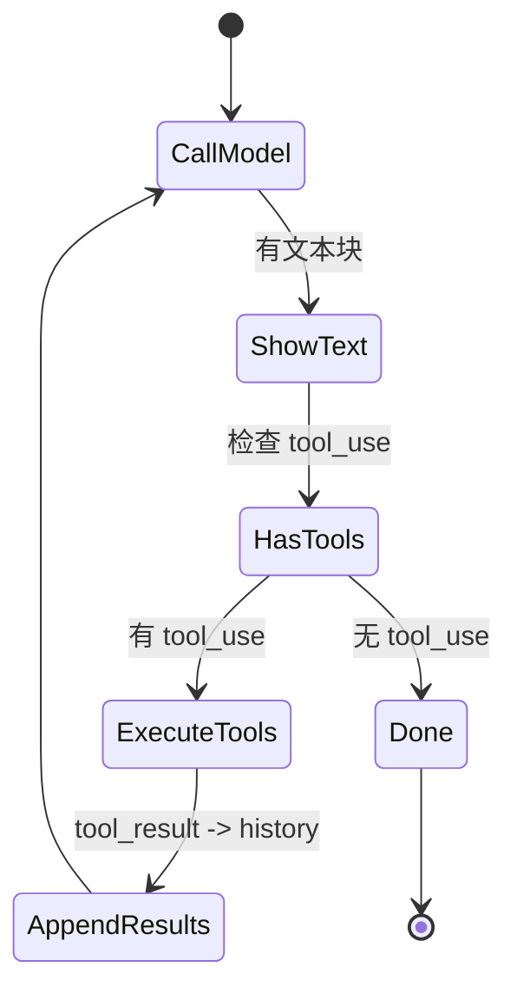

# Lab 2：实现工具注册与执行

> **系列**：Claude Code 完全指南 V2 · 第 19 篇实战 Lab  
> **前置**：完成 [Lab 1](./index.md)，理解 Messages API 与 `history` 维护方式。

---

## 学习目标

1. 定义统一的 **Tool 接口**：`name`、`description`、`inputSchema`、`execute`。
2. 实现 **ToolRegistry**：注册、按名查找、列出全部工具定义（供 API `tools` 参数使用）。
3. 实现两个示例工具：**ReadFileTool**、**ListDirectoryTool**（仅读文件系统，注意路径安全）。
4. 在 `messages.create` 中传入 `tools`，处理 `stop_reason === "tool_use"`，执行工具并以 **`tool_result` user 消息** 追加后继续请求，直到模型输出自然语言结束。

---

## 概念：Claude 工具调用流程

```mermaid
sequenceDiagram
  participant Loop as Agent Loop
  participant API as Claude API
  participant Reg as ToolRegistry

  Loop->>API: messages + tools definitions
  API-->>Loop: assistant(content含tool_use)
  Loop->>Reg: execute(name, input)
  Reg-->>Loop: 字符串结果
  Loop->>API: user(tool_result) + 原history
  API-->>Loop: 最终文本或再次tool_use
```

要点：

- `tools` 数组中的每一项需符合 Anthropic 的 [tool schema](https://docs.anthropic.com/en/api/messages)（`name`、`description`、`input_schema`）。
- 收到 `tool_use` 后，必须用 **同一次对话** 追加一条 `user` 消息，`content` 为 `tool_result` 块，且 `tool_use_id` 与响应一致。

---

## 项目结构（在 Lab 1 基础上扩展）

```
mini-agent-lab2/
├── package.json
├── tsconfig.json
└── src/
    ├── main.ts
    ├── tool.ts          # Tool 接口
    ├── registry.ts      # ToolRegistry
    └── tools/
        ├── read-file.ts
        └── list-dir.ts
```

安装依赖与 Lab 1 相同；若从 Lab 1 复制项目，只需新增上述文件。

---

## 步骤 1：`Tool` 接口与 JSON Schema 类型

创建 `src/tool.ts`：

```typescript
import type { Tool as AnthropicTool } from "@anthropic-ai/sdk/resources/messages";

/** 单工具执行：返回给模型的文本（可序列化为字符串） */
export type ToolExecute = (input: Record<string, unknown>) => Promise<string>;

export interface ToolDefinition {
  name: string;
  description: string;
  /** JSON Schema object，对应 API 的 input_schema */
  inputSchema: Record<string, unknown>;
  execute: ToolExecute;
}

export function toAnthropicTool(def: ToolDefinition): AnthropicTool {
  return {
    name: def.name,
    description: def.description,
    input_schema: def.inputSchema as AnthropicTool["input_schema"],
  };
}
```

---

## 步骤 2：`ToolRegistry`

创建 `src/registry.ts`：

```typescript
import type { Tool as AnthropicTool } from "@anthropic-ai/sdk/resources/messages";
import type { ToolDefinition } from "./tool.js";
import { toAnthropicTool } from "./tool.js";

export class ToolRegistry {
  private readonly map = new Map<string, ToolDefinition>();

  register(tool: ToolDefinition): void {
    if (this.map.has(tool.name)) {
      throw new Error(`Tool already registered: ${tool.name}`);
    }
    this.map.set(tool.name, tool);
  }

  get(name: string): ToolDefinition | undefined {
    return this.map.get(name);
  }

  listDefinitions(): AnthropicTool[] {
    return [...this.map.values()].map(toAnthropicTool);
  }
}
```

---

## 步骤 3：`ReadFileTool` 与 `ListDirectoryTool`

`src/tools/read-file.ts`：

```typescript
import * as fs from "node:fs/promises";
import * as path from "node:path";
import type { ToolDefinition } from "../tool.js";

function resolveSafe(root: string, userPath: string): string {
  const abs = path.resolve(root, userPath);
  const rootAbs = path.resolve(root);
  if (!abs.startsWith(rootAbs + path.sep) && abs !== rootAbs) {
    throw new Error("Path escapes workspace root");
  }
  return abs;
}

export function createReadFileTool(workspaceRoot: string): ToolDefinition {
  return {
    name: "read_file",
    description: "Read UTF-8 text from a file under the workspace root.",
    inputSchema: {
      type: "object",
      properties: {
        path: { type: "string", description: "Relative path from workspace root" },
      },
      required: ["path"],
    },
    async execute(input) {
      const p = String(input.path ?? "");
      const full = resolveSafe(workspaceRoot, p);
      const data = await fs.readFile(full, "utf8");
      return data;
    },
  };
}
```

`src/tools/list-dir.ts`：

```typescript
import * as fs from "node:fs/promises";
import * as path from "node:path";
import type { ToolDefinition } from "../tool.js";

function resolveSafe(root: string, userPath: string): string {
  const abs = path.resolve(root, userPath);
  const rootAbs = path.resolve(root);
  if (!abs.startsWith(rootAbs + path.sep) && abs !== rootAbs) {
    throw new Error("Path escapes workspace root");
  }
  return abs;
}

export function createListDirectoryTool(workspaceRoot: string): ToolDefinition {
  return {
    name: "list_directory",
    description: "List non-hidden entries in a directory under the workspace root.",
    inputSchema: {
      type: "object",
      properties: {
        path: {
          type: "string",
          description: "Relative directory path; use . for root",
        },
      },
      required: ["path"],
    },
    async execute(input) {
      const p = String(input.path ?? ".");
      const full = resolveSafe(workspaceRoot, p);
      const entries = await fs.readdir(full, { withFileTypes: true });
      const lines = entries
        .filter((e) => !e.name.startsWith("."))
        .map((e) => (e.isDirectory() ? `${e.name}/` : e.name));
      return lines.length ? lines.join("\n") : "(empty)";
    },
  };
}
```

---

## 步骤 4：主循环（含工具执行）

创建 `src/main.ts`（完整可运行）：

```typescript
import * as readline from "node:readline/promises";
import { stdin as input, stdout as output } from "node:process";
import * as path from "node:path";
import Anthropic from "@anthropic-ai/sdk";
import type {
  Message,
  MessageParam,
  ToolResultBlockParam,
  ToolUseBlock,
} from "@anthropic-ai/sdk/resources/messages";
import { ToolRegistry } from "./registry.js";
import { createReadFileTool } from "./tools/read-file.js";
import { createListDirectoryTool } from "./tools/list-dir.js";

const MODEL = "claude-sonnet-4-20250514";

function extractText(message: Message): string {
  const parts: string[] = [];
  for (const block of message.content) {
    if (block.type === "text") parts.push(block.text);
  }
  return parts.join("\n");
}

function extractToolUses(message: Message): ToolUseBlock[] {
  return message.content.filter(
    (b): b is ToolUseBlock => b.type === "tool_use"
  );
}

async function runAgentTurn(
  client: Anthropic,
  history: MessageParam[],
  tools: ReturnType<ToolRegistry["listDefinitions"]>,
  registry: ToolRegistry
): Promise<void> {
  let current = await client.messages.create({
    model: MODEL,
    max_tokens: 2048,
    tools,
    messages: history,
  });

  while (true) {
    history.push({ role: "assistant", content: current.content });

    const text = extractText(current);
    if (text) console.log("\n助手:\n" + text + "\n");

    const uses = extractToolUses(current);
    if (uses.length === 0) break;

    const results: ToolResultBlockParam[] = [];
    for (const u of uses) {
      const tool = registry.get(u.name);
      let out: string;
      if (!tool) {
        out = `Unknown tool: ${u.name}`;
      } else {
        try {
          const inputObj = (u.input ?? {}) as Record<string, unknown>;
          out = await tool.execute(inputObj);
        } catch (e) {
          out = e instanceof Error ? e.message : String(e);
        }
      }
      results.push({
        type: "tool_result",
        tool_use_id: u.id,
        content: out,
      });
    }

    history.push({ role: "user", content: results });

    current = await client.messages.create({
      model: MODEL,
      max_tokens: 2048,
      tools,
      messages: history,
    });
  }
}

async function main(): Promise<void> {
  const apiKey = process.env.ANTHROPIC_API_KEY;
  if (!apiKey) {
    console.error("请设置 ANTHROPIC_API_KEY");
    process.exit(1);
  }

  const workspace = path.resolve(process.cwd());
  const registry = new ToolRegistry();
  registry.register(createReadFileTool(workspace));
  registry.register(createListDirectoryTool(workspace));
  const tools = registry.listDefinitions();

  const client = new Anthropic({ apiKey });
  const rl = readline.createInterface({ input, output });

  const history: MessageParam[] = [
    {
      role: "user",
      content: `工作区根目录: ${workspace}。你可使用 read_file 与 list_directory 协助用户。`,
    },
  ];

  console.log("Lab2 Agent（带工具）已启动。exit/quit 退出。\n");

  while (true) {
    const line = (await rl.question("你: ")).trim();
    if (!line) continue;
    if (/^(exit|quit)$/i.test(line)) {
      rl.close();
      break;
    }
    history.push({ role: "user", content: line });
    await runAgentTurn(client, history, tools, registry);
  }
}

main().catch((e) => {
  console.error(e);
  process.exit(1);
});
```

---

## `package.json` 参考

```json
{
  "name": "mini-agent-lab2",
  "type": "module",
  "scripts": {
    "start": "tsx src/main.ts"
  },
  "dependencies": {
    "@anthropic-ai/sdk": "^0.39.0"
  },
  "devDependencies": {
    "@types/node": "^22.0.0",
    "tsx": "^4.19.0",
    "typescript": "^5.7.0"
  }
}
```

使用 ESM 时请在 `tsconfig.json` 中保持 `"module": "NodeNext"`。

---

## 运行与验证

```bash
export ANTHROPIC_API_KEY=...
npm start
```

尝试提问：「列出当前目录有哪些文件」或「读取 package.json 的内容」。应观察到模型发起 `tool_use`，终端打印工具执行后的第二轮助手回复。

---

## 内部状态机（Mermaid）



---

## 安全提示

- `resolveSafe` 限制路径必须在 `workspaceRoot` 下，避免任意文件读取。
- 生产环境还需限制文件大小、二进制检测等（本 Lab 从简）。

---

## 小结与下一 Lab

| 能力 | 说明 |
|------|------|
| 注册表 | 集中管理工具名与实现 |
| API 对齐 | `listDefinitions()` → `tools` |
| 闭环 | `assistant(tool_use)` → `user(tool_result)` → 再次 `create` |

下一篇：[Lab 3：权限控制](./03-permissions.md) 将在执行工具前加入确认与黑名单策略。
