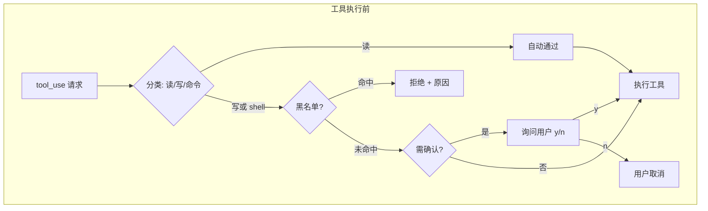
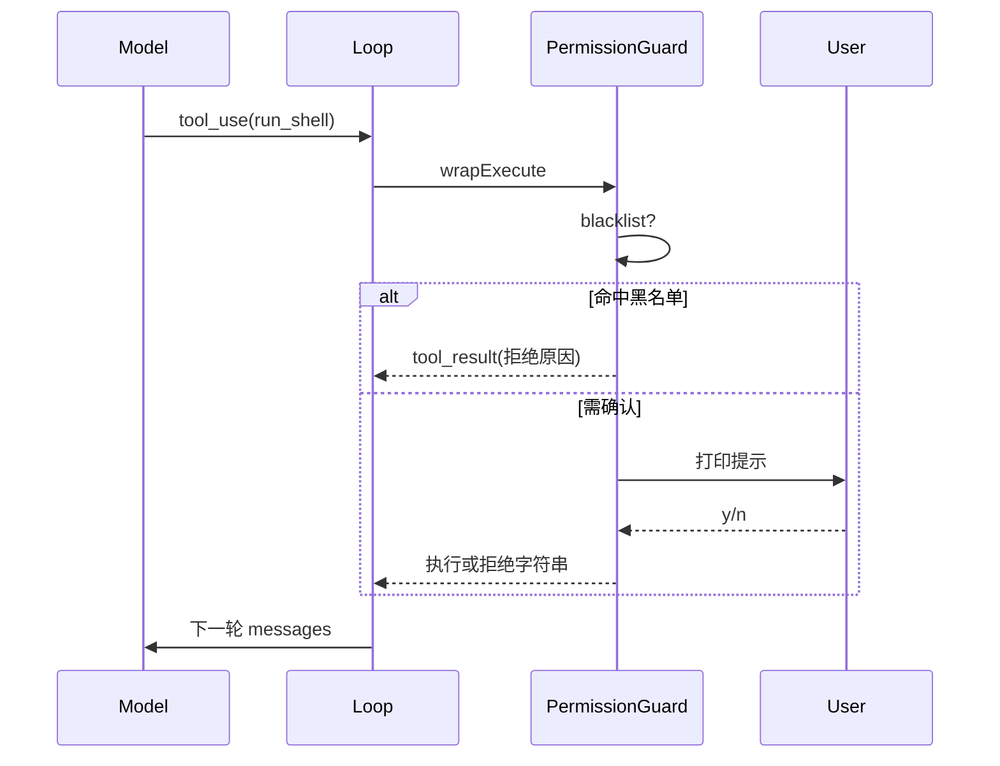

# Lab 3：添加权限控制

> **系列**：Claude Code 完全指南 V2 · 第 19 篇实战 Lab  
> **前置**：完成 [Lab 2](./02-tool-registry.md)，已能执行 `read_file` / `list_directory`。

---

## 学习目标

1. 在**工具真正执行前**插入统一的权限检查层（Policy / Gate）。
2. 实现简单规则：**读类操作默认通过**；**写类或敏感操作**需用户在终端输入 `y`/`n` 确认。
3. 维护**命令黑名单**（如包含 `rm -rf`、`mkfs` 等子串的命令一律拒绝），防止模型或用户误触发毁灭性操作。
4. 将拒绝原因以字符串返回给模型（作为 `tool_result` 内容），使模型能向用户解释并重试。

---

## 权限模型概览



本 Lab 在 Lab 2 的 `ToolRegistry` 执行路径外包一层 **`PermissionGuard`**，主循环只调用 `guard.run(toolName, input, () => tool.execute(input))`。

---

## 步骤 1：定义工具风险等级与策略接口

创建 `src/permissions/types.ts`：

```typescript
export type RiskLevel = "read" | "write" | "command";

export interface PermissionContext {
  /** 同步询问用户；返回 true 表示允许 */
  confirm(message: string): Promise<boolean>;
}

export type ClassifyFn = (
  toolName: string,
  input: Record<string, unknown>
) => RiskLevel;
```

---

## 步骤 2：黑名单与分类逻辑

创建 `src/permissions/policy.ts`：

```typescript
import type { ClassifyFn, PermissionContext, RiskLevel } from "./types.js";

const COMMAND_BLACKLIST_PATTERNS: RegExp[] = [
  /\brm\s+-rf\b/i,
  /\bmkfs\b/i,
  /:\(\)\{\s*:\|:&\s*\};:/, // fork bomb 简例
  />\s*\/dev\/sd/, // 危险重定向示例
];

export function isBlacklistedCommand(cmd: string): string | null {
  const c = cmd.trim();
  for (const re of COMMAND_BLACKLIST_PATTERNS) {
    if (re.test(c)) return `黑名单命中: ${re.source}`;
  }
  return null;
}

/** 演示用分类：按工具名粗分；你可按 input 细化 */
export const classifyTool: ClassifyFn = (
  toolName: string,
  _input: Record<string, unknown>
): RiskLevel => {
  if (toolName === "read_file" || toolName === "list_directory") return "read";
  if (toolName === "run_shell") return "command";
  return "write";
};

export async function ensureAllowed(
  level: RiskLevel,
  toolName: string,
  input: Record<string, unknown>,
  ctx: PermissionContext
): Promise<{ ok: true } | { ok: false; reason: string }> {
  if (level === "read") return { ok: true };

  if (level === "command") {
    const cmd = String(input.command ?? input.cmd ?? "");
    const bl = isBlacklistedCommand(cmd);
    if (bl) return { ok: false, reason: bl };
    const ok = await ctx.confirm(
      `[命令执行] 是否允许运行?\n工具: ${toolName}\n命令: ${cmd}`
    );
    return ok ? { ok: true } : { ok: false, reason: "用户拒绝执行命令" };
  }

  // write 或其他
  const ok = await ctx.confirm(
    `[写操作] 是否允许工具 ${toolName} 修改系统状态?\n输入: ${JSON.stringify(
      input
    )}`
  );
  return ok ? { ok: true } : { ok: false, reason: "用户拒绝写操作" };
}
```

---

## 步骤 3：`PermissionGuard` 包装执行

创建 `src/permissions/guard.ts`：

```typescript
import type { ToolDefinition } from "../tool.js";
import type { PermissionContext } from "./types.js";
import { classifyTool, ensureAllowed } from "./policy.js";

export class PermissionGuard {
  constructor(private readonly ctx: PermissionContext) {}

  async wrapExecute(
    def: ToolDefinition,
    input: Record<string, unknown>
  ): Promise<string> {
    const level = classifyTool(def.name, input);
    const decision = await ensureAllowed(level, def.name, input, this.ctx);
    if (!decision.ok) return `[权限拒绝] ${decision.reason}`;
    return def.execute(input);
  }
}
```

---

## 步骤 4：演示用 `run_shell` 工具（可选但推荐）

创建 `src/tools/run-shell.ts`（**仅用于教学**，生产请用更严格的沙箱）：

```typescript
import { execFile } from "node:child_process";
import { promisify } from "node:util";
import type { ToolDefinition } from "../tool.js";

const execFileAsync = promisify(execFile);

export function createRunShellTool(): ToolDefinition {
  return {
    name: "run_shell",
    description:
      "Run a single shell command (non-interactive). Dangerous; requires user confirmation and blacklist checks.",
    inputSchema: {
      type: "object",
      properties: {
        command: { type: "string", description: "Single command line" },
      },
      required: ["command"],
    },
    async execute(input) {
      const command = String(input.command ?? "");
      // 极简演示：拆成可执行文件 + 参数（真实场景需更严谨解析）
      const [bin, ...args] = command.split(/\s+/);
      if (!bin) throw new Error("empty command");
      const { stdout, stderr } = await execFileAsync(bin, args, {
        maxBuffer: 1024 * 1024,
      });
      return (stdout || stderr || "(no output)").toString();
    },
  };
}
```

---

## 步骤 5：整合到主循环 `main.ts`

在 Lab 2 的 `runAgentTurn` 中，将执行段改为使用 `PermissionGuard`。下面给出**关键修改片段**（完整文件 = Lab 2 结构 + 下列替换）。

```typescript
import * as readline from "node:readline/promises";
import { stdin as input, stdout as output } from "node:process";
import { PermissionGuard } from "./permissions/guard.js";
import { createRunShellTool } from "./tools/run-shell.js";
// ... 其余 import 同 Lab2

async function runAgentTurn(
  client: Anthropic,
  history: MessageParam[],
  tools: ReturnType<ToolRegistry["listDefinitions"]>,
  registry: ToolRegistry,
  guard: PermissionGuard
): Promise<void> {
  let current = await client.messages.create({
    model: MODEL,
    max_tokens: 2048,
    tools,
    messages: history,
  });

  while (true) {
    history.push({ role: "assistant", content: current.content });
    const text = extractText(current);
    if (text) console.log("\n助手:\n" + text + "\n");

    const uses = extractToolUses(current);
    if (uses.length === 0) break;

    const results: ToolResultBlockParam[] = [];
    for (const u of uses) {
      const def = registry.get(u.name);
      let out: string;
      if (!def) out = `Unknown tool: ${u.name}`;
      else {
        const inputObj = (u.input ?? {}) as Record<string, unknown>;
        out = await guard.wrapExecute(def, inputObj);
      }
      results.push({
        type: "tool_result",
        tool_use_id: u.id,
        content: out,
      });
    }

    history.push({ role: "user", content: results });
    current = await client.messages.create({
      model: MODEL,
      max_tokens: 2048,
      tools,
      messages: history,
    });
  }
}

async function main(): Promise<void> {
  const rl = readline.createInterface({ input, output });
  const guard = new PermissionGuard({
    async confirm(msg: string) {
      console.log("\n" + msg + "\n允许? [y/N]: ");
      const ans = (await rl.question("")).trim().toLowerCase();
      return ans === "y" || ans === "yes";
    },
  });

  const registry = new ToolRegistry();
  registry.register(createReadFileTool(workspace));
  registry.register(createListDirectoryTool(workspace));
  registry.register(createRunShellTool());

  // ... 循环里 await runAgentTurn(..., guard);
}
```

---

## 行为矩阵

| 工具 | 分类 | 黑名单 | 用户确认 |
|------|------|--------|----------|
| read_file | read | — | 否 |
| list_directory | read | — | 否 |
| run_shell | command | 是 | 是 |
| 未来 write_file | write | 可扩展 | 是 |

---

## 测试用例建议

1. **读文件**：应无确认提示。  
2. **`run_shell` + `echo hello`**：应弹出确认，`y` 后成功。  
3. **`run_shell` + `rm -rf /`**：应直接拒绝，无需确认（黑名单）。  

---

## Mermaid：与模型交互时的拒绝路径



---

## 设计取舍

- **为何不把黑名单放在模型侧？** 模型可被诱导；**执行前硬编码策略**更可靠。  
- **为何读操作不确认？** 降低摩擦；若工作区含密钥文件，应改为「敏感路径二次确认」（扩展练习）。

---

## 下一 Lab

[Lab 4：流式响应](./04-streaming.md) 将把 `messages.create` 改为流式 API，实现终端逐 token 输出。
