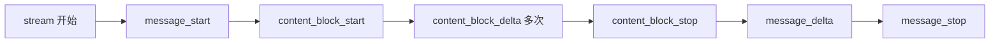
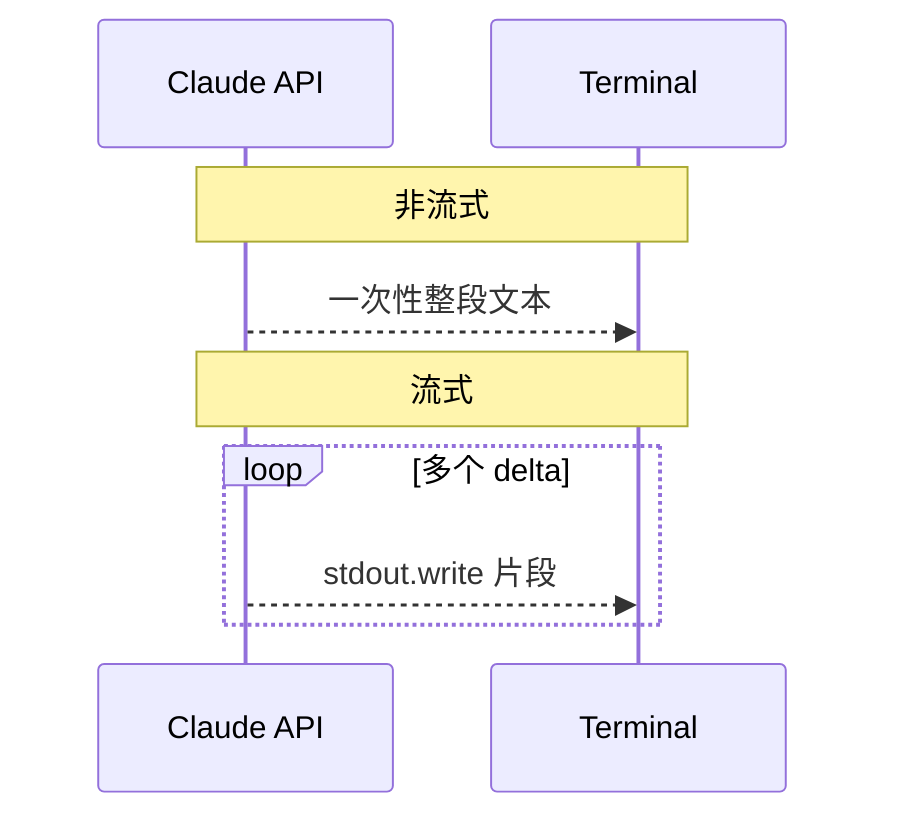

# Lab 4：实现流式响应

> **系列**：Claude Code 完全指南 V2 · 第 19 篇实战 Lab  
> **前置**：完成 [Lab 2](./02-tool-registry.md)（Lab 3 权限可与本 Lab 独立合并）。

---

## 学习目标

1. 使用 Anthropic SDK 的 **`stream: true`**（或 `messages.stream`）消费 Server-Sent Events 风格的分片。
2. 将**文本增量**实时写入终端（`process.stdout.write`），改善交互体验。
3. 从流中**重组完整 `Message`**（或等价结构），以便正确提取 **`tool_use` 块**并走与 Lab 2 相同的工具执行闭环。
4. 理解流式场景下 **`message_start` / `content_block_start` / `content_block_delta` / `message_delta`** 等事件顺序。

---

## 流式事件管线



SDK 的具体事件名以当前版本为准；核心是：**累积 text delta**，并对 `tool_use` 块累积 `partial_json` 直至块结束。

---

## 步骤 1：依赖与模型常量

与前面 Lab 相同，确保：

```bash
npm install @anthropic-ai/sdk
```

---

## 步骤 2：流式辅助 — 累积完整内容与 tool_use

创建 `src/streaming/accumulate.ts`（适配 `@anthropic-ai/sdk` 的 stream 迭代器；若类型有差异，以官方类型为准微调）：

```typescript
import type Anthropic from "@anthropic-ai/sdk";
import type {
  Message,
  MessageStreamEvent,
} from "@anthropic-ai/sdk/resources/messages";

type ToolUsePartial = {
  id: string;
  name: string;
  inputJson: string;
};

/**
 * 消费 async iterable 流，边打印文本边累积最终 Message 所需结构。
 * 返回与 messages.create 类似的对象，便于复用 Lab2 的 extractToolUses。
 */
export async function streamToMessage(
  stream: AsyncIterable<MessageStreamEvent>,
  onTextDelta: (t: string) => void
): Promise<Message> {
  const textParts: string[] = [];
  const toolUses: ToolUsePartial[] = [];
  let currentTextBlockIndex = -1;
  let currentToolIndex = -1;
  let stopReason: Message["stop_reason"] | null = null;
  let usage: Message["usage"] | undefined;

  for await (const event of stream) {
    switch (event.type) {
      case "message_start": {
        // usage 可能在 message_delta 中更新
        break;
      }
      case "content_block_start": {
        if (event.content_block.type === "text") {
          currentTextBlockIndex = event.index;
          textParts.push("");
        } else if (event.content_block.type === "tool_use") {
          currentToolIndex = event.index;
          toolUses.push({
            id: event.content_block.id,
            name: event.content_block.name,
            inputJson: "",
          });
        }
        break;
      }
      case "content_block_delta": {
        if (event.delta.type === "text_delta") {
          const t = event.delta.text;
          onTextDelta(t);
          if (currentTextBlockIndex >= 0) {
            textParts[currentTextBlockIndex] =
              (textParts[currentTextBlockIndex] ?? "") + t;
          }
        } else if (event.delta.type === "input_json_delta") {
          const chunk = event.delta.partial_json ?? "";
          const tu = toolUses[currentToolIndex];
          if (tu) tu.inputJson += chunk;
        }
        break;
      }
      case "message_delta": {
        if (event.delta.stop_reason)
          stopReason = event.delta.stop_reason as Message["stop_reason"];
        if (event.usage) usage = event.usage as Message["usage"];
        break;
      }
      default:
        break;
    }
  }

  const content: Message["content"] = [];

  for (let i = 0; i < textParts.length; i++) {
    if (textParts[i]) content.push({ type: "text", text: textParts[i] });
  }
  for (const tu of toolUses) {
    let input: Record<string, unknown> = {};
    try {
      input = tu.inputJson ? JSON.parse(tu.inputJson) : {};
    } catch {
      input = { _raw: tu.inputJson };
    }
    content.push({
      type: "tool_use",
      id: tu.id,
      name: tu.name,
      input,
    });
  }

  return {
    id: "stream-local",
    type: "message",
    role: "assistant",
    content,
    model: "stream",
    stop_reason: stopReason ?? "end_turn",
    stop_sequence: null,
    usage: usage ?? { input_tokens: 0, output_tokens: 0 },
  };
}
```

> **说明**：不同 SDK 版本事件字段可能略有不同；若编译报错，请对照 `node_modules/@anthropic-ai/sdk` 中 `MessageStreamEvent` 定义逐项对齐。

---

## 步骤 3：主循环中改用 `stream`

`src/main.ts` 核心片段：

```typescript
import Anthropic from "@anthropic-ai/sdk";
import { streamToMessage } from "./streaming/accumulate.js";

const MODEL = "claude-sonnet-4-20250514";

async function createMessageStreaming(
  client: Anthropic,
  params: Omit<Anthropic.Messages.MessageCreateParams, "stream"> & {
    stream?: true;
  }
): Promise<import("@anthropic-ai/sdk/resources/messages").Message> {
  const stream = await client.messages.create({
    ...params,
    stream: true,
  });
  process.stdout.write("\n助手: ");
  const message = await streamToMessage(stream, (t) => {
    process.stdout.write(t);
  });
  process.stdout.write("\n\n");
  return message;
}

// 在 runAgentTurn 内将 client.messages.create 替换为 createMessageStreaming
```

完整逻辑仍为：

1. `createMessageStreaming` 得到 `message`。  
2. `history.push({ role: "assistant", content: message.content })`。  
3. 若有 `tool_use`，执行工具，`history.push(tool_result)`，再次流式请求，直到无工具。

---

## 终端体验对比



---

## 调试建议

1. 临时 `console.error(JSON.stringify(event))` 打印事件，确认 `content_block` 索引与 text/tool 交错顺序。  
2. `tool_use` 的 `input_json` 可能分多片到达，**必须拼接完再 `JSON.parse`**。  
3. 若模型先输出说明性文字再输出 `tool_use`，用户会先看到流式文本，再进入工具分支，体验与 Claude Code 类似。

---

## 与 Lab 3 合并

将 `createMessageStreaming` 与 `PermissionGuard.wrapExecute` 放在同一 `runAgentTurn` 即可；无额外冲突。

---

## 小结

| 要点 | 内容 |
|------|------|
| UX | `stdout.write` 逐字输出 |
| 正确性 | 累积完整 `content` 再写 history |
| 工具 | `input_json_delta` 拼接 |

---

## 非流式与流式统一封装（可选）

若希望同一套 `runAgentTurn` 在配置中切换模式，可提取：

```typescript
type CreateMsg = typeof Anthropic.prototype.messages.create;

async function callModel(
  client: Anthropic,
  params: Anthropic.Messages.MessageCreateParamsNonStreaming,
  streaming: boolean
): Promise<Anthropic.Message> {
  if (!streaming) {
    return client.messages.create(params);
  }
  const stream = await client.messages.create({ ...params, stream: true });
  process.stdout.write("\n助手: ");
  const message = await streamToMessage(stream, (t) => process.stdout.write(t));
  process.stdout.write("\n\n");
  return message;
}
```

注意：`streamToMessage` 返回的本地对象在 `id`/`usage` 上与真实 REST 响应可能略有差异，但 **`content` 结构**足以驱动 `extractToolUses` 与 history 追加。

---

## SDK 版本与事件类型

`MessageStreamEvent` 的联合成员名随 `@anthropic-ai/sdk` 小版本可能增减。若 TypeScript 报错：

1. 在 `node_modules/@anthropic-ai/sdk/resources/messages` 中搜索 `MessageStreamEvent`。  
2. 为 `content_block_delta` 分支增加对新 `delta.type` 的 `switch` 分支或 `default` 吞掉未知事件。  
3. 升级 SDK 时运行 `npm run typecheck`，用编译器引导你补齐处理逻辑。

---

## 错误处理与重试（教学提示）

流中途若网络断开，`for await` 会抛错。可在循环外层包一层：

```typescript
async function withRetry<T>(fn: () => Promise<T>, times = 2): Promise<T> {
  let last: unknown;
  for (let i = 0; i <= times; i++) {
    try {
      return await fn();
    } catch (e) {
      last = e;
      if (i === times) break;
      await new Promise((r) => setTimeout(r, 500 * (i + 1)));
    }
  }
  throw last;
}
```

生产环境还需区分 **429 / 5xx** 与 **4xx 业务错误**（Anthropic SDK 会抛出带 `status` 的错误对象）。

---

## 自检清单

- [ ] 纯文本对话时，终端逐字出现且无乱码。  
- [ ] 含 `tool_use` 时，流结束后仍能解析出完整 `name` 与 `input`。  
- [ ] 多轮工具调用中，每一轮 assistant `content` 均已写入 `history`。  

---

## 下一 Lab

[Lab 5：构建 MCP 服务器](./05-mcp-server.md) 将用 `@modelcontextprotocol/sdk` 实现 stdio MCP，并把远程工具挂入 Agent。
