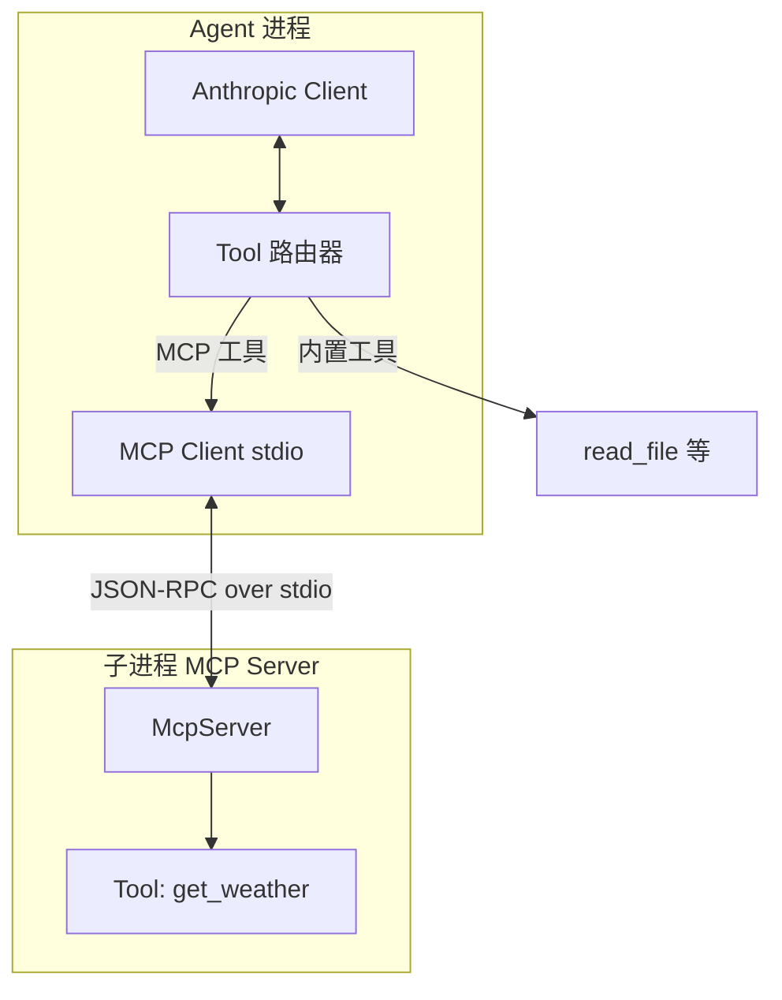

# Lab 5：构建 MCP 服务器（stdio）并在 Agent 中使用

> **系列**：Claude Code 完全指南 V2 · 第 19 篇实战 Lab  
> **前置**：完成 [Lab 2](./02-tool-registry.md)；理解工具在 API 中的声明方式。

---

## 学习目标

1. 使用 **`@modelcontextprotocol/sdk`** 搭建一个最小 **MCP Server**，通过 **stdio** 与客户端通信。
2. 实现一个演示工具 **`get_weather`**（可返回模拟 JSON，不必调用真实气象 API）。
3. 在 Node Agent 中使用 **`@anthropic-ai/sdk` 之外的 MCP 客户端**（或用 `child_process` 启动 server 并用 MCP 客户端库连接）。本 Lab 采用：**独立 `mcp-server` 子包 + Agent 内 `@modelcontextprotocol/sdk` Client + StdioClientTransport**。
4. 将 MCP 暴露的工具**动态合并**进 `messages.create` 的 `tools` 列表，并把执行路由到 MCP `callTool`。

---

## 架构总览



---

## 步骤 1：工作区布局

```
lab5-mcp/
├── package.json
├── tsconfig.json
├── src/
│   ├── agent/
│   │   └── main.ts
│   └── mcp-server/
│       └── index.ts
```

根 `package.json`：

```json
{
  "name": "lab5-mcp",
  "type": "module",
  "scripts": {
    "mcp": "tsx src/mcp-server/index.ts",
    "agent": "tsx src/agent/main.ts"
  },
  "dependencies": {
    "@anthropic-ai/sdk": "^0.39.0",
    "@modelcontextprotocol/sdk": "^1.12.0",
    "zod": "^3.25.0"
  },
  "devDependencies": {
    "@types/node": "^22.0.0",
    "tsx": "^4.19.0",
    "typescript": "^5.7.0"
  }
}
```

---

## 步骤 2：MCP Server（stdio）

当前 npm 上的 **`@modelcontextprotocol/sdk`（v1.x）** 推荐使用高层 **`McpServer`** + **`registerTool`**，并需安装 peer 依赖 **`zod`**（可与 SDK 一样使用 `zod/v4` 或 `zod/v3`，见 SDK README）。

`src/mcp-server/index.ts`：

```typescript
#!/usr/bin/env node
import { McpServer } from "@modelcontextprotocol/sdk/server/mcp.js";
import { StdioServerTransport } from "@modelcontextprotocol/sdk/server/stdio.js";
import * as z from "zod/v4";

const server = new McpServer({ name: "weather-demo", version: "0.1.0" });

server.registerTool(
  "get_weather",
  {
    description: "Get fake weather for a city (demo only).",
    inputSchema: {
      city: z.string().describe("City name"),
    },
  },
  async ({ city }) => {
    const payload = {
      city,
      unit: "C",
      condition: "sunny",
      temperature: 22,
      note: "This is simulated data for Lab 5.",
    };
    return {
      content: [{ type: "text", text: JSON.stringify(payload) }],
    };
  }
);

async function main() {
  const transport = new StdioServerTransport();
  await server.connect(transport);
  console.error("MCP weather server (stdio) ready.");
}

main().catch((e) => {
  console.error(e);
  process.exit(1);
});
```

> **注意**：MCP server 进程应**只通过 stdout 写协议数据**；调试请用 `console.error` 打到 stderr，避免破坏 JSON-RPC 流。

若你使用的是已拆分的 **v2 预览包**（`@modelcontextprotocol/server`），请将 import 改为该包的 `server/mcp` 与 `server/stdio` 路径，逻辑保持一致即可。

---

## 步骤 3：Agent 连接 MCP 并桥接到 Claude

`src/agent/main.ts`（**教学版**：启动时 `spawn` 子进程运行同一套 `tsx mcp-server`，再用 `StdioClientTransport` 连接；为缩短篇幅，内置工具可省略，仅演示 MCP）：

```typescript
import { spawn } from "node:child_process";
import * as path from "node:path";
import { fileURLToPath } from "node:url";
import Anthropic from "@anthropic-ai/sdk";
import { Client } from "@modelcontextprotocol/sdk/client/index.js";
import { StdioClientTransport } from "@modelcontextprotocol/sdk/client/stdio.js";

const MODEL = "claude-sonnet-4-20250514";

const __filename = fileURLToPath(import.meta.url);
const __dirname = path.dirname(__filename);
const root = path.resolve(__dirname, "../..");

async function startMcpClient(): Promise<{
  client: Client;
  transport: StdioClientTransport;
}> {
  const serverPath = path.join(root, "src/mcp-server/index.ts");
  const transport = new StdioClientTransport({
    command: "npx",
    args: ["tsx", serverPath],
    cwd: root,
  });
  const client = new Client({ name: "lab5-agent", version: "0.1.0" });
  await client.connect(transport);
  return { client, transport };
}

function mcpToolToAnthropic(t: {
  name: string;
  description?: string;
  inputSchema?: unknown;
}) {
  return {
    name: t.name,
    description: t.description ?? "",
    input_schema: t.inputSchema as Record<string, unknown>,
  };
}

async function main() {
  const apiKey = process.env.ANTHROPIC_API_KEY;
  if (!apiKey) throw new Error("ANTHROPIC_API_KEY required");

  const { client: mcp, transport } = await startMcpClient();
  const listed = await mcp.listTools();
  const anthropicTools = listed.tools.map(mcpToolToAnthropic);

  const anthropic = new Anthropic({ apiKey });

  const userPrompt =
    "请用 get_weather 查询 Beijing 的天气，并用一句话中文总结。";

  let messages: Anthropic.Messages.MessageParam[] = [
    { role: "user", content: userPrompt },
  ];

  while (true) {
    const msg = await anthropic.messages.create({
      model: MODEL,
      max_tokens: 1024,
      tools: anthropicTools,
      messages: messages,
    });

    messages.push({ role: "assistant", content: msg.content });

    const toolUses = msg.content.filter((b) => b.type === "tool_use");
    if (toolUses.length === 0) {
      const text = msg.content
        .filter((b) => b.type === "text")
        .map((b) => b.text)
        .join("\n");
      console.log("助手:", text);
      break;
    }

    const results: Anthropic.Messages.ToolResultBlockParam[] = [];
    for (const u of toolUses) {
      const res = await mcp.callTool({
        name: u.name,
        arguments: (u.input ?? {}) as Record<string, unknown>,
      });
      const text = res.content
        .filter((c) => c.type === "text")
        .map((c) => c.text)
        .join("\n");
      results.push({
        type: "tool_result",
        tool_use_id: u.id,
        content: text,
      });
    }
    messages.push({ role: "user", content: results });
  }

  await mcp.close();
  await transport.close();
}

main().catch((e) => {
  console.error(e);
  process.exit(1);
});
```

---

## 运行方式

终端 1（可选手动调试 server）：

```bash
npm run mcp
```

运行 Agent（会自动拉起子进程 server）：

```bash
export ANTHROPIC_API_KEY=...
npm run agent
```

---

## MCP 与 Anthropic tools 字段映射

```mermaid
flowchart LR
  M[ListTools MCP] --> T[name/description/inputSchema]
  T --> A[Anthropic tools[]]
  A --> API[messages.create]
  API --> TU[tool_use]
  TU --> CT[callTool MCP]
  CT --> TR[tool_result]
```

---

## 常见问题

1. **`npx tsx` 找不到**：在 `lab5-mcp` 根目录先 `npm install`。  
2. **Windows 路径**：`StdioClientTransport` 的 `command` 可改为 `node` + 预编译 `dist`。  
3. **与 Claude Code 对比**：真实 Claude Code 通过内置 MCP 配置管理多 server；本 Lab 为单 server 硬编码演示。

---

## 扩展练习

- 把 Lab 2 的 `read_file` 与 MCP `get_weather` **合并**到同一 `tools` 数组，路由器根据 `name` 前缀或注册表分流。  
- 增加 `resources` / `prompts` 能力（SDK 支持），体验完整 MCP。

---

## 下一 Lab

[Lab 6：多 Agent 协调](./06-multi-agent.md) 将实现主从 Agent：子 Agent 只读探索，主 Agent 决策。
