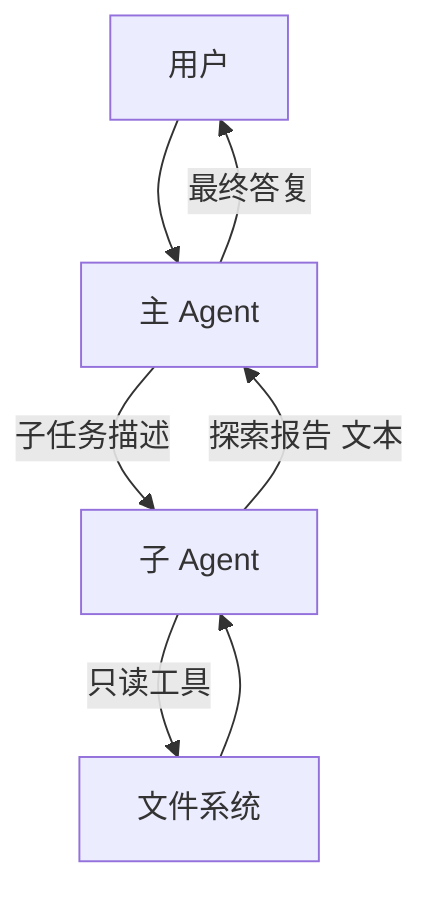
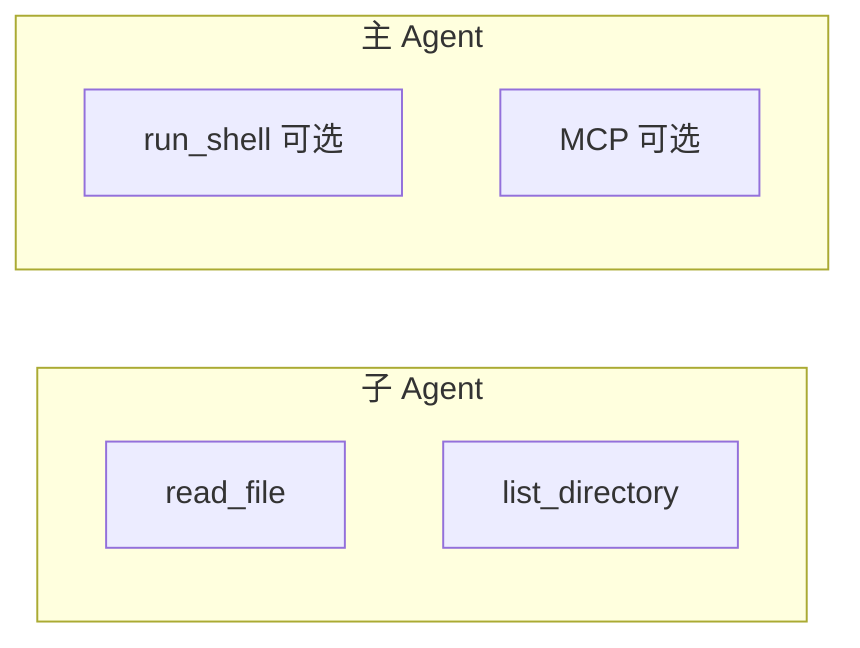
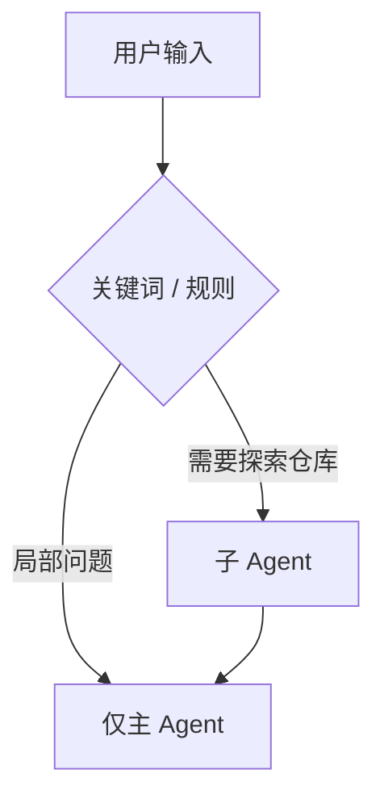

# Lab 6：多 Agent 协调（主 Agent + 只读子 Agent）

> **系列**：Claude Code 完全指南 V2 · 第 19 篇实战 Lab  
> **前置**：完成 [Lab 2](./02-tool-registry.md)；理解 `messages` 与工具闭环。

---

## 学习目标

1. 实现 **主 Agent（Orchestrator）** 与 **子 Agent（Explorer）** 两个独立调用链（两次 `messages.create` 序列，或两套 system 提示）。
2. 约束 **子 Agent 仅使用只读工具**（`read_file`、`list_directory`），并在 system prompt 中明确禁止写操作与 shell。
3. 主 Agent 接收 **用户原始目标**，先委派子任务（例如「总结 src 目录结构」），再将 **子 Agent 的最终文本报告** 作为上下文，由主 Agent 给出决策与面向用户的答案。
4. 用清晰的 TypeScript 类型表达「子任务输入 / 输出」，便于后续替换为并行子 Agent。

---

## 角色与数据流



---

## 设计说明

- **子 Agent** 使用较短 `max_tokens`，专用 system：仅输出结构化 Markdown 报告，不直接对用户说话。  
- **主 Agent** 拥有完整工具集（若已做 Lab 3/5，可只给主 Agent `run_shell` / MCP，而子 Agent 工具列表过滤）。  
- 本 Lab **串行**执行：先跑完子 Agent，再跑主 Agent；Lab 扩展可做 `Promise.all` 多子任务。

---

## 完整示例代码

`src/multi-agent.ts`：

```typescript
import Anthropic from "@anthropic-ai/sdk";
import type { MessageParam, Tool } from "@anthropic-ai/sdk/resources/messages";
import * as path from "node:path";
import { ToolRegistry } from "./registry.js";
import { createReadFileTool } from "./tools/read-file.js";
import { createListDirectoryTool } from "./tools/list-dir.js";

const MODEL = "claude-sonnet-4-20250514";

const SUB_SYSTEM = `你是代码探索子代理。你只能使用提供的只读工具。
禁止建议写文件、执行 shell、或任何副作用操作。
输出一份简洁的 Markdown 报告：目录结构要点、关键文件、与任务相关的发现。`;

const MAIN_SYSTEM = `你是主代理。你会先收到子代理的探索报告，再结合用户目标给出最终方案。
你可以使用完整工具集（若可用）。回答用户时使用中文，条理清晰。`;

/**
 * 子 Agent：仅使用 readOnlyTools；工具体通过 registry 执行（与主循环一致）。
 */
async function runSubAgentWithRegistry(
  client: Anthropic,
  task: string,
  registry: ToolRegistry,
  readOnlyTools: Tool[]
): Promise<string> {
  const messages: MessageParam[] = [
    { role: "user", content: `探索任务:\n${task}` },
  ];

  for (let turn = 0; turn < 8; turn++) {
    const msg = await client.messages.create({
      model: MODEL,
      max_tokens: 2048,
      system: SUB_SYSTEM,
      tools: readOnlyTools,
      messages,
    });

    messages.push({ role: "assistant", content: msg.content });

    const uses = msg.content.filter((b) => b.type === "tool_use");
    if (uses.length === 0) {
      return msg.content
        .filter((b) => b.type === "text")
        .map((b) => b.text)
        .join("\n");
    }

    const results = [];
    for (const u of uses) {
      const def = registry.get(u.name);
      let out: string;
      if (!def) out = `unknown tool ${u.name}`;
      else {
        try {
          out = await def.execute((u.input ?? {}) as Record<string, unknown>);
        } catch (e) {
          out = e instanceof Error ? e.message : String(e);
        }
      }
      results.push({
        type: "tool_result" as const,
        tool_use_id: u.id,
        content: out,
      });
    }
    messages.push({ role: "user", content: results });
  }
  return "(subagent) max turns exceeded";
}

async function runMainAgent(
  client: Anthropic,
  userGoal: string,
  subReport: string,
  mainTools: Tool[],
  registry: ToolRegistry
): Promise<void> {
  const messages: MessageParam[] = [
    {
      role: "user",
      content: `用户目标:\n${userGoal}\n\n--- 子代理探索报告 ---\n${subReport}`,
    },
  ];

  for (let turn = 0; turn < 10; turn++) {
    const msg = await client.messages.create({
      model: MODEL,
      max_tokens: 4096,
      system: MAIN_SYSTEM,
      tools: mainTools,
      messages,
    });

    messages.push({ role: "assistant", content: msg.content });

    const text = msg.content
      .filter((b) => b.type === "text")
      .map((b) => b.text)
      .join("\n");
    if (text) console.log("\n[主代理]\n" + text + "\n");

    const uses = msg.content.filter((b) => b.type === "tool_use");
    if (uses.length === 0) return;

    const results = [];
    for (const u of uses) {
      const def = registry.get(u.name);
      let out: string;
      if (!def) out = `unknown tool ${u.name}`;
      else {
        try {
          out = await def.execute((u.input ?? {}) as Record<string, unknown>);
        } catch (e) {
          out = e instanceof Error ? e.message : String(e);
        }
      }
      results.push({
        type: "tool_result" as const,
        tool_use_id: u.id,
        content: out,
      });
    }
    messages.push({ role: "user", content: results });
  }
}

async function main() {
  const apiKey = process.env.ANTHROPIC_API_KEY;
  if (!apiKey) throw new Error("ANTHROPIC_API_KEY required");

  const root = path.resolve(process.cwd());
  const registry = new ToolRegistry();
  registry.register(createReadFileTool(root));
  registry.register(createListDirectoryTool(root));

  const allTools = registry.listDefinitions();
  const readOnlyTools = allTools; // 本例仅只读工具；若有 run_shell，请 filter 掉再给子 Agent

  const client = new Anthropic({ apiKey });

  const userGoal = "我想了解这个项目的目录与 package.json 里定义了哪些脚本。";
  const subTask = `请在项目根目录下列出顶层文件，并读取 package.json 摘要关键字段。工作区: ${root}`;

  console.log("--- 子代理探索中 ---\n");
  const subReport = await runSubAgentWithRegistry(
    client,
    subTask,
    registry,
    readOnlyTools
  );
  console.log("--- 子代理报告 ---\n", subReport, "\n");

  console.log("--- 主代理答复 ---\n");
  await runMainAgent(client, userGoal, subReport, allTools, registry);
}

main().catch((e) => {
  console.error(e);
  process.exit(1);
});
```

---

## 工具权限分离（Mermaid）



实现方式：`readOnlyTools = allTools.filter(t => READ_SET.has(t.name))`。

---

## 与 Claude Code 的类比

| 概念 | Claude Code | 本 Lab |
|------|-------------|--------|
| 子代理 | Explore / 子任务 | `runSubAgentWithRegistry` |
| 主代理 | 主对话 + 决策 | `runMainAgent` |
| 隔离 | 进程 / 权限模型 | 不同 `tools` 数组 + system prompt |

---

## 子任务路由策略（何时启用子 Agent）

不必每笔用户消息都跑子 Agent。常见启发式：

| 用户意图 | 建议 |
|----------|------|
| 「这个仓库是干什么的」 | 启用子 Agent 做目录 + README 扫描 |
| 「把 foo 改成 bar」 | 主 Agent 直接处理；子 Agent 可选做一次只读确认 |
| 「解释某文件第 N 行」 | 主 Agent `read_file` 即可 |

实现上可在 `main.ts` 增加轻量分类：先用 **小模型或关键词**（教学）判断 `needsExplorer`，再调用 `runSubAgentWithRegistry`。



---

## 陷阱与建议

1. **不要把子 Agent 的 `messages` 与主 Agent 混在一个 history**，除非你做显式角色标注；否则模型易混淆。  
2. **子 Agent 输出可能过长**：可要求「最多 20 行」或在主 Agent 侧二次摘要（衔接 Lab 7）。  
3. **成本**：两次调用链 ≈ 双倍 token；重要场景再启用子 Agent。

---

## 下一 Lab

[Lab 7：上下文压缩](./07-context-compaction.md) 将在历史过长时自动摘要旧消息。
