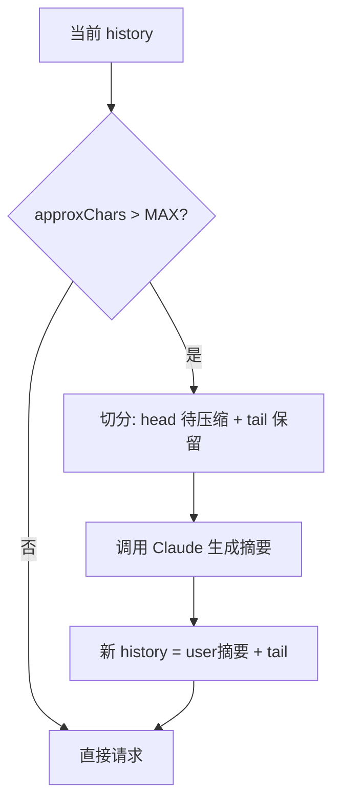
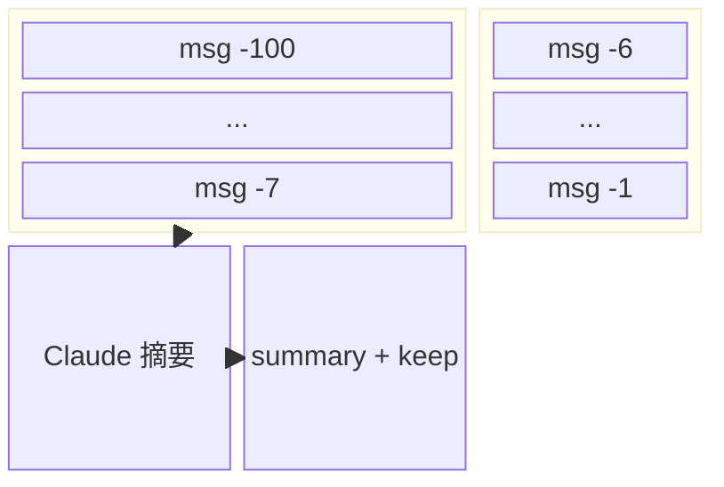
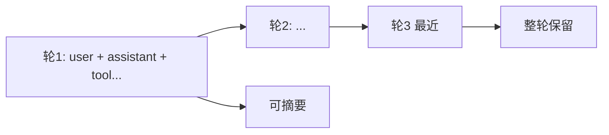

# Lab 7：实现上下文压缩（摘要替换旧历史）

> **系列**：Claude Code 完全指南 V2 · 第 19 篇实战 Lab  
> **前置**：完成 [Lab 1](./index.md)～[Lab 2](./02-tool-registry.md)；理解 `MessageParam[]` 的维护。

---

## 学习目标

1. 在每次用户发话前（或每 N 轮后）评估**上下文长度**；本 Lab 用 **字符数近似 token**（教学用），避免引入额外 tokenizer 依赖。
2. 当总字符数超过阈值 `MAX_CHARS` 时，调用 **Claude** 生成一段**不丢失关键决策与未完成事项**的对话摘要。
3. 用摘要 **替换** 旧消息，但 **保留最近 `KEEP_LAST` 条「轮次」**（用户消息 + 其后 assistant/tool 链算一轮，实现时可简化为保留数组尾部 K 个元素）。
4. 压缩后的 history 仍以合法 `MessageParam[]` 形式继续调用 `messages.create`。

---

## 压缩策略流程图



---

## 近似 Token 与阈值

真实场景应使用 **tiktoken** 或厂商 tokenizer；为保持依赖最小，本 Lab：

```typescript
export function approxChars(messages: import("@anthropic-ai/sdk/resources/messages").MessageParam[]): number {
  return JSON.stringify(messages).length;
}
```

经验系数：`chars / 4 ≈ tokens`（英文）；中文偏差更大，可把 `MAX_CHARS` 调低。

---

## 步骤 1：`compactMessages` 实现

创建 `src/context/compaction.ts`：

```typescript
import Anthropic from "@anthropic-ai/sdk";
import type { MessageParam } from "@anthropic-ai/sdk/resources/messages";

const MODEL = "claude-sonnet-4-20250514";

export function approxChars(messages: MessageParam[]): number {
  return JSON.stringify(messages).length;
}

/**
 * 保留尾部 keepLast 条消息，将其余前缀压缩为一条 user 摘要消息。
 */
export async function maybeCompact(
  client: Anthropic,
  messages: MessageParam[],
  options: { maxChars: number; keepLast: number }
): Promise<MessageParam[]> {
  if (approxChars(messages) <= options.maxChars) return messages;
  if (messages.length <= options.keepLast) return messages;

  const head = messages.slice(0, -options.keepLast);
  const tail = messages.slice(-options.keepLast);

  const summaryPrompt: MessageParam[] = [
    {
      role: "user",
      content: `请将下列对话历史压缩为简洁中文摘要，保留：
- 用户目标与约束
- 已执行的重要工具结果（路径、结论）
- 未完成的行动项与错误信息

原始消息(JSON)：\n${JSON.stringify(head).slice(0, 120_000)}`,
    },
  ];

  const sum = await client.messages.create({
    model: MODEL,
    max_tokens: 1024,
    messages: summaryPrompt,
  });

  const text = sum.content
    .filter((b) => b.type === "text")
    .map((b) => b.text)
    .join("\n");

  const summaryMessage: MessageParam = {
    role: "user",
    content: `[上下文已压缩] 以下为此前对话的摘要，请在此基础上继续协助用户：\n\n${text}`,
  };

  return [summaryMessage, ...tail];
}
```

> **注意**：`JSON.stringify(head).slice(0, 120_000)` 防止摘要请求本身过大；生产应分块或多段摘要。

---

## 步骤 2：接入主循环

在每次 `history.push(用户输入)` **之后**、调用模型 **之前**：

```typescript
import { approxChars, maybeCompact } from "./context/compaction.js";

// ...
history.push({ role: "user", content: line });

if (approxChars(history) > 50_000) {
  console.error("[context] 压缩中…");
  history = await maybeCompact(client, history, {
    maxChars: 40_000,
    keepLast: 6,
  });
}

await runAgentTurn(client, history, tools, registry);
```

`keepLast: 6` 表示保留最近 6 条 `MessageParam`（简化版）；更严谨可按「轮」切分。

---

## 保留最近 N 轮的 Mermaid 说明



---

## 风险与缓解

| 风险 | 缓解 |
|------|------|
| 摘要丢失 tool_use/tool_result 配对 | 保留段内应包含**未完成**工具链；或压缩前强制结束 open tool |
| 摘要请求超上下文 | 对 `head` 分段多次摘要 |
| 字符近似不准 | 换用官方 tokenizer |

---

## 与 Claude Code 的「Compaction」

Claude Code 在上下文将满时会做**结构化压缩**与**检查点**；本 Lab 用「单条摘要 user 消息 + 尾部原样」展示**最小可行实现**。

---

## 扩展练习

1. 压缩时**剔除**纯寒暄轮次。  
2. 将摘要存盘为 `~/.mini-agent/sessions/id.json`，支持断点续聊。  
3. 使用 `claude-3-5-haiku` 等更小模型做摘要以节省成本。

---

## 按「轮次」切分（进阶）

简化版按「消息条数」保留尾部，在**工具密集**对话中可能把同一轮 `assistant(tool_use)` 与 `user(tool_result)` 切开。更稳妥做法是：

1. 将 `MessageParam[]` 从左扫描，按「用户一条 user（非 tool_result）」作为一轮起点。  
2. 其后直到下一条「用户新意图」之前的 assistant / user(tool_result) 都归入该轮。  
3. 压缩时**永远保留完整最近 K 轮**，而不是 K 条消息。



伪代码：

```typescript
function splitIntoTurns(messages: MessageParam[]): MessageParam[][] {
  const turns: MessageParam[][] = [];
  let cur: MessageParam[] = [];
  for (const m of messages) {
    if (m.role === "user" && cur.length > 0 && !isOnlyToolResults(m)) {
      turns.push(cur);
      cur = [];
    }
    cur.push(m);
  }
  if (cur.length) turns.push(cur);
  return turns;
}

function isOnlyToolResults(m: MessageParam): boolean {
  return (
    Array.isArray(m.content) &&
    m.content.length > 0 &&
    m.content.every((b) => typeof b === "object" && b && "type" in b && b.type === "tool_result")
  );
}
```

将 `maybeCompact` 中的 `head` / `tail` 改为基于 `splitIntoTurns` 的合并结果，可显著降低 **tool 配对被破坏** 的概率。

---

## 使用更小模型做摘要（可选代码）

在 `maybeCompact` 内把 `MODEL` 换为环境变量 `SUMMARY_MODEL`（如 `claude-3-5-haiku-20241022`），可降低成本：

```typescript
const SUMMARY_MODEL =
  process.env.SUMMARY_MODEL ?? "claude-sonnet-4-20250514";

const sum = await client.messages.create({
  model: SUMMARY_MODEL,
  max_tokens: 1024,
  messages: summaryPrompt,
});
```

摘要任务不要求最强推理，Haiku 类模型通常足够。

---

## 压测脚本思路

1. 写脚本循环向 Agent 发送「再讲一个段子」类请求 30 次。  
2. 观察 `approxChars(history)` 曲线与压缩触发次数。  
3. 调整 `maxChars` / `keepLast`，在**成本**与**遗忘率**之间折中。

---

## 小结

| 项目 | 建议 |
|------|------|
| 度量 | 教学用 `JSON.stringify` 长度；上线换 tokenizer |
| 切分 | 优先按「轮」保留尾部 |
| 摘要 | 专用短模型 + 明确 bullet 保留项 |

---

## 下一 Lab

[Lab 8：完整项目整合](./08-full-integration.md) 将把 Lab 1～7 模块化为可配置工程并附运行检查清单。
