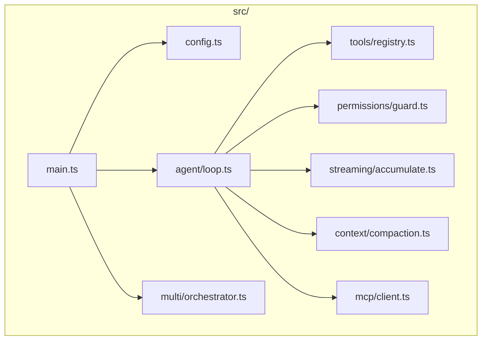
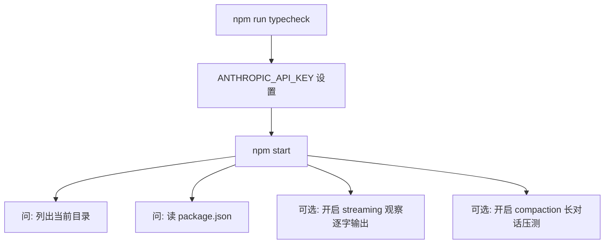
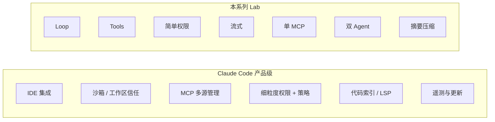

# Lab 8：完整项目整合与架构对照

> **系列**：Claude Code 完全指南 V2 · 第 19 篇实战 Lab  
> **前置**：建议按顺序完成 [Lab 1](./index.md)～[Lab 7](./07-context-compaction.md)。

---

## 学习目标

1. 将 **Agent Loop、工具注册表、权限、流式输出（可选开关）、MCP 客户端（可选）、多 Agent（可选）、上下文压缩** 整合为**单一可运行仓库**。
2. 使用 **配置文件**（`mini-agent.config.json`）管理模型名、阈值、是否启用 MCP 路径等，避免硬编码散落。
3. 提供 **`npm run build` / `npm start`** 与最小「冒烟」验证步骤。
4. 对照 **真实 Claude Code** 的架构维度做总结，明确教学项目与生产产品的差距。

---

## 推荐最终目录结构



```
mini-agent-full/
├── package.json
├── tsconfig.json
├── mini-agent.config.json
├── src/
│   ├── main.ts
│   ├── config.ts
│   ├── agent/
│   │   └── loop.ts
│   ├── tools/
│   │   ├── registry.ts
│   │   ├── types.ts
│   │   ├── read-file.ts
│   │   ├── list-dir.ts
│   │   └── run-shell.ts
│   ├── permissions/
│   │   ├── guard.ts
│   │   └── policy.ts
│   ├── streaming/
│   │   └── accumulate.ts
│   ├── context/
│   │   └── compaction.ts
│   ├── mcp/
│   │   └── client.ts
│   └── multi/
│       └── orchestrator.ts
└── README.md（可选，本教程不强制）
```

---

## `mini-agent.config.json` 示例

```json
{
  "model": "claude-sonnet-4-20250514",
  "maxTokens": 4096,
  "streaming": true,
  "compaction": {
    "enabled": true,
    "maxChars": 48000,
    "keepLast": 8
  },
  "mcp": {
    "enabled": false,
    "serverScript": "src/mcp-server/index.ts"
  },
  "multiAgent": {
    "enabled": false
  }
}
```

---

## `src/config.ts`

```typescript
import * as fs from "node:fs";
import * as path from "node:path";

export interface AppConfig {
  model: string;
  maxTokens: number;
  streaming: boolean;
  compaction: {
    enabled: boolean;
    maxChars: number;
    keepLast: number;
  };
  mcp: {
    enabled: boolean;
    serverScript: string;
  };
  multiAgent: {
    enabled: boolean;
  };
}

const DEFAULTS: AppConfig = {
  model: "claude-sonnet-4-20250514",
  maxTokens: 4096,
  streaming: false,
  compaction: {
    enabled: true,
    maxChars: 50000,
    keepLast: 6,
  },
  mcp: { enabled: false, serverScript: "src/mcp-server/index.ts" },
  multiAgent: { enabled: false },
};

export function loadConfig(cwd: string): AppConfig {
  const p = path.join(cwd, "mini-agent.config.json");
  if (!fs.existsSync(p)) return DEFAULTS;
  const raw = JSON.parse(fs.readFileSync(p, "utf8")) as Partial<AppConfig>;
  return { ...DEFAULTS, ...raw, compaction: { ...DEFAULTS.compaction, ...raw.compaction }, mcp: { ...DEFAULTS.mcp, ...raw.mcp }, multiAgent: { ...DEFAULTS.multiAgent, ...raw.multiAgent } };
}
```

---

## `src/main.ts`（整合入口骨架）

```typescript
import * as readline from "node:readline/promises";
import { stdin as input, stdout as output } from "node:process";
import * as path from "node:path";
import Anthropic from "@anthropic-ai/sdk";
import { loadConfig } from "./config.js";
import { createAgentLoop } from "./agent/loop.js";

async function main() {
  const apiKey = process.env.ANTHROPIC_API_KEY;
  if (!apiKey) {
    console.error("缺少 ANTHROPIC_API_KEY");
    process.exit(1);
  }
  const cwd = process.cwd();
  const cfg = loadConfig(cwd);
  const client = new Anthropic({ apiKey });
  const rl = readline.createInterface({ input, output });

  const loop = await createAgentLoop({
    client,
    cfg,
    workspaceRoot: path.resolve(cwd),
    rl,
  });

  console.log("Mini Claude-Agent 已启动（Lab8 整合版）。exit 退出。\n");
  while (true) {
    const line = (await rl.question("你: ")).trim();
    if (!line) continue;
    if (/^(exit|quit)$/i.test(line)) break;
    await loop.handleUserLine(line);
  }
  rl.close();
}

main().catch((e) => {
  console.error(e);
  process.exit(1);
});
```

---

## `src/agent/loop.ts`（模块职责说明）

`createAgentLoop` 应内部完成：

1. 初始化 `ToolRegistry`，注册 `read_file` / `list_directory` / `run_shell`（可选）。  
2. 若 `cfg.mcp.enabled`，按 Lab 5 启动 MCP 并把工具并入 `tools`。  
3. `PermissionGuard` 包装执行（Lab 3）。  
4. 若 `cfg.compaction.enabled`，在模型调用前 `maybeCompact`（Lab 7）。  
5. 若 `cfg.multiAgent.enabled`，对复杂查询先走 `orchestrator`（Lab 6）。  
6. 根据 `cfg.streaming` 选择 `messages.create` 或 `stream: true` + `streamToMessage`（Lab 4）。

完整实现建议**直接把 Lab 2～4 的 `runAgentTurn` 抽成函数**，再逐段插入上述分支；为控制篇幅，此处不重复粘贴数百行，读者应以自己 Lab 代码为「源码真值」。

---

## `package.json` 脚本

```json
{
  "scripts": {
    "build": "tsc -p .",
    "start": "tsx src/main.ts",
    "start:dist": "node dist/main.js",
    "typecheck": "tsc -p . --noEmit"
  }
}
```

---

## 运行测试（冒烟清单）



1. **`npm run typecheck`**：无 TypeScript 错误。  
2. **工具**：能列出目录、读取小文件。  
3. **权限**：`run_shell` + 黑名单命令应拒绝。  
4. **配置热读**：修改 `mini-agent.config.json` 后重启进程验证。

---

## 与真正 Claude Code 架构对比



| 维度 | 教学 Mini-Agent | Claude Code |
|------|-----------------|-------------|
| 上下文 | 单文件 history + 摘要 | 多子系统、持久化会话、产品级 compaction |
| 工具 | 自注册 + 可选 MCP | 丰富内置能力 + 生态 MCP |
| 安全 | 路径校验 + 黑名单 + 确认 | 企业策略、审计、沙箱执行 |
| 体验 | 终端 + 可选流式 | 编辑器内 diff、应用编辑、多模态 |
| 工程 | 单进程演示 | 版本化协议、兼容矩阵、规模化测试 |

---

## 结语

八个 Lab 串联了 **「能对话 → 能调用工具 → 能控权 → 能流式 → 能接 MCP → 能分工 → 能控长度 → 能工程化」** 的完整学习路径。建议你在整合时**每合并一个 Lab 就提交一次 git**，便于回滚与对比。

恭喜你完成 **Claude Code 完全指南 V2 · 第 19 篇实战 Lab** 全部内容。

---

## 系列索引

- [Lab 1：最简 Agent Loop](./index.md)  
- [Lab 2：工具注册与执行](./02-tool-registry.md)  
- [Lab 3：权限控制](./03-permissions.md)  
- [Lab 4：流式响应](./04-streaming.md)  
- [Lab 5：MCP 服务器](./05-mcp-server.md)  
- [Lab 6：多 Agent](./06-multi-agent.md)  
- [Lab 7：上下文压缩](./07-context-compaction.md)  
- **Lab 8：完整整合（本文）**
