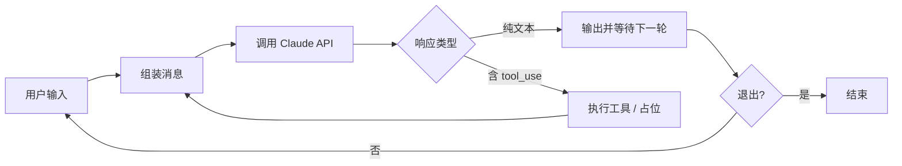
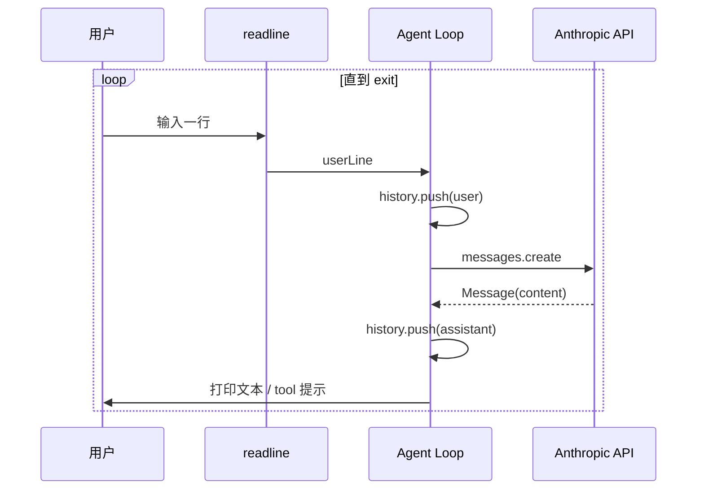

# Lab 1：从零搭建最简 Agent Loop

> **系列**：Claude Code 完全指南 V2 · 第 19 篇实战 Lab  
> **前置**：已安装 Node.js 18+、npm；拥有 [Anthropic API Key](https://console.anthropic.com/)

---

## 学习目标

完成本 Lab 后，你将能够：

1. 使用 `npm init` 与 TypeScript 配置搭建一个最小 Node.js 项目。
2. 理解 **Agent Loop** 的核心：`读入 → 调用模型 → 输出 → 判断是否继续（含工具调用）→ 循环`。
3. 使用官方 `@anthropic-ai/sdk` 调用 Claude Messages API。
4. 在终端中与模型进行多轮对话，并识别响应中的 `tool_use` 块（为后续 Lab 打基础）。

---

## 核心概念

### 什么是 Agent Loop？

Agent 不是「问一句答一句」的静态接口，而是一个**持续运转的循环**：每次把当前对话状态发给模型，根据返回决定是结束、继续对话，还是执行工具并把结果再喂回模型。



本 Lab 中，遇到 `tool_use` 时我们先**打印说明并继续循环**（真正执行工具在 Lab 2）。

---

## 环境准备

### 步骤 1：创建项目目录

```bash
mkdir mini-agent-lab1 && cd mini-agent-lab1
npm init -y
```

### 步骤 2：安装依赖

```bash
npm install @anthropic-ai/sdk
npm install -D typescript @types/node tsx
```

- **@anthropic-ai/sdk**：官方 Anthropic SDK。  
- **tsx**：直接运行 TypeScript，无需先编译（开发体验好）。

### 步骤 3：配置 TypeScript

创建 `tsconfig.json`：

```json
{
  "compilerOptions": {
    "target": "ES2022",
    "module": "NodeNext",
    "moduleResolution": "NodeNext",
    "strict": true,
    "skipLibCheck": true,
    "outDir": "dist",
    "rootDir": "src",
    "esModuleInterop": true
  },
  "include": ["src/**/*"]
}
```

### 步骤 4：配置启动脚本

在 `package.json` 的 `scripts` 中增加：

```json
{
  "scripts": {
    "start": "tsx src/main.ts"
  }
}
```

### 步骤 5：设置 API Key

```bash
export ANTHROPIC_API_KEY="sk-ant-api03-..."
```

或在项目根目录创建 `.env`（本 Lab 代码用环境变量即可，Lab 8 再整合 dotenv）。

---

## 完整可运行代码

将下列文件保存为 `src/main.ts`。代码约 **70 行**，实现：`while(true)` 循环、读取 `readline` 用户输入、调用 Claude、打印助手文本，并**检测** `tool_use`（暂不执行）。

```typescript
/**
 * Lab 1：最简 Agent Loop
 * 运行：ANTHROPIC_API_KEY=xxx npm start
 */
import * as readline from "node:readline/promises";
import { stdin as input, stdout as output } from "node:process";
import Anthropic from "@anthropic-ai/sdk";
import type {
  Message,
  MessageParam,
  ToolUseBlock,
} from "@anthropic-ai/sdk/resources/messages";

const MODEL = "claude-sonnet-4-20250514";

function extractText(message: Message): string {
  const parts: string[] = [];
  for (const block of message.content) {
    if (block.type === "text") parts.push(block.text);
  }
  return parts.join("\n");
}

function extractToolUses(message: Message): ToolUseBlock[] {
  return message.content.filter(
    (b): b is ToolUseBlock => b.type === "tool_use"
  );
}

async function main(): Promise<void> {
  const apiKey = process.env.ANTHROPIC_API_KEY;
  if (!apiKey) {
    console.error("请设置环境变量 ANTHROPIC_API_KEY");
    process.exit(1);
  }

  const client = new Anthropic({ apiKey });
  const rl = readline.createInterface({ input, output });

  const history: MessageParam[] = [
    {
      role: "user",
      content:
        "你是一个简洁的编程助手。用户会在终端与你对话。若需要调用工具，请先说明意图；本演示环境尚未挂载真实工具。",
    },
  ];

  console.log("最简 Agent Loop 已启动。输入 exit 或 quit 退出。\n");

  while (true) {
    const userLine = await rl.question("你: ");
    const trimmed = userLine.trim();
    if (!trimmed) continue;
    if (/^(exit|quit)$/i.test(trimmed)) {
      console.log("再见。");
      rl.close();
      break;
    }

    history.push({ role: "user", content: trimmed });

    const message = await client.messages.create({
      model: MODEL,
      max_tokens: 1024,
      messages: history,
    });

    const assistantText = extractText(message);
    const toolUses = extractToolUses(message);

    history.push({
      role: "assistant",
      content: message.content,
    });

    if (assistantText) {
      console.log("\n助手:\n" + assistantText + "\n");
    }

    if (toolUses.length > 0) {
      console.log(
        "[Loop] 检测到 tool_use（本 Lab 仅打印，Lab 2 将执行）：",
        toolUses.map((t) => t.name).join(", ")
      );
      // 占位：真实场景需把 tool_result 以 user 消息形式追加，再调 API
    }
  }
}

main().catch((err) => {
  console.error(err);
  process.exit(1);
});
```

---

## 运行与验证

```bash
cd mini-agent-lab1
export ANTHROPIC_API_KEY="你的密钥"
npm start
```

1. 输入普通问题，应看到助手回复。  
2. 若模型返回 `tool_use`，终端会打印 `[Loop] 检测到 tool_use...`。

---

## 步骤指引小结

| 步骤 | 内容 |
|------|------|
| 1 | `npm init`、安装 SDK / TypeScript / tsx |
| 2 | 编写 `tsconfig.json` 与 `src/main.ts` |
| 3 | 用 `readline` 读用户输入，维护 `history: MessageParam[]` |
| 4 | `client.messages.create` 发请求，把 `message.content` 原样追加到 history |
| 5 | 解析文本与 `tool_use`，为 Lab 2 预留执行分支 |

---

## 架构一图读懂



---

## 常见问题

**Q：为什么要把 assistant 的 `content` 整块放进 history？**  
A：Claude Messages API 要求多轮对话时保留**完整**的 assistant 消息（含 `tool_use` 块），后续才能配对 `tool_result`。

**Q：本 Lab 为何不执行工具？**  
A：先保证循环与 API 调用正确；Lab 2 会接入 `tools` 参数与 `tool_result` 回传。

---

## 完整 `package.json`（Lab 1 可直接使用）

```json
{
  "name": "mini-agent-lab1",
  "version": "1.0.0",
  "type": "module",
  "private": true,
  "scripts": {
    "start": "tsx src/main.ts",
    "typecheck": "tsc --noEmit"
  },
  "dependencies": {
    "@anthropic-ai/sdk": "^0.39.0"
  },
  "devDependencies": {
    "@types/node": "^22.0.0",
    "tsx": "^4.19.0",
    "typescript": "^5.7.0"
  }
}
```

使用 ESM 时务必设置 `"type": "module"`，与 `tsconfig` 的 `NodeNext` 一致。

---

## 术语速查

| 术语 | 含义 |
|------|------|
| Agent Loop | 反复「请求模型 → 处理输出 → 可能执行工具 → 再请求」的循环 |
| `MessageParam` | 发给 Messages API 的单条角色消息（user / assistant） |
| `tool_use` | 模型在 `content` 中声明要调用的工具及参数 |
| `tool_result` | 你把工具返回值回传给模型的 user 消息块 |

---

## 课后作业（建议）

1. 在检测到 `tool_use` 时，打印 **完整 JSON** 的 `input` 到 stderr，观察模型如何填参。  
2. 增加命令 `/reset`：清空 `history` 仅保留一条 system 风格的首条 user。  
3. 将 `MODEL` 改为从环境变量 `ANTHROPIC_MODEL` 读取，默认仍为 Sonnet。

---

## 下一 Lab

[Lab 2：工具注册与执行](./02-tool-registry.md) 将实现 `Tool` 接口、`ToolRegistry`，以及 `ReadFileTool` / `ListDirectoryTool` 的真实执行与 API 对接。
