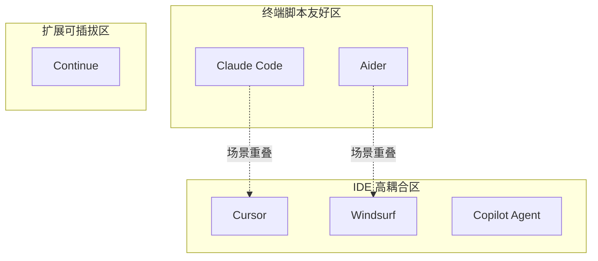
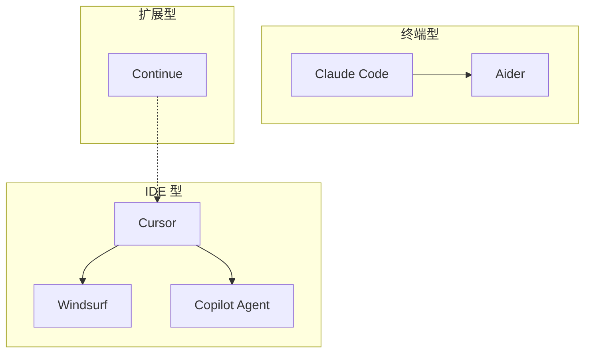
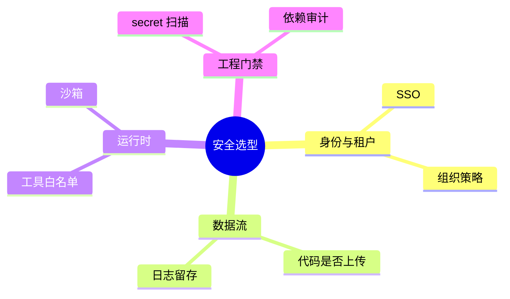
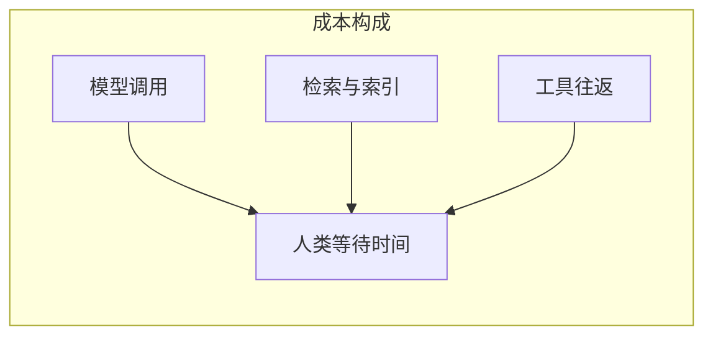
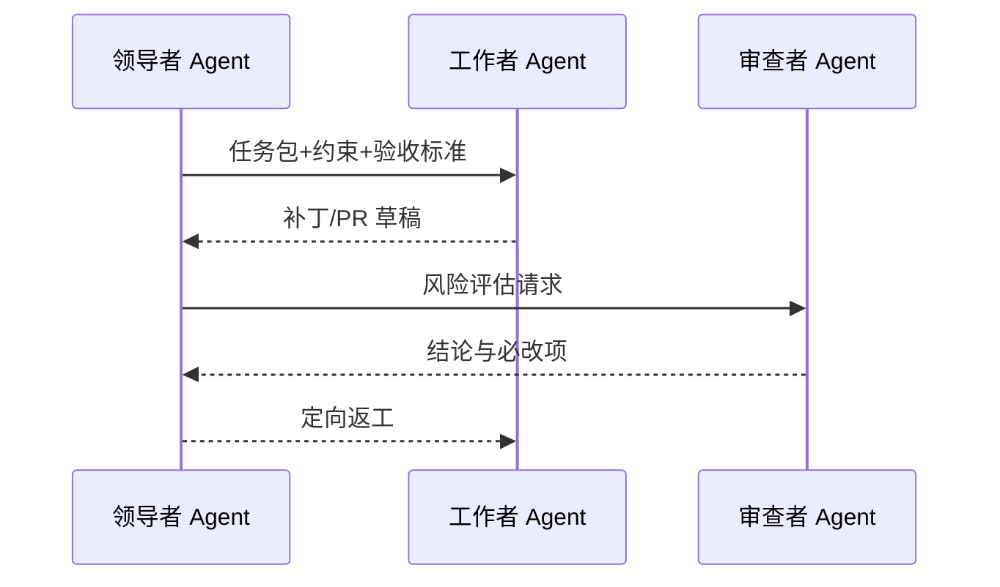
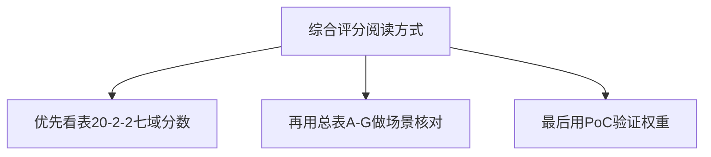
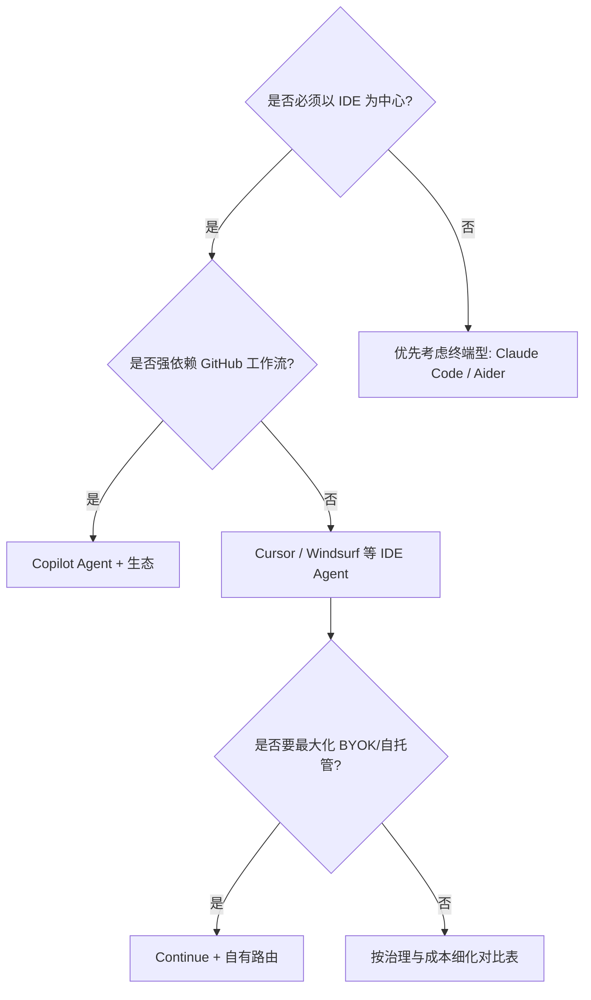

# 20.2 深度对比：Claude Code、Cursor、GitHub Copilot Agent、Windsurf、Aider、Continue

> **本节目标**：用同一张「多维评分表」对齐六类代表性形态，避免「谁广告多谁就好」的选型误区。下列评级为**教学用相对刻度（1–5）**，侧重架构与工程特征，不代表对任何商业产品的官方评价；真实选型请以你团队约束为准。

---

## 1. 对比对象如何界定

| 产品/形态 | 本节所指范围（教学界定） |
|-----------|--------------------------|
| Claude Code | Anthropic 体系下的终端/Agent 式编程助手及其工具链生态 |
| Cursor | 基于 VS Code 派生的 AI IDE，强调编辑器内 Agent 与补全 |
| GitHub Copilot Agent | 以 GitHub / VS Code 生态为中心的 Agent 能力（含托管侧协作） |
| Windsurf | 强调 Flow/Agent 体验的 AI IDE 类产品（迭代快，以官方能力为准） |
| Aider | 开源终端型 pair programmer，强调 git 集成与补丁式改码 |
| Continue | 开源 IDE 扩展，强调可插拔模型与本地/远程配置 |

> 说明：分区仅为帮助建立直觉；不同版本发布会导致边界漂移。精确坐标对比见下方总表。

---

## 2. 总表 A：架构与交互范式

| 维度 | Claude Code | Cursor | Copilot Agent | Windsurf | Aider | Continue |
|------|------------|--------|---------------|----------|-------|----------|
| 主战场 | 终端 + 仓库 | IDE 工作区 | IDE + GitHub | IDE 工作区 | 终端 + git | IDE 扩展 |
| 会话内核 | Agent 循环 + 工具 | 多模式 Agent | 生态集成 Agent | Agent Flow | 对话 + 补丁 | 聊天 + 工具 |
| 项目表征 | 仓库级上下文 | 工作区索引 | 仓库/PR 语境 | 工作区索引 | 文件树 + git | 工作区文件 |
| 适合长任务链 | 强 | 强 | 中–强 | 强 | 中 | 中（视配置） |
| 适合快速点改 | 中 | 强 | 强 | 强 | 强 | 强 |

---

## 3. 总表 B：安全、权限与合规

| 维度 | Claude Code | Cursor | Copilot Agent | Windsurf | Aider | Continue |
|------|------------|--------|---------------|----------|-------|----------|
| 企业治理成熟度 | 高（视部署与策略） | 高 | 高（GitHub 生态） | 中–高 | 中（自管为主） | 中（自管为主） |
| 数据驻留可控性 | 依赖方案 | 依赖方案 | 依赖 GitHub/租户策略 | 依赖方案 | 高（本地为主） | 高（可本地模型） |
| 密钥与秘文风险面 | 中 | 中 | 中 | 中 | 中–高 | 中 |
| 审计友好度 | 中–高 | 中–高 | 高 | 中 | 中 | 中 |

**教学提示**：安全不是「是否开源」单选题，而是 **默认权限 + 可审计 + 可回滚** 的组合题。

---

## 4. 总表 C：扩展性（工具 / 协议 / 插件）

| 维度 | Claude Code | Cursor | Copilot Agent | Windsurf | Aider | Continue |
|------|------------|--------|---------------|----------|-------|----------|
| 工具扩展故事 | 强（生态工具链） | 强（规则/命令/生态） | 强（平台集成） | 强 | 中（脚本/工作流） | 强（开放配置） |
| MCP 等协议态度 | 友好 | 友好 | 渐进 | 友好 | 视集成 | 友好 |
| 可脚本化 | 强 | 中–强 | 中 | 中–强 | 强 | 中 |
| 自建「第二大脑」成本 | 中 | 中 | 中–高 | 中 | 低–中 | 低–中 |

---

## 5. 总表 D：成本与 Token 经济学

| 维度 | Claude Code | Cursor | Copilot Agent | Windsurf | Aider | Continue |
|------|------------|--------|---------------|----------|-------|----------|
| 计费透明度 | 中–高 | 中（套餐/用量） | 中（订阅/组织） | 中 | 高（自带 KEY） | 高（自带 KEY） |
| 上下文「烧钱点」 | 仓库+工具往返 | 索引+多文件编辑 | PR/对话+代码 | 多步 Flow | 多轮+大文件 | 视模型与检索 |
| 成本优化抓手 | 缓存/分层/工具输出瘦身 | 规则/排除/模式 | 工作项拆分 | Flow 设计 | map/repo 策略 | 本地模型/路由 |

---

## 6. 总表 E：上下文管理（检索、压缩、缓存）

| 维度 | Claude Code | Cursor | Copilot Agent | Windsurf | Aider | Continue |
|------|------------|--------|---------------|----------|-------|----------|
| 仓库级理解 | 强 | 强 | 强 | 强 | 中–强 | 中–强 |
| 「只读该读」能力 | 强（依赖实现） | 强 | 中–强 | 强 | 中 | 中–强 |
| 多文件一致性编辑 | 强 | 强 | 强 | 强 | 强 | 中–强 |
| 可插拔检索 | 中–高 | 高 | 中–高 | 中–高 | 中 | 高 |

**表 20-2-1：上下文策略检查清单（通用）**

| 检查项 | 通过标准（教学） |
|--------|------------------|
| 相关性 | 变更点 2-hop 内文件优先 |
| 重复读 | 同文件同版本不反复塞全文 |
| 秘文 | 秘文不进窗口或已脱敏 |
| 里程碑 | 长任务有阶段性摘要状态 |

---

## 7. 总表 F：多 Agent / 多角色协作

| 维度 | Claude Code | Cursor | Copilot Agent | Windsurf | Aider | Continue |
|------|------------|--------|---------------|----------|-------|----------|
| 一等公民多 Agent | 中–强 | 中–强 | 中 | 中–强 | 弱–中 | 弱–中 |
| 子任务委派模型 | 有 | 有 | 有 | 有 | 主要靠人 | 主要靠配置 |
| 适合「实现/审查」拆分 | 强 | 强 | 中–强 | 强 | 中 | 中 |

---

## 8. 总表 G：开源程度与可 fork 性

| 维度 | Claude Code | Cursor | Copilot Agent | Windsurf | Aider | Continue |
|------|------------|--------|---------------|----------|-------|----------|
| 客户端开源 | 否/部分信息 | 否 | 否 | 否 | 是 | 是 |
| 可自托管模型 | 视方案 | 受限 | 受限 | 视方案 | 强 | 强 |
| 社区插件生态 | 中–高 | 高 | 高 | 中–高 | 中 | 高 |
| 适合「学习内核」 | 中（文档/外围） | 中 | 中 | 中 | 强 | 强 |

> **重要声明**：闭源产品也可能更安全、更易治理；开源也不等于默认可信——供应链与配置同样关键。

---

## 9. 综合雷达：教学评分（1–5）

**表 20-2-2：综合评分（示意，5 为更强）**

| 能力域 | Claude Code | Cursor | Copilot Agent | Windsurf | Aider | Continue |
|--------|------------|--------|---------------|----------|-------|----------|
| 架构清晰度（可讲清楚） | 4 | 4 | 4 | 4 | 5 | 5 |
| 企业治理与审计 | 4 | 4 | 5 | 3 | 3 | 3 |
| 扩展性与协议友好 | 5 | 5 | 4 | 4 | 3 | 5 |
| 成本可控（BYOK 等） | 4 | 3 | 3 | 3 | 5 | 5 |
| 上下文工程上限 | 5 | 5 | 4 | 5 | 4 | 4 |
| 多 Agent 协作 | 4 | 4 | 3 | 4 | 2 | 3 |
| 开源可审计 | 2 | 2 | 2 | 2 | 5 | 5 |

> 注：雷达图在不同渲染器支持不一，本节以 **表 20-2-2** 为权威对照。

---

## 10. 选型决策树（教学版）

---

## 11. 典型组合打法（非排他）

| 组合 | 适用场景 | 风险点 |
|------|----------|--------|
| IDE Agent + 终端 Agent | IDE 写码，终端跑批任务 | 上下文分裂，需要明确主会话 |
| 开源扩展 + 商用模型 | 可控配置 + 强模型 | 合规与数据流要梳理 |
| PR 机器人 + 本地 Agent | 自动化评审 + 本地改码 | 权限与 token 泄露 |

---

## 12. 对比方法论：如何避免「站队」

1. **先列约束**：数据能否出网、是否 SSO、是否必须审计日志。
2. **再列任务**：重构、修 bug、写测试、写文档，权重不同。
3. **再做 PoC**：同一 issue 用同一验收标准跑三轮。
4. **最后看 TCO**：订阅 + 人工等待 + 事故成本。

---

## 13. 与 20.1 的呼应

20.1 指出壁垒在系统；本节说明：**不同产品把「系统」做成了不同形状**——有的偏 IDE 集成，有的偏终端与 git，有的偏平台托管。没有 universally best，只有 **约束最优**。

---

## 14. 反模式清单

| 反模式 | 后果 |
|--------|------|
| 仅按「模型强弱」选型 | 权限与流程不匹配，事故概率上升 |
| 多工具并行无主编 | 上下文冲突、重复劳动 |
| 忽略审计与密钥扫描 | 合规与安全问题后置，代价高 |

---

## 15. 本节小结

- 用 **七张总表** 对齐架构、安全、扩展、成本、上下文、多 Agent、开源。
- 用 **决策树** 把「约束优先」落到路径。
- 评分与象限均为 **教学示意**，真实版本迭代会改变结论，应以 PoC 为准。

---

## 16. 迁移检查表（从工具 A 迁到 B）

| 步骤 | 内容 |
|------|------|
| 1 | 导出规则、命令、忽略清单 |
| 2 | 重建工具白名单与秘文策略 |
| 3 | 跑一轮黄金 issue 集回归 |
| 4 | 对齐 CI 与评审模板 |

---

## 17. 术语表（本节）

| 术语 | 解释 |
|------|------|
| BYOK | Bring Your Own Key，自备 API Key |
| PoC | Proof of Concept，验证性试点 |
| TCO | Total Cost of Ownership，总拥有成本 |

---

## 18. 练习

1. 为你的团队填写「约束表」10 行，再重排本节各表权重。
2. 选一个真实 issue，用两种形态各做一次，记录耗时与返工次数。
3. 画一张你们当前的「工具组合架构图」，标出数据流。

---

## 19. 过渡到 20.3

对比解决「现在各家长什么样」；下一节讨论「未来两年大概率往哪走」——更长上下文、缓存、多模态、自主性、安全与信任的再平衡。

---

*教学稿 V2 · 第 20 篇第 2 节 · 产品快速迭代可能导致特征变化，请以官方文档为准。*
