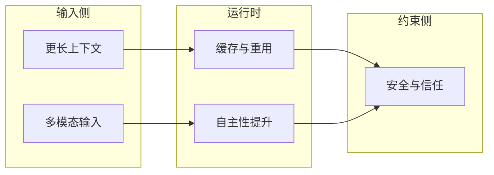
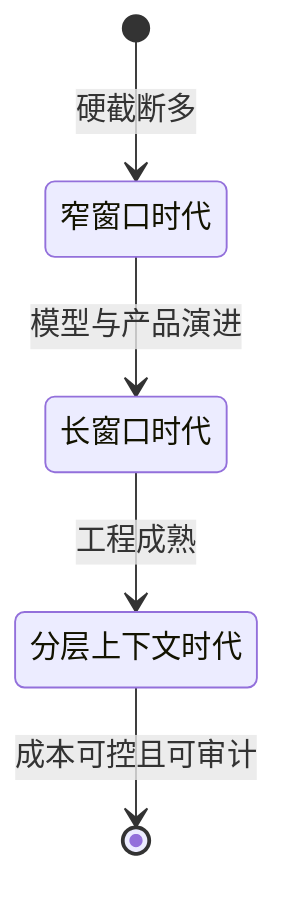
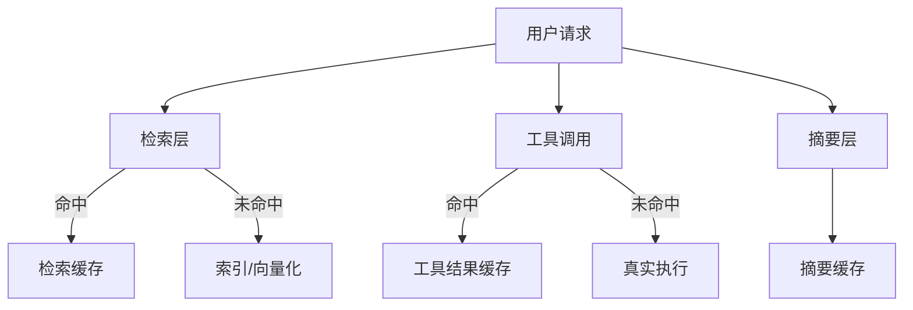
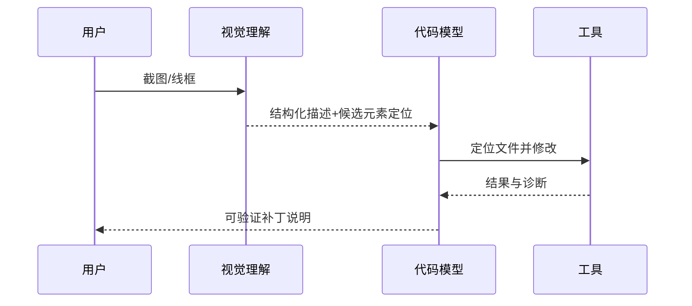
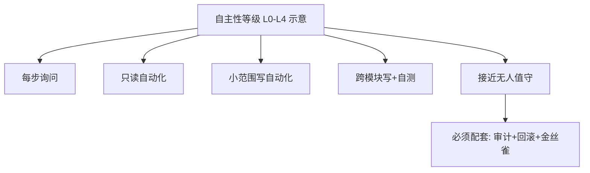
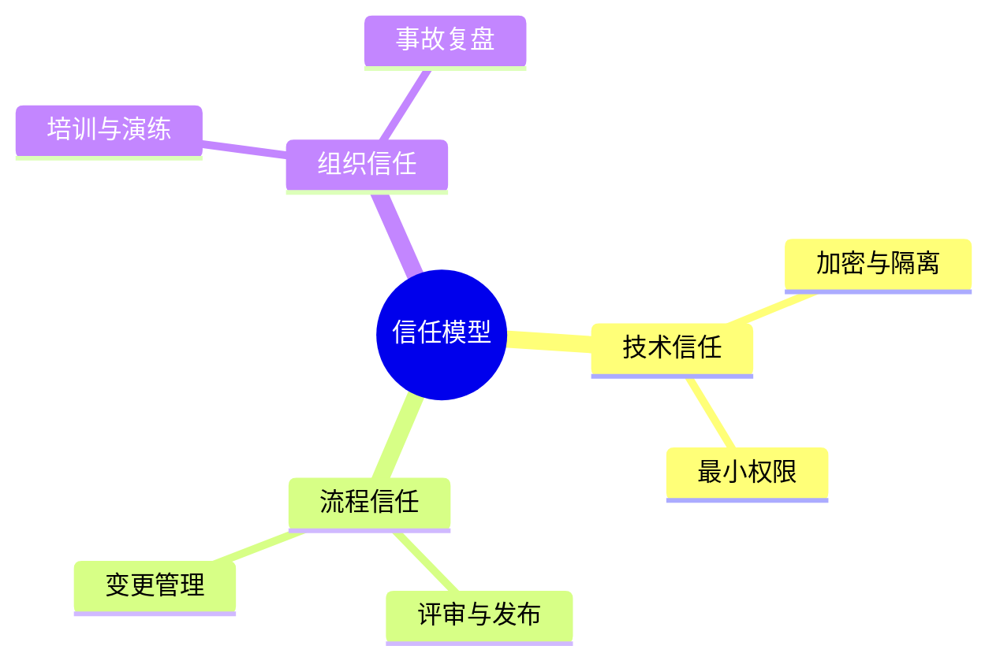
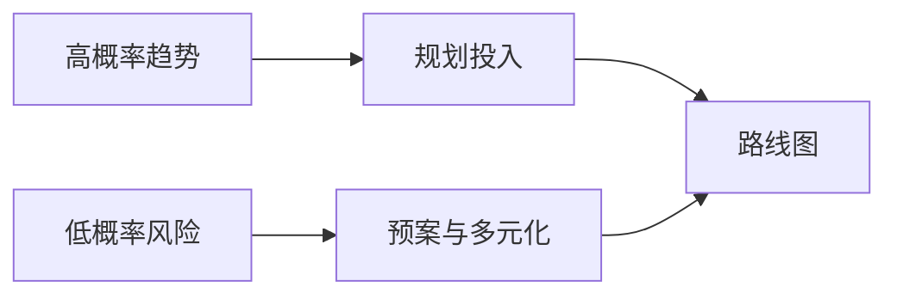
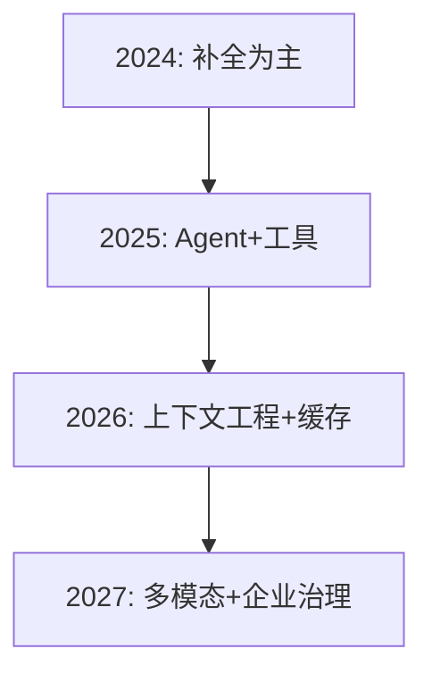

# 20.3 AI 编程工具未来趋势：上下文、成本、多模态、自主性与信任

> **本节目标**：把「未来两年高概率发生的事」从营销话术里剥离出来，用**可验证的技术方向**描述：更长上下文、更好缓存、多模态 Agent、自主性提升，以及安全与信任的再平衡。

---

## 1. 趋势总览：五股力量同向挤压

**表 20-3-1：趋势 → 对工程实践的含义**

| 趋势 | 对用户可见的变化 | 你需要提前准备的工程动作 |
|------|------------------|--------------------------|
| 更长上下文 | 更少「硬压缩」带来的信息丢失 | 仍要坚持分层加载，避免「全能塞入」 |
| 更好缓存 | 更低重复读成本 | 设计稳定缓存键、减少无意义抖动 |
| 多模态 | UI/截图/线框图驱动改码 | 建立截图脱敏与权限边界 |
| 自主性 | 更长任务链自动化 | 强化卡点、回滚与审计 |
| 信任 | 更严格的企业采纳 | 日志、租户隔离、供应链治理 |

---

## 2. 更长上下文：从「能塞」到「该塞什么」

上下文变长并不会自动让 Agent 更聪明；它主要降低**机械式截断**带来的失败。未来更可能的工程方向是：

- **分层记忆**：工作记忆（当前任务）/  episodic（会话轨迹）/  semantic（仓库知识）。
- **结构化引用**：用指针（路径、符号、commit）代替粘贴全文。
- **动态预算**：根据任务类型分配读、写、验证的 token 配额。

**表 20-3-2：长窗口下的三类反模式**

| 反模式 | 症状 | 修复方向 |
|--------|------|----------|
| 万物皆可塞 | 成本高、噪声大 | 相关性子图加载 |
| 长而不结构化 | 模型抓错重点 | schema、标题、要点列表 |
| 无版本指针 | 读后即过期 | 绑定 commit / 文件 hash |

---

## 3. 更好缓存 → 更低成本：从「重复纳税」到「可复用资产」

缓存不仅是 HTTP 层概念，在 Agent 体系里至少分三层：

1. **检索缓存**：同一查询的索引结果。
2. **工具输出缓存**：只读命令、构建产物列表等。
3. **摘要缓存**：对稳定大文件的摘要。

**表 20-3-3：缓存键设计检查项**

| 检查项 | 说明 |
|--------|------|
| 稳定性 | 避免无意义时间戳进键 |
| 粒度 | 过粗失效慢，过细命中率低 |
| 失效 | 文件变更、依赖变更要联动 |
| 安全 | 缓存层不可泄漏跨租户数据 |

---

## 4. 多模态 Agent：视觉 + 代码的联合作战

多模态让「指哪打哪」更自然：圈选 UI、贴错误截图、上传架构白板照片。代价是：

- **隐私面扩大**：截图常含个人信息与商业信息。
- **解释性变难**：需要把视觉证据链接到具体文件/行号。
- **评测复杂**：同样截图在不同主题下渲染不同。

**表 20-3-4：多模态落地三阶段**

| 阶段 | 能力 | 风险 |
|------|------|------|
| L1 | 截图 → 文字说明 | 低 |
| L2 | 截图 → 定位组件/文件 | 中 |
| L3 | 截图 → 自动改样式/布局 | 高（需强验证） |

---

## 5. 自主性提升：自动化加深后的「新事故类型」

自主性不是「少点确认」，而是**把确认转移到更正确的层级**：

- 低风险高频动作自动化。
- 高风险动作保留显式授权或可回滚窗口。
- 长链路需要**检查点**与**人类接管点**。

**表 20-3-5：自主性提升时的必备「安全带」**

| 安全带 | 作用 |
|--------|------|
| 变更集边界 | 限制 blast radius |
| 自动测试门禁 | 捕获隐性破坏 |
| 特性开关 | 快速止血 |
| 审计轨迹 | 事后追责与学习 |

---

## 6. 安全与信任的平衡：从「能用」到「敢规模化用」

未来竞争焦点会逐渐从「单次炫技」转向「组织级采纳」：

- **数据最小化**：默认不收集、收集必说明、可删除。
- **供应链**：插件、模型路由、第三方工具链的可信根。
- **人机共治**：关键决策保留人类签名（审批、发布）。

**表 20-3-6：信任成熟度模型（教学简化）**

| 级别 | 特征 |
|------|------|
| T1 | 个人试用，无统一策略 |
| T2 | 团队规范 + 秘文扫描 |
| T3 | 组织策略 + SSO + 审计 |
| T4 | 合规映射 + 定期红队 |

---

## 7. 与 20.1、20.2 的关系

- 20.1：壁垒在系统。
- 20.2：各产品在不同维度取舍。
- 20.3：行业会把「长上下文、缓存、多模态、自主性」做成默认能力，**差距将更集中在治理与评测**。

---

## 8. 未来 12–24 个月的「高概率清单」

| 预测项 | 依据类型 | 对你意味着什么 |
|--------|----------|----------------|
| 上下文继续变长 | 模型与硬件迭代 | 仍要分层，不迷信「全塞」 |
| 缓存成为标配能力 | 成本压力 | 你要会设计失效策略 |
| 多模态进入主路径 | 产品差异化 | 提前做脱敏与权限 |
| Agent 更长链路 | 自动化诉求 | 投资测试与可观测性 |
| 企业采购更严 | 合规趋势 | 提前准备审计与数据流说明 |

---

## 9. 低概率但高影响：黑天鹅提示

- 监管突变导致某些部署模式受限。
- 关键开源组件供应链事件。
- 模型服务商定价策略剧烈调整。

---

## 10. 路线图模板（可直接复制到团队文档）

| 季度 | 目标 | 度量 |
|------|------|------|
| Q1 | 建立工具白名单与审计 | 违规调用次数 |
| Q2 | 引入黄金 issue 回归集 | 通过率 |
| Q3 | 上下文成本账 | $/任务 或 tokens/任务 |
| Q4 | 多模态试点 | 脱敏违规=0 |

---

## 11. 本节练习

1. 为你的仓库画「分层上下文」三层内容各 5 条。
2. 列出三种可缓存工具输出，并写缓存失效条件。
3. 设想一张含隐私信息的截图，写一条处理规范。

---

## 12. 小结

- **更长上下文**减轻截断，但不取消**结构化**责任。
- **缓存**是降本核心杠杆，键与失效策略决定成败。
- **多模态**提升交互自然度，同时扩大隐私与验证面。
- **自主性**必须与**门禁、审计、回滚**同向演进。
- **信任**将成为规模化采纳的分水岭。

---

## 13. 过渡到 20.4

趋势回答「世界往哪走」；下一节回答「开发者个人与团队该如何站位」——架构思维、Token 经济学、安全优先与多 Agent 协作。

---

## 14. 参考框架图（能力叠进）

---

## 15. 术语

| 英文 | 中文 |
|------|------|
| multimodal | 多模态 |
| blast radius | 影响半径 |
| canary | 金丝雀发布 |

---

## 16. 与全书主题词对照

| 全书主题 | 在本节的落点 |
|----------|--------------|
| 工具治理 | 缓存与工具输出治理 |
| 权限 | 多模态与自主性下的边界 |
| 成本 | 缓存与分层加载 |

---

## 17. 批判性思考

「更长上下文」是否会让工程师更懒于抽象？教学观点：**会**，因此更需要 code review 与模块边界文化。

---

## 18. 企业读者检查表

- [ ] 是否定义了可接受的数据流（含截图）？
- [ ] 是否有密钥与令牌轮换策略？
- [ ] 是否有 Agent 相关变更的发布审批？

---

## 19. 个人读者检查表

- [ ] 是否记录过自己的 token 热点？
- [ ] 是否有一套「实现/自审」习惯？
- [ ] 是否为常用任务建立了可复用提示模板（结构化）？

---

## 20. 图表索引

| 图 | 类型 | 主题 |
|----|------|------|
| 图 20-3-1 | flowchart | 五股力量 |
| 图 20-3-2 | stateDiagram | 上下文演进 |
| 图 20-3-3 | flowchart | 缓存分层 |
| 图 20-3-4 | sequence | 多模态链路 |
| 图 20-3-5 | flowchart | 自主性等级 |
| 图 20-3-6 | mindmap | 信任模型 |
| 图 20-3-7 | flowchart | 风险规划 |
| 图 20-3-8 | flowchart | 年份叠进 |

---

*教学稿 V2 · 第 20 篇第 3 节*
