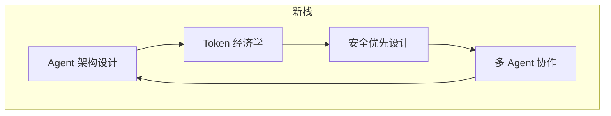
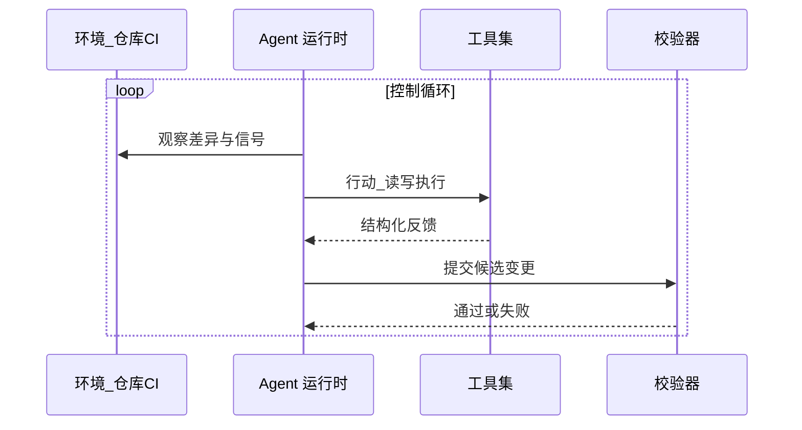
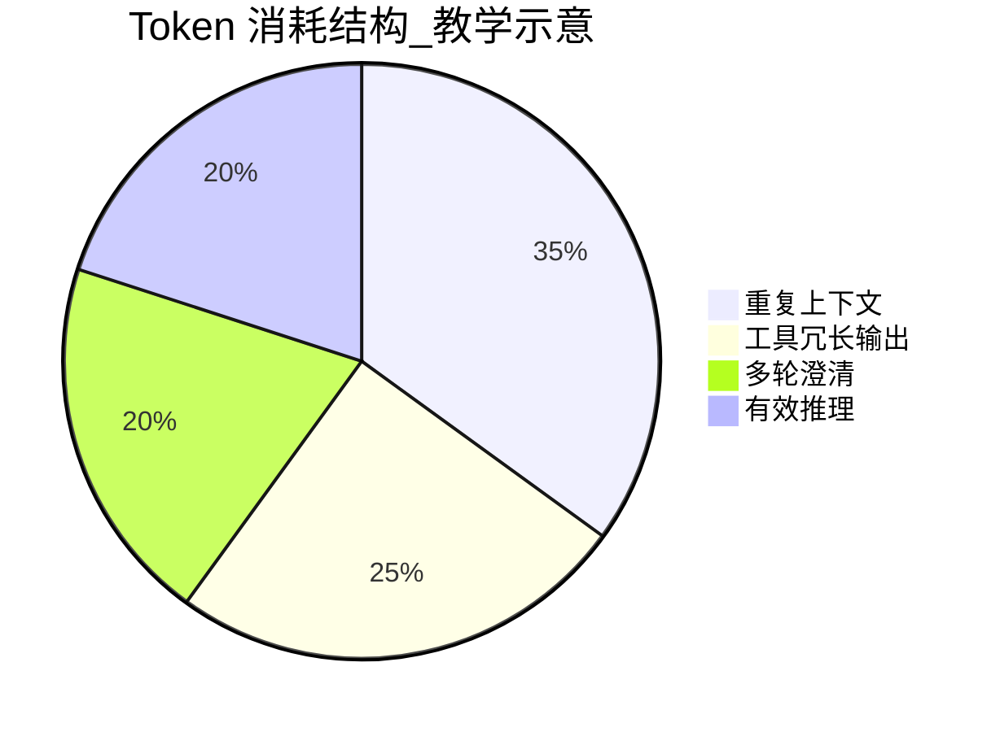
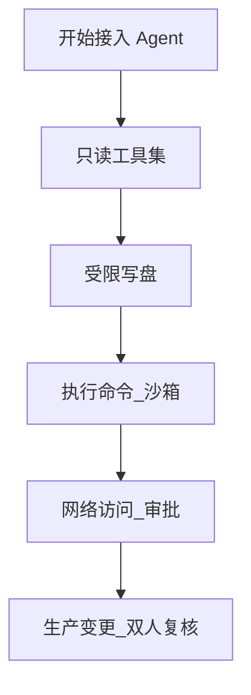
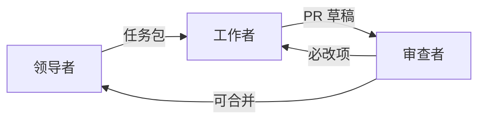
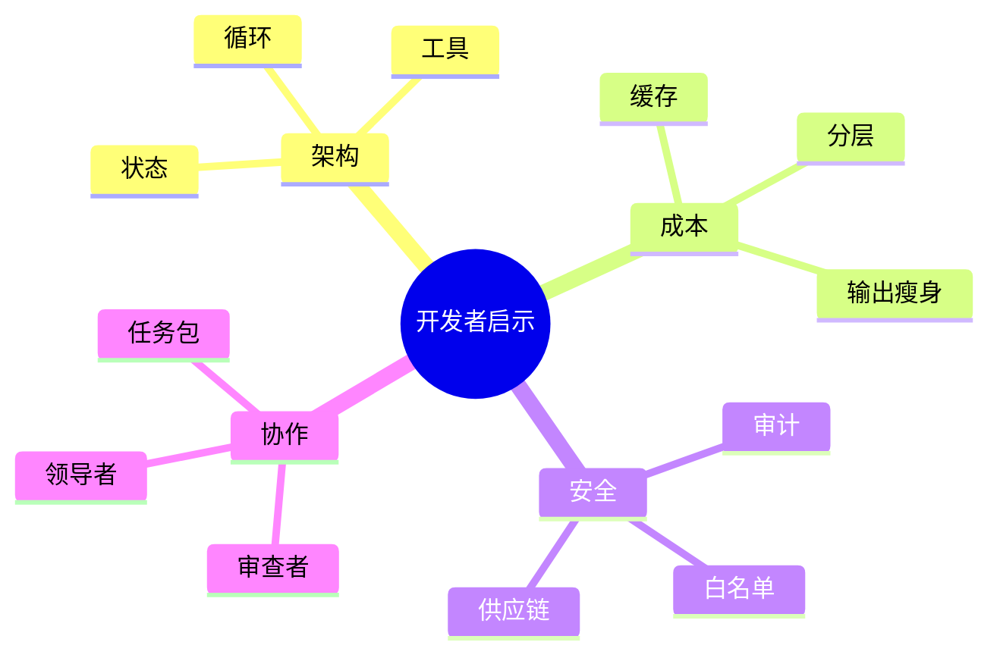

# 20.4 对开发者的启示：架构、Token 经济学、安全与多 Agent

> **本节目标**：把前文的「产品视角」转译为**个人与团队可执行的成长项**：学习 AI Agent 架构设计、理解 Token 经济学、坚持安全优先、掌握多 Agent 协作模式。

---

## 1. 四个支柱：你真正要升级的「新栈」

**表 20-4-1：四支柱 → 具体能力映射**

| 支柱 | 3 个月内可验证产出 |
|------|---------------------|
| 架构设计 | 能画出自己的 Agent 数据流与工具边界图 |
| Token 经济学 | 能解释一次任务的 token 主要消耗点 |
| 安全优先 | 能为工具调用分级并写白名单 |
| 多 Agent | 能写一份「领导者-工作者」任务包模板 |

---

## 2. 启示一：学习 AI Agent 架构设计

Agent 架构不是「调用 OpenAI API」那么简单，它至少包含：

- **控制循环**：观察 → 计划 → 行动 → 校验。
- **工具层**：schema、错误语义、幂等。
- **状态管理**：会话、检查点、人类在环。

**表 20-4-2：架构学习路径（自学周计划示意）**

| 周次 | 主题 | 实践作业 |
|------|------|----------|
| W1 | 控制循环与状态 | 用伪代码写一个「修 lint」循环 |
| W2 | 工具 schema | 给三个内部脚本写 JSON schema |
| W3 | 校验闭环 | 把单元测试接入「行动后必跑」 |
| W4 | 观测 | 导出一次完整轨迹并复盘 |

---

## 3. 启示二：理解 Token 经济学

Token 不是会计细节，是**性能与成本的联合约束**。你需要建立三类直觉：

1. **输入贵还是输出贵**：依模型与任务而异，要会测。
2. **重复读是最大浪费**：检索与缓存优先级常高于换大模型。
3. **结构化便宜**：列表、表格、指针优于散文。

> 注：比例为教学示意，真实分布请用你的日志估计。

**表 20-4-3：降本手段优先级（一般情况）**

| 优先级 | 手段 | 说明 |
|--------|------|------|
| P0 | 去重与缓存 |  often 立竿见影 |
| P1 | 分层加载 | 控制噪声 |
| P2 | 工具输出分页 | 避免巨型 JSON |
| P3 | 换更强模型 | 最后手段 |

---

## 4. 启示三：安全优先设计（默认不信任）

安全优先不是「不用 Agent」，而是 **默认最小权限 + 可审计 + 可回滚**：

- **工具白名单**：从只读开始，逐步放开。
- **秘文治理**：.env、密钥、令牌不进窗口或脱敏。
- **供应链**：插件来源固定、版本锁定。

**表 20-4-4：风险分级示例**

| 等级 | 示例动作 | 建议策略 |
|------|----------|----------|
| L0 | 搜索只读 | 自动 |
| L1 | 改测试代码 | 自动+CI |
| L2 | 改业务核心 | 评审 |
| L3 | 改密钥或权限 | 强审批+审计 |

---

## 5. 启示四：多 Agent 协作模式

多 Agent 的价值不在「人多势众」，而在**角色分离减少认知污染**：

- **领导者**：拆任务、定验收、合并结果。
- **工作者**：实现、跑测、迭代。
- **审查者**：威胁建模、边界条件、测试缺口。

**表 20-4-5：任务包最小字段（模板）**

| 字段 | 内容 |
|------|------|
| 目标 | 一句话可验证目标 |
| 约束 | 不可触碰模块/接口 |
| 验收 | 测试命令与期望 |
| 上下文指针 | 文件路径、符号、commit |
| 风险 | 已知坑 |

---

## 6. 与职业阶段的关系

| 阶段 | 侧重点 |
|------|--------|
| 初级 | 会用工具 + 会写清晰任务包 |
| 中级 | 会设计校验闭环 + 会控成本 |
| 高级 | 会定团队规范 + 会评估供应商方案 |
| 专家 | 能造内部平台 + 能做安全与合规映射 |

---

## 7. 常见误区

| 误区 | 实际情况 |
|------|----------|
| 「会 Chat 就会 Agent」 | 缺工具与闭环难落地 |
| 「模型越强越省钱」 | 可能更贵且更难控 |
| 「开源=安全」 | 配置错误同样危险 |

---

## 8. 团队层面的最小制度包

1. **Agent 变更同样走 PR**（除非明确豁免清单）。
2. **CI 必须通过**才能合并。
3. **秘文扫描**与依赖审计不降级。
4. **重大工具权限**需要登记与审批。

---

## 9. 个人层面的每日习惯

- 开始任务前写 5 行「验收标准」。
- 结束任务后记录「token/耗时/返工原因」各一行。
- 每周复盘一次「最大浪费上下文」。

---

## 10. 本节与全书技能树对齐

---

## 11. 案例骨架（课堂可用）

**背景**：修复一个 flaky 测试。  
**错误做法**：让 Agent 直接改生产逻辑凑绿。  
**更好做法**：任务包要求先复现、再加最小隔离测试、最后改实现。  
**安全点**：禁止扩大网络权限去「抓外部数据凑数」。

---

## 12. 度量建议

| 指标 | 用途 |
|------|------|
| tokens/合并 PR | 成本趋势 |
| 返工轮次 | 任务包质量 |
| CI 失败率 | 闭环可靠性 |
| 秘文告警数 | 安全基线 |

---

## 13. 过渡到 20.5

本节回答「该学什么」；下一节给出**按角色划分的学习路径**与推荐资源，便于你把启示落到时间表。

---

## 14. 小结背板

- **架构**：循环 + 工具 + 校验 + 观测。
- **Token**：先治理上下文，再考虑换模型。
- **安全**：默认拒绝，逐步放权，全程可审计。
- **多 Agent**：用角色分离降低认知噪声，靠任务包对齐。

---

## 15. 自测题（口试）

1. 控制循环四步各举一例工具调用。
2. 说出一个「P0 降本」手段及适用条件。
3. 解释为何 L3 风险需要双人复核。
4. 任务包五字段缺一会怎样？

---

## 16. 术语

| 英文 | 中文 |
|------|------|
| human-in-the-loop | 人类在环 |
| least privilege | 最小权限 |

---

## 17. 延伸阅读钩子

详见 `05-learning-path.md` 与附录 `further-reading.md`。

---

## 18. 图表索引

| 图 | 类型 |
|----|------|
| 图 20-4-1 | flowchart 四支柱 |
| 图 20-4-2 | sequence 控制循环 |
| 图 20-4-3 | pie token 示意 |
| 图 20-4-4 | flowchart 权限渐进 |
| 图 20-4-5 | flowchart 多 Agent |
| 图 20-4-6 | mindmap 技能树 |

---

## 19. 结语句（可引用）

> Agent 时代工程师的核心竞争力，是**把不确定性关进系统**，而不是把希望寄托在模型的「自觉」上。

---

## 20. 版本记录

| 版本 | 说明 |
|------|------|
| V2 | 与全书 20 篇结构对齐 |

---

*教学稿 V2 · 第 20 篇第 4 节*
