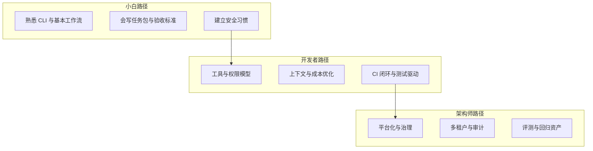
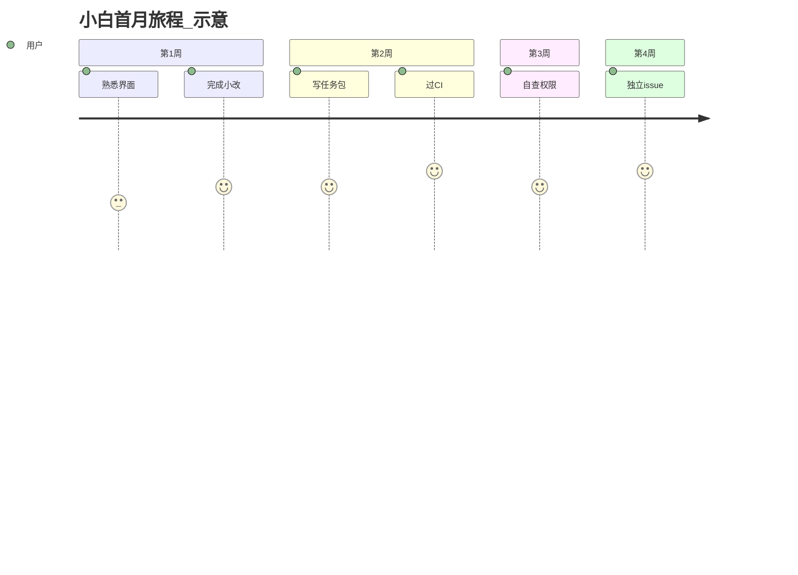
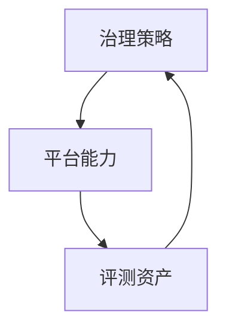
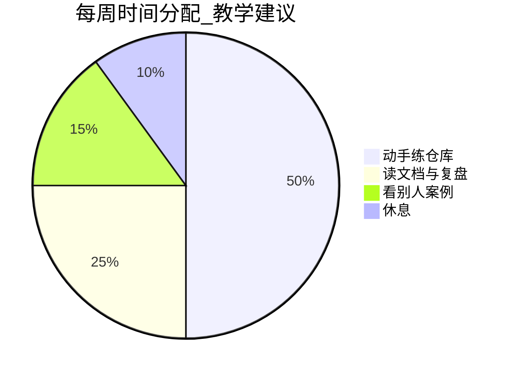

# 20.5 推荐学习路径：按角色划分的进阶路线与资源

> **本节目标**：把「读完 20 篇之后干什么」拆成可执行路线。覆盖 **小白 / 开发者 / 架构师** 三类读者，并给出推荐项目、练习与资源入口（详细外链见附录 `further-reading.md`）。

---

## 1. 路线总览：三条主径与一个交汇点

**表 20-5-1：角色 → 12 周目标（建议节奏）**

| 角色 | 第 4 周 | 第 8 周 | 第 12 周 |
|------|---------|---------|----------|
| 小白 | 独立完成小改修 | 能带测试提交 PR | 能自查秘文与权限 |
| 开发者 | 建立个人模板库 | token 成本账清晰 | 能指导同事任务包 |
| 架构师 | 出团队规范 v0 | PoC 对比两家方案 | 建立黄金 issue 集 |

---

## 2. 小白路径：从「敢用」到「用得稳」

### 2.1 前置条件

- 会用 git 基本操作（branch、commit、push）。
- 能读懂项目 README 与简单报错。

### 2.2 第 1–2 周：环境与心智

| 日 | 主题 | 产出 |
|----|------|------|
| 1–2 | 安装与最小工作流 | 跑通 hello 级任务 |
| 3–4 | 任务描述结构化 | 个人模板 3 份 |
| 5–7 | 第一次 PR | 带截图或测试说明 |

### 2.3 第 3–4 周：安全与习惯

- 学会识别秘文与 `.env`。
- 养成「改前先拉分支、改后跑最小测试」。

**表 20-5-2：小白常见坑**

| 坑 | 预防 |
|----|------|
| 让 Agent 直接改 main | 分支策略写进模板第一行 |
| 复制密钥进聊天 | 用占位符+本地文件引用 |
| 不做自测就合并 | 任务包强制写验收命令 |

### 2.4 推荐练手项目类型

| 类型 | 说明 |
|------|------|
| 小型 CLI 工具 | 边界清晰 |
| 带测试的库 | 易验证 |
| 文档型仓库 | 低风险练结构化写作 |

---

## 3. 开发者路径：从「会用」到「可复用工程化」

### 3.1 核心模块

1. **工具与权限**：理解 allowlist、沙箱、确认流。
2. **上下文策略**：相关文件集、摘要、缓存意识。
3. **闭环**：lint、typecheck、test 成为默认后缀动作。

### 3.2 第 5–8 周专题

| 周 | 专题 | 深度练习 |
|----|------|----------|
| 5 | 工具 schema | 给内部脚本加输入校验 |
| 6 | Token 账 | 记录三次任务的消耗结构 |
| 7 | 多文件重构 | 要求 Agent 输出变更表 |
| 8 | Flaky 测试治理 | 禁止「关测试」式修复 |

**表 20-5-3：开发者「模板库」最小集合**

| 模板名 | 用途 |
|--------|------|
| bugfix | 复现→定位→测试→修复 |
| refactor | 行为不变清单+增量步骤 |
| feature | 接口草案+验收用例 |
| docs | 读者对象+目录结构 |

### 3.3 推荐开源项目（学习向）

| 项目 | 学习点 |
|------|--------|
| Continue | 扩展结构、模型路由 |
| Aider | git 集成、补丁流 |
| 各 MCP 示例服务 | 工具协议与鉴权 |

> 具体仓库链接见附录 `further-reading.md`。

---

## 4. 架构师路径：从「团队能用」到「组织敢用」

### 4.1 关注面

- **治理**：SSO、租户、数据流说明、留痕。
- **平台化**：统一模板、统一工具注册、统一观测。
- **评测**：黄金 issue、对比实验、回归节奏。

### 4.2 交付物清单（v1）

| 交付物 | 内容 |
|--------|------|
| 数据流白皮书 | 哪些数据出网、存多久 |
| 工具注册表 | 名称、风险级、 owner |
| 变更策略 | Agent 改码的 PR 规则 |
| 事件响应 | 误执行、秘文泄露预案 |

**表 20-5-4：架构师 PoC 评分卡（节选）**

| 项 | 权重 |
|----|------|
| 合规映射 | 高 |
| 审计完整性 | 高 |
| TCO | 中 |
| 开发者体验 | 中 |
| 可迁移性 | 中 |

---

## 5. 交汇点：所有人都应掌握的「四项基本功」

1. **结构化任务描述**（目标/约束/验收）。
2. **最小权限意识**。
3. **可验证闭环**（测试或静态检查）。
4. **复盘记录**（一次一行也能积少成多）。

---

## 6. 与全书 20 篇的映射（如何复盘）

| 全书板块（示意） | 小白 | 开发者 | 架构师 |
|------------------|------|--------|--------|
| 入门与安装 | 精读 | 扫读 | 指定标准 |
| 工具与权限 | 遵守 | 精读 | 制定 |
| 上下文与成本 | 感知 | 精读 | 平台化 |
| 多 Agent | 了解 | 实践 | 设计 |
| 安全合规 | 遵守 | 实践 | 负责 |

---

## 7. 学习节奏建议（防 burnout）

---

## 8. 里程碑认证（自娱式）

| 徽章 | 条件 |
|------|------|
| 绿通新手 | 10 个带测试的小 PR |
| 闭环工程师 | 连续 20 次 CI 一次过 |
| 成本守门员 | 文档化三次降本改动 |
| 治理共建者 | 输出团队规范并被采纳 |

---

## 9. 社群与协作学习

- 参与 **code review**：看别人如何写任务包。
- 组织 **brown bag**：每周 30 分钟分享一次翻车与修复。
- 维护 **团队 playbook**：比个人笔记更能沉淀。

---

## 10. 与附录联动

| 需求 | 附录文件 |
|------|----------|
| 命令与配置速查 | `cheatsheet.md` |
| 术语中英 | `glossary-en-zh.md` |
| 自测巩固 | `quiz.md` |
| 外链资源 | `further-reading.md` |
| 源码地图 | `source-index.md` |

---

## 11. 常见时间陷阱

| 陷阱 | 调整 |
|------|------|
| 沉迷换模型 | 先固定模型优化上下文 |
| 沉迷收藏文章 | 每周一篇精读+实践 |
| 无验收标准 | 先写验收再允许开工 |

---

## 12. 过渡到 20.6

下一节为全书收束：**回顾 20 篇 200+ 节**、致谢读者，并强调开源社区与共建的意义。

---

## 13. 小结

- **小白**：稳、慢、带测试；先习惯与模板。
- **开发者**：闭环、成本、模板库；能带人。
- **架构师**：治理、平台、评测；能担责。
- **资源**：全书 + 附录 + 你手头的真实仓库。

---

## 14. 30 天打卡表（可复制）

| 天 | 任务 |
|----|------|
| 1 | 安装与环境验证 |
| 2 | 任务包模板 v0 |
| 3 | 第一个 PR |
| … | … |
| 30 | 复盘文 800 字 |

---

## 15. 图表索引

| 图 | 类型 |
|----|------|
| 图 20-5-1 | flowchart 三路径 |
| 图 20-5-2 | journey 小白旅程 |
| 图 20-5-3 | flowchart 开发者闭环 |
| 图 20-5-4 | flowchart 架构师三角 |
| 图 20-5-5 | pie 时间分配 |

---

## 16. 术语

| 英文 | 中文 |
|------|------|
| brown bag | 午餐学习会 |
| playbook | 实战手册 |

---

## 17. 自测

1. 写出你所在角色的「12 周目标」三行版。
2. 列出你模板库还缺的两种场景。
3. 架构师 PoC 你最看重哪两项权重？为什么？

---

## 18. 版本

| 版本 | 说明 |
|------|------|
| V2 | 与附录资源联动 |

---

*教学稿 V2 · 第 20 篇第 5 节*
