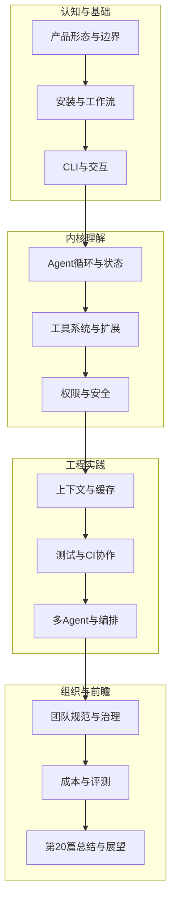
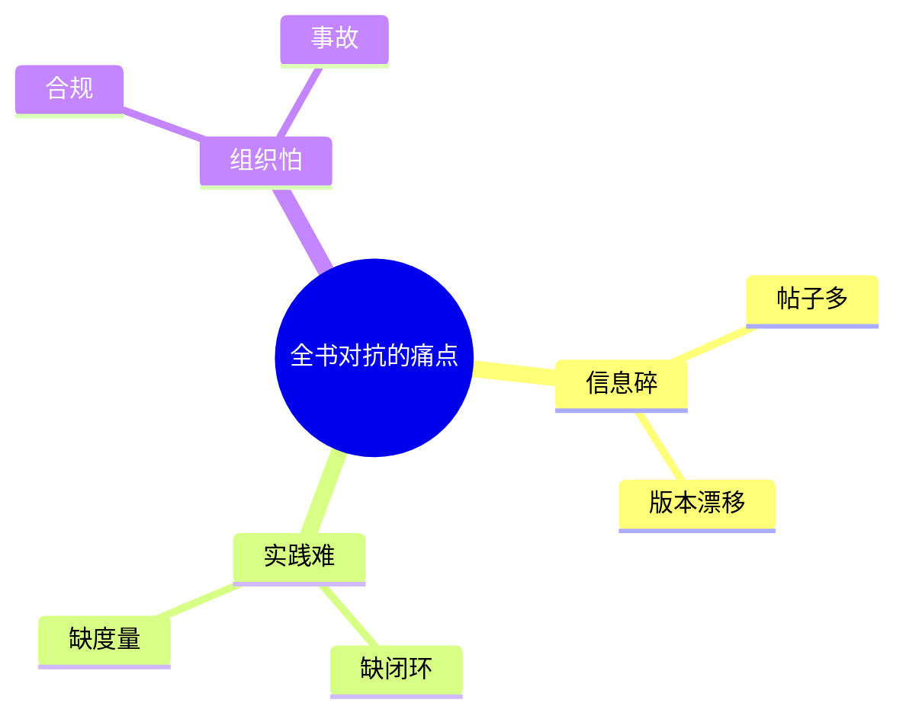
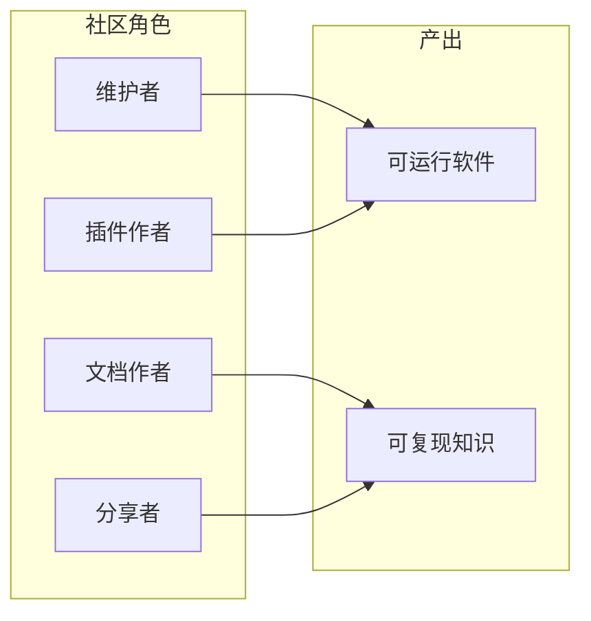
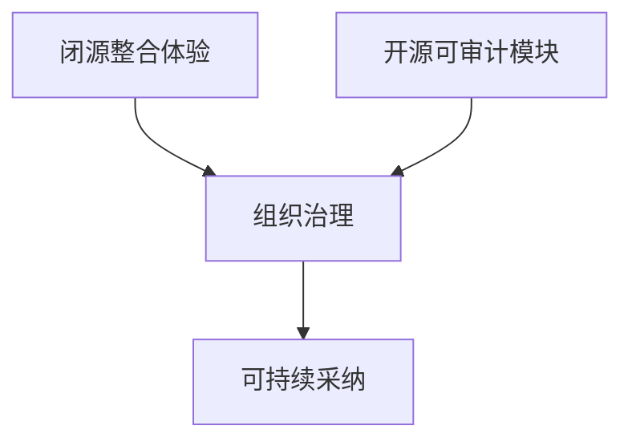
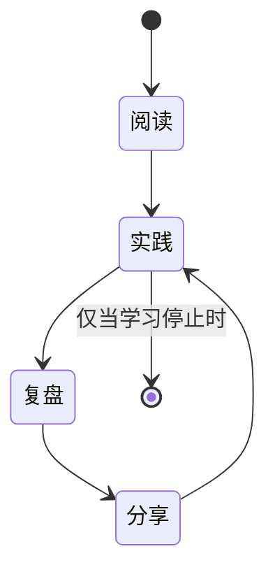
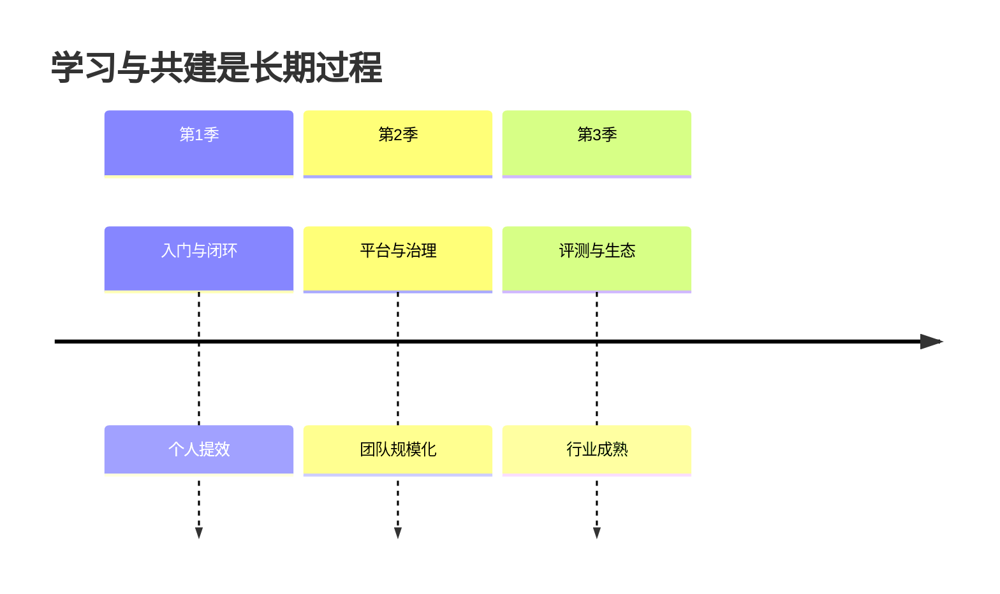

# 20.6 结语：回顾全书、致谢读者与开源共建

> **本节目标**：为《Claude Code 完全指南 V2》画上句号——回顾 **20 篇、200+ 节** 的知识地图，真诚感谢读者投入的时间，并重申 **开源社区** 在这一波 Agent 工程浪潮中的位置：不是附属品，而是主航道的一部分。

---

## 1. 我们一同走过的路：全书结构回眸

全书以「从能用到敢用、从个人到组织」为隐线，约 **20 篇** 正文与 **200+ 节** 细粒度拆解，试图覆盖以下主干（篇名以教学抽象表述，便于对照你手中的目录）：

**表 20-6-1：全书能力栈（再浓缩版）**

| 层级 | 你应带走的句子 |
|------|----------------|
| 认知层 | Agent 是系统问题，模型是其中一环。 |
| 工具层 | schema 与权限决定可靠性与边界。 |
| 上下文层 | Token 是预算，分层与缓存是纪律。 |
| 协作层 | 任务包与评审把「聪明」变成「可合并」。 |
| 组织层 | 没有审计与制度的规模化，只是放大风险。 |

---

## 2. 数字背后的意义：200+ 节到底在对抗什么

「200+ 节」不是为了厚，而是为了**对抗碎片化学习**：Agent 领域文章很多，但缺少把 **CLI、工具、权限、上下文、测试、治理** 连成闭环的叙述。每一节尽量做到：

- **可单独阅读**（有局部结论）；
- **可串成路径**（有前后引用）；
- **可落到仓库**（有检查表或练习）。

---

## 3. 致谢读者：你完成的不仅是阅读

如果你一路读到第 20 篇，你完成的远不止一次「看完」。你很可能已经：

- 在自己的项目上做过 **PoC**；
- 为同事写过 **模板** 或 **规范**；
- 在 CI 红绿之间理解过 **Agent 的代价**。

这些实践比任何书评都更珍贵。**谢谢你愿意把时间与真实代码交给这套叙事来对照。**

---

## 4. 致谢贡献者与社区：工具链是集体作品

无论闭源产品还是开源生态，背后都有 **维护者、文档写作者、插件作者、踩坑分享者**。本书若引用或对齐了某些社区经验，本质上都是站在他人肩膀上的教学整理。

**表 20-6-2：你可以回馈社区的微行动**

| 行动 | 影响 |
|------|------|
| 提交文档 PR | 降低新人门槛 |
| 发布最小复现 | 节省他人数小时 |
| 写清 issue 边界 | 维护者更高效 |
| 分享失败案例 | 比成功学更稀缺 |

---

## 5. 开源精神在 Agent 时代的变体

传统开源强调 **源码可得**；Agent 时代还要强调：

- **行为可得**：工具做什么、默认权限是什么，应可读、可审计。
- **数据流可得**：哪些内容离开本机，应有清晰说明。
- **评测可得**：宣称的能力应用可重复脚本验证。

这不是道德绑架，而是 **规模化协作的摩擦系数**——摩擦越低，创新越快。

---

## 6. 闭源与开源如何共处（务实看法）

本书立场：**不必二极管**。团队可以选择闭源产品获得整合体验，同时用开源组件补齐 **可审计模块** 与 **逃生通道**。关键是：

- 合同与租户策略清晰；
- 关键资产有备份与迁移计划；
- 不把「方便」建立在「不可追溯」上。

---

## 7. 全书金句复盘（便于引用）

1. **AI Agent 约 90% 的工作量在 AI 之外。**
2. **好体验来自制度与工程，而不是几段 Prompt。**
3. **Token 是预算，上下文治理是专业度。**
4. **安全是默认拒绝 + 可审计 + 可回滚。**
5. **多 Agent 的本质是角色分离与任务包协议。**

---

## 8. 未完成之书：为什么指南必须持续更新

Agent 产品与模型迭代极快，任何「完全指南」都只是 **快照**：

- 命令与参数会变；
- 最佳实践会迁移；
- 合规要求会加码。

因此本书建议与 **官方文档**、**变更日志** 同步阅读；附录中的外链与索引也会需要读者自行刷新。

---

## 9. 你带走的三样东西

| 物品 | 说明 |
|------|------|
| 一张图 | 你自己的 Agent 数据流 |
| 一份表 | 团队工具白名单与风险级 |
| 一个习惯 | 先写验收再允许 Agent 动手 |

---

## 10. 最后的练习：写给你的「一年后信」

用 10 行回答：

- 我希望 Agent 在我们团队解决的三类问题是什么？
- 我绝不让它碰的三类红线是什么？
- 一年后我希望成本与质量指标各变成什么样？

把信存进仓库的 `docs/`，一年后打开——这比任何结论都有力量。

---

## 11. 附录导航（收束全书）

| 文件 | 用途 |
|------|------|
| `source-index.md` | 源码与模块索引 |
| `cheatsheet.md` | 命令与配置速查 |
| `quiz.md` | 50 题自测 |
| `further-reading.md` | 主题化外链 |
| `glossary-en-zh.md` | 中英术语 |

---

## 12. 再见不是终点

若本书帮你少翻一次车、少熬一夜、少吵一场会，它就完成了使命。更希望你能带着 **工程化与治理** 的视角，参与下一波共建——无论你写的是业务代码、平台代码，还是一篇诚实的复盘帖。

---

## 13. 致谢（编辑与教学伙伴）

感谢在草稿阶段提出「太像广告」「不够可验证」「缺检查表」的审阅者——你们的刻薄让稿子更耐读。

---

## 14. 许可与使用建议

- 教学幻灯可拆解引用，建议保留出处与日期。
- 商业转载请遵守原仓库声明（若有）。

---

## 15. 联系与勘误（占位）

- 欢迎在原书配套仓库提交 **issue** 指正事实错误与过期命令。
- 区分「版本变更」与「内容错误」：前者更新快，后者应修。

---

## 16. 全书路线图时间轴（象征）

---

## 17. 小结背板

- **20 篇 / 200+ 节**：对抗碎片化，服务闭环实践。
- **感谢读者**：时间投入即贡献。
- **社区与开源**：Agent 时代更需要可审计与可复现。
- **指南会过期**：与官方文档并行阅读。
- **带走习惯**：验收、白名单、复盘。

---

## 18. 终章一句

> 愿你在自动化浪潮里，仍然是自己系统的 **架构师**——而不是幸运的乘客。

---

*《Claude Code 完全指南 V2》· 第 20 篇第 6 节 · 全书终*
