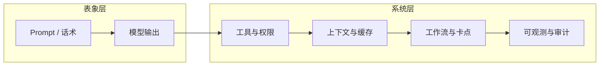
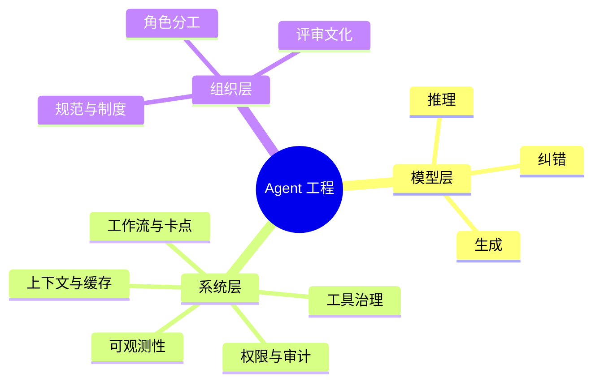
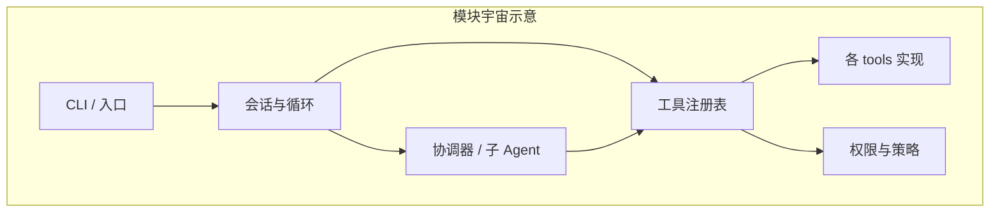
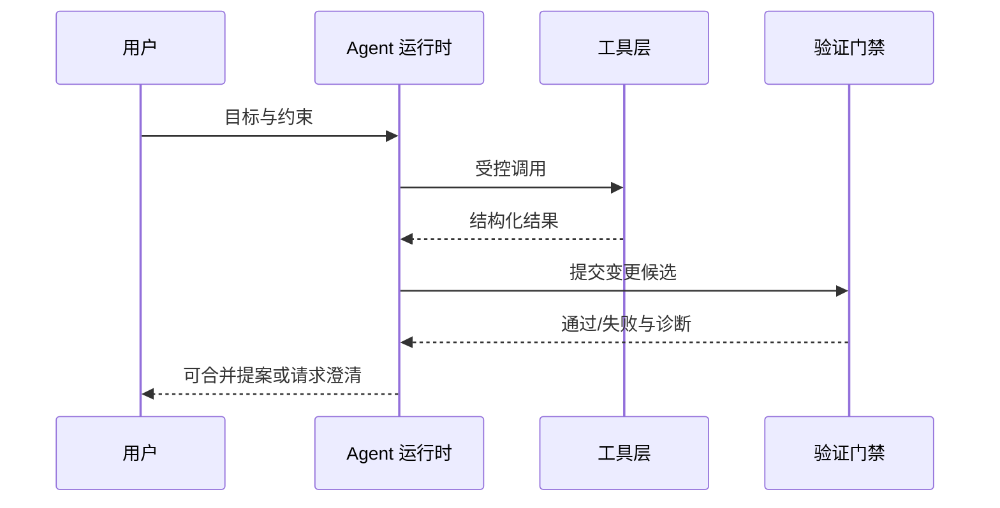
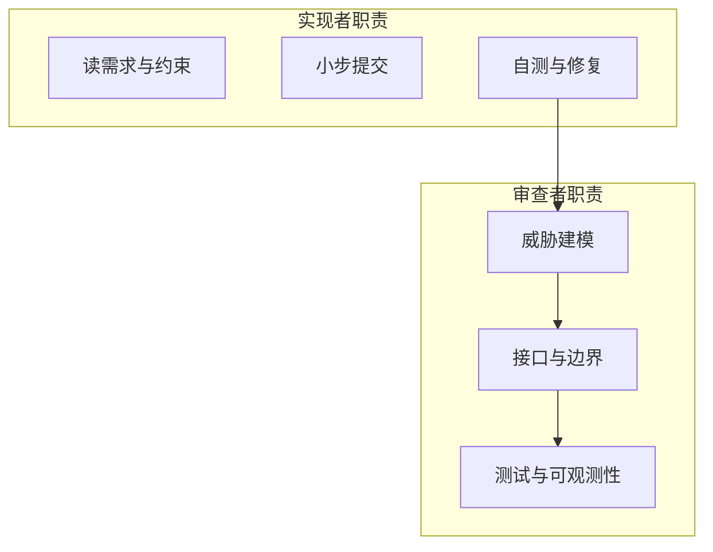
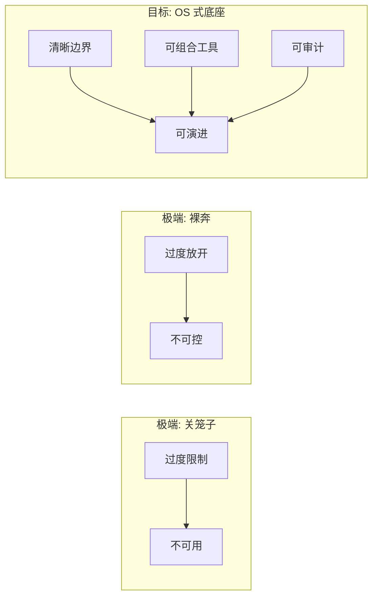
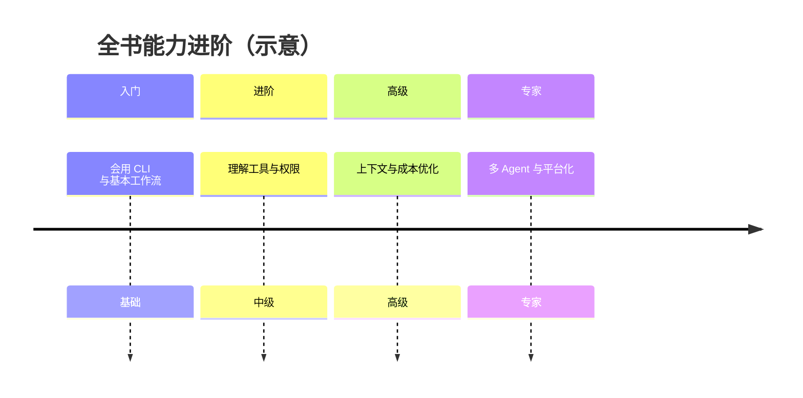

# 第 20 篇 · 总结与展望（一）AI Agent 的壁垒在哪里

> **本篇定位**：在通读全书约 20 篇、200+ 节之后，把「Agent 到底难在哪」从感性体验拉回到工程现实。核心论点只有一句：**AI Agent 约 90% 的工作量落在 AI 模型之外**。

---

## 1. 开篇：体验好 ≠ 模型强

许多团队第一次接触「编程 Agent」时，会把成败归因到「Prompt 写得好不好」。短期演示里，这往往成立；但一旦进入真实仓库、真实权限、真实 CI 与真实评审流程，**模型能力的天花板很快让位给系统能力的天花板**。

**表 20-1：常见误判 vs 更贴近事实的解释**

| 现象 | 易误判原因 | 更接近事实的解释 |
|------|------------|------------------|
| Agent 经常「改错文件」 | 模型不聪明 | 索引/检索/工作区边界未治理 |
| Agent 反复读大文件 | 模型浪费 | 上下文策略与缓存未设计 |
| Agent 乱执行命令 | 模型不听话 | 权限模型与确认流缺失 |
| Agent 输出看似正确但不可合并 | 模型幻觉 | 测试/类型检查/评审未嵌入闭环 |

---

## 2. 核心论点：「90% 在 AI 之外」意味着什么

把一次「从需求到可合并 PR」的旅程拆开，你会发现模型主要负责的是**语言层面的推理与生成**；而下面这些工作，几乎全部由**产品与工程底座**承担：

- **任务分解与状态机**：何时读、何时写、何时停、何时问人。
- **工具契约**：每个工具输入输出的 schema、错误语义、幂等与重试。
- **权限与审计**：谁能动什么、动了什么能否追溯。
- **上下文经济学**：哪些进窗口、如何压缩、如何命中缓存。
- **人机协同**：卡点、回滚、代码评审、发布门禁。

**表 20-2：工作量粗粒度拆分（教学用示意，非精确测量）**

| 范畴 | 典型活动 | 相对占比（示意） |
|------|----------|------------------|
| 系统与产品工程 | 工具、权限、上下文、UI/CLI 流程 | ~45% |
| 质量与流程 | 测试、CI、评审模板、回滚策略 | ~25% |
| 数据与评估 | 日志、轨迹、回归集、对比实验 | ~15% |
| 模型与 Prompt | 指令、样例、约束、风格 | ~15% |

> 教学目的：**不要把「Agent 项目」当成「调模型项目」**。模型是发动机，但整车能不能上路，取决于底盘、刹车与交规。

---

## 3. 「4756 个模块」的隐喻：复杂度来自组合爆炸

书中常以大型代码库为例说明：**行数与文件数本身不是壁垒，模块间耦合与隐式协议才是**。所谓「4756 个模块」在此作为教学隐喻，指向三件事：

1. **边界数量**：每一个可被 Agent 调用的能力，都是一条「对外协议」。
2. **失败面**：任意模块的模糊语义，都会在长链路里被放大成事故。
3. **演进成本**：没有版本化与兼容策略时，Agent 行为会「随小改小动而漂移」。

**表 20-3：模块膨胀时优先治理的「杠杆点」**

| 杠杆点 | 为什么优先 | 典型抓手 |
|--------|------------|----------|
| 工具 schema | 一处模糊，处处翻车 | 严格类型、示例、错误码 |
| 权限默认 | 默认过宽等于裸奔 | 白名单、分级、可审计 |
| 上下文入口 | 垃圾进窗口，贵且慢 | 索引、摘要、分层加载 |
| 可观测性 | 不能复盘就无法迭代 | 结构化日志、轨迹导出 |

---

## 4. 好体验不是「几段 Prompt 忽悠出来的」

高质量 Agent 体验通常具备以下特征，它们几乎都依赖工程而非话术：

- **可预测**：在相同约束下，行为稳定、可解释。
- **可中断**：用户随时能接管、回滚、改方向。
- **可验证**：改动能自动被测试/类型检查/静态规则捕获。
- **可审计**：关键动作有记录，便于追责与复盘。

**表 20-4：「Prompt 主义」 vs 「系统工程」对照**

| 维度 | Prompt 主义陷阱 | 系统工程做法 |
|------|-----------------|--------------|
| 安全 | 让模型「答应不乱来」 | 运行时强制策略与审计 |
| 质量 | 让模型「自我检查」 | CI + 测试 + 人类评审 |
| 成本 | 反复塞全文 | 缓存、分层、只读必要片段 |
| 协作 | 一个超级 Prompt | 角色拆分与交接协议 |

---

## 5. 你需要什么：制度、角色、卡点、Token 预算

### 5.1 把好行为写成制度

制度不是官僚文本，而是**把「正确路径」变成默认路径**：分支策略、提交规范、评审清单、发布窗口、回滚预案。Agent 在制度清晰的团队里更稳，因为环境信号一致、反馈回路短。

### 5.2 拆分「写代码 / 审代码」角色

教学上推荐把心智拆成两类责任（可由同人分阶段承担，也可由多 Agent 承担）：

- **实现者**：专注交付最小可验证改动。
- **审查者**：专注风险、边界、测试充分性与可维护性。

### 5.3 层层卡点与工具治理

卡点不是刁难，而是**把高风险动作暴露为显式决策**：网络访问、写盘范围、执行命令、修改配置密钥等。工具治理的目标是：默认安全、逐步放权、全程可审计。

### 5.4 Token 当预算精打细算

把 Token 视作**云资源预算**：能缓存的别重读，能结构化的别啰嗦，能工具化的别长篇推理。长期成本与延迟往往由上下文策略决定，而不是由「模型是不是最强」决定。

**表 20-5：Token 预算的「四类账户」**

| 账户 | 花在哪 | 节省策略 |
|------|--------|----------|
| 系统提示与规范 | 稳定规则 | 分层加载、版本化片段 |
| 仓库上下文 | 代码与文档 | 检索、摘要、相关文件集合 |
| 工具往返 | 输入输出 | schema 瘦身、分页、增量 |
| 对话历史 | 多轮澄清 | 压缩、里程碑摘要、结构化状态 |

---

## 6. Anthropic 的答卷：不能关笼子，也不能裸奔

业界常见两种极端：

- **关笼子**：能力阉割到几乎不可用，安全但创新停滞。
- **裸奔**：权限与流程缺位，短期爽、长期事故与合规风险。

更可持续的路线，是把它做成**操作系统式底座**：进程（会话）、系统调用（工具）、权限（capabilities）、文件系统（工作区）、审计（日志）、更新机制（版本与兼容）。

**表 20-6：底座能力清单（教学抽象）**

| 能力域 | 用户可感知价值 | 工程要点 |
|--------|----------------|----------|
| 会话与循环 | 「能持续推进任务」 | 状态、重试、失败恢复 |
| 工具系统 | 「能真实改代码」 | 注册、校验、沙箱 |
| 权限 | 「敢用」 | 默认拒绝、分级授权 |
| 上下文 | 「快且准」 | 缓存、压缩、检索 |
| 观测 | 「能改好」 | 轨迹、指标、回归 |

---

## 7. 与全书脉络的衔接：从「会用」到「能建」

若你把前 19 篇看作「拆解一辆车的结构」，本篇要做的是提醒你：**造车厂的主要工时不在发动机广告词，而在供应链与质检**。下一节（20.2）将从产品形态维度对比主流工具；20.3 讨论趋势；20.4—20.5 落到个人与团队成长路径；20.6 收束全书。

---

## 8. 本篇小结（背板）

- **壁垒主要在系统**：工具、权限、上下文、流程与观测，决定上限。
- **模块规模大是信号**：需要协议化、版本化与治理，而不是更大 Prompt。
- **体验来自制度与工程**：可预测、可验证、可审计比「会聊天」更重要。
- **Token 是预算**：治理上下文就是治理成本与延迟。
- **产品哲学**：在限制与放开之间，用「OS 底座」换取长期可持续。

---

## 9. 自测清单（读完本篇应能回答）

1. 为什么说「90% 在 AI 之外」并不贬低模型价值？
2. 举出三类「看起来像模型问题、其实是系统问题」的例子。
3. 「实现者 / 审查者」拆分解决的是什么组织难题？
4. 用你自己的项目举一个「应设卡点」的高风险工具调用。
5. 「OS 底座」与「裸奔 / 关笼子」各差在哪三个要素？

---

## 10. 延伸阅读钩子

- 对比维度：见 `02-comparison.md`。
- 趋势判断：见 `03-future.md`。
- 个人与团队行动项：见 `04-insights.md` 与 `05-learning-path.md`。
- 术语与命令速查：见附录 `glossary-en-zh.md`、`cheatsheet.md`。

---

## 11. 术语对齐（本篇）

| 英文/产品语 | 中文教学表述 |
|-------------|--------------|
| Tool / MCP | 工具与扩展协议 |
| Permission model | 权限模型 |
| Context window | 上下文窗口 |
| Audit trail | 审计轨迹 |

---

## 12. 常见反对意见与回应

| 反对意见 | 教学回应 |
|----------|----------|
| 「我们团队小，不需要制度」 | 小团队更需要默认路径，否则知识在人不在系统 |
| 「卡点会降低效率」 | 卡点针对高风险动作；低风险应自动化 |
| 「最强模型可以解决一切」 | 模型不能替代运行时约束与合规要求 |

---

## 13. 最小行动建议（本周可做）

1. 画一张你当前 Agent 调用的工具清单，标注风险等级。
2. 写一份「审查者检查表」10 条，用于 PR 或自审。
3. 记录一次会话的 Token/耗时粗账，找最重的三类上下文来源。

---

## 14. 图表索引（本篇）

| 编号 | 类型 | 主题 |
|------|------|------|
| 图 20-1 | flowchart | 表象层与系统层 |
| 图 20-2 | mindmap | Agent 工程心智图 |
| 图 20-3 | graph TB | 模块关系示意 |
| 图 20-4 | sequence | 验证闭环 |
| 图 20-5 | flowchart | 实现者与审查者 |
| 图 20-6 | flowchart | 极端与 OS 底座 |
| 图 20-7 | timeline | 全书进阶 |

---

## 15. 结语（过渡到 20.2）

当你能稳定地用 Agent 提效之后，下一步的自然问题是：**在工具丛林里如何选型与组合**。下一文件从架构、安全、扩展性、成本、上下文、多 Agent 与开源程度等维度，给出一张「多维对比」总表，便于你把本篇的抽象判断落到具体产品差异上。

---

*文档版本：V2 教学稿 · 第 20 篇第 1 节 · 行数与结构服务于课堂与自学复盘。*
